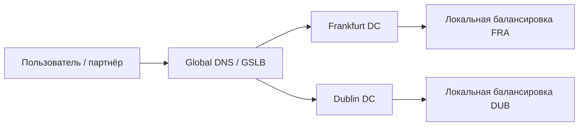
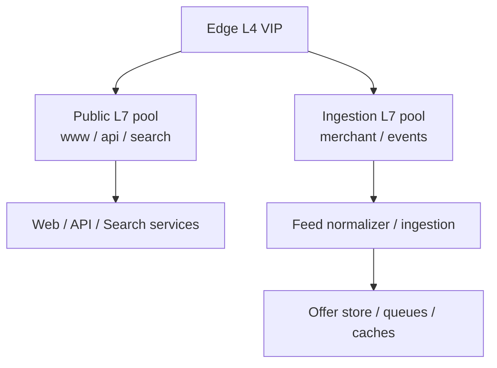
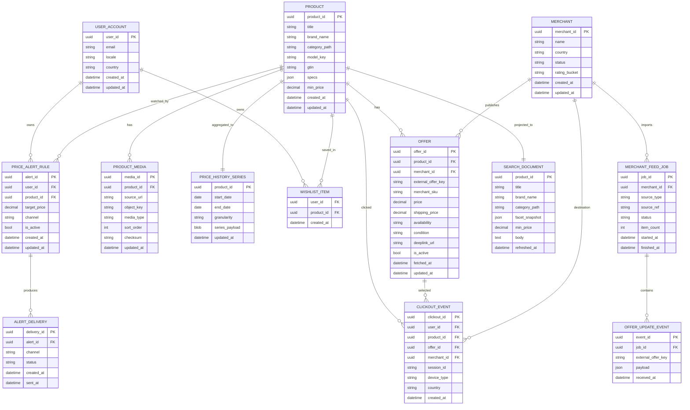
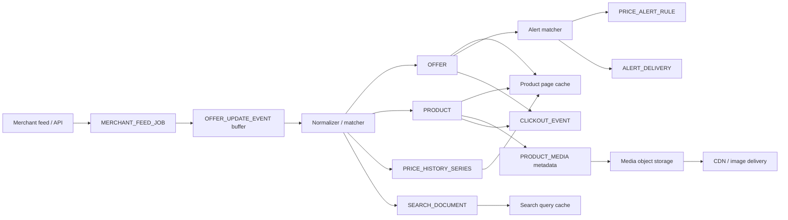
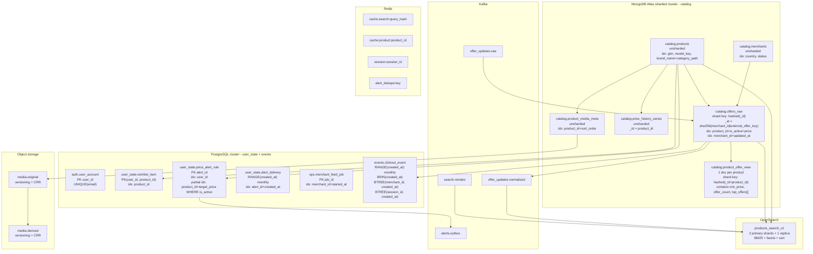

# Проектирование высоконагруженной системы: PriceCompare

Курсовой проект по дисциплине «Проектирование высоконагруженных систем» (НИУ ВШЭ).

PriceCompare — веб‑сервис сравнения цен по модели idealo: пользователь ищет товар, сравнивает предложения разных магазинов, смотрит историю цены, добавляет товар в избранное/уведомления и переходит в магазин для покупки (click‑out).

## Содержание

- [1. Тема и целевая аудитория](#1-тема-и-целевая-аудитория)
    - [1.1 Короткое описание сервиса](#11-короткое-описание-сервиса)
    - [1.2 Почему тема подходит под highload](#12-почему-тема-подходит-под-highload)
    - [1.3 Отличительные черты сервиса](#13-отличительные-черты-сервиса)
    - [1.4 Целевая аудитория](#14-целевая-аудитория)
    - [1.5 MVP‑функционал](#15-mvpфункционал)
    - [1.6 Ключевые продуктовые решения](#16-ключевые-продуктовые-решения)
    - [1.7 Термины](#17-термины)
- [2. Расчёт нагрузки](#2-расчёт-нагрузки)
    - [2.1 Продуктовые метрики](#21-продуктовые-метрики)
    - [2.2 Технические метрики](#22-технические-метрики)
- [3. Глобальная балансировка нагрузки](#3-глобальная-балансировка-нагрузки)
    - [3.1 Функциональное разбиение по доменам](#31-функциональное-разбиение-по-доменам)
    - [3.2 Обоснование расположения ДЦ](#32-обоснование-расположения-дц)
    - [3.3 Распределение запросов по ДЦ](#33-распределение-запросов-по-дц)
    - [3.4 DNS‑балансировка](#34-dns-балансировка)
    - [3.5 Anycast‑балансировка](#35-anycast-балансировка)
    - [3.6 Механизм регулировки трафика между ДЦ](#36-механизм-регулировки-трафика-между-дц)
- [4. Локальная балансировка нагрузки](#4-локальная-балансировка-нагрузки)
    - [4.1 Схема локальной балансировки и резервирования](#41-схема-локальной-балансировки-и-резервирования)
    - [4.2 Выбор схемы резервирования](#42-выбор-схемы-резервирования)
    - [4.3 Производительность одного балансировщика](#43-производительность-одного-балансировщика)
    - [4.4 Формула расчёта количества балансировщиков](#44-формула-расчёта-количества-балансировщиков)
    - [4.5 Расчёт по пулам](#45-расчёт-по-пулам)
    - [4.6 Локальные edge L4 балансировщики](#46-локальные-edge-l4-балансировщики)
    - [4.7 Сводная таблица по количеству балансировщиков](#47-сводная-таблица-по-количеству-балансировщиков)
    - [4.8 Вывод](#48-вывод)
- [5. Логическая схема БД](#5-логическая-схема-бд)
    - [5.1 Цели логической схемы](#51-цели-логической-схемы)
    - [5.2 Базовые допущения для размеров](#52-базовые-допущения-для-размеров)
    - [5.3 Логическая ER‑схема](#53-логическая-erсхема)
    - [5.4 Операционные data objects: кэши, буферы, object storage](#54-операционные-data-objects-кэши-буферы-object-storage)
    - [5.5 Таблица описания логических таблиц](#55-таблица-описания-логических-таблиц)
    - [5.6 Размеры данных и нагрузка на чтение/запись](#56-размеры-данных-и-нагрузка-на-чтениезапись)
    - [5.7 Требования к консистентности](#57-требования-к-консистентности)
    - [5.8 Особенности распределения нагрузки по ключам](#58-особенности-распределения-нагрузки-по-ключам)
    - [5.9 Вывод](#59-вывод)
- [6. Физическая схема БД](#6-физическая-схема-бд)
    - [6.1 Принципы выбора физических хранилищ](#61-принципы-выбора-физических-хранилищ)
    - [6.2 Распределение таблиц по хранилищам](#62-распределение-таблиц-по-хранилищам)
    - [6.3 Физическая схема размещения данных](#63-физическая-схема-размещения-данных)
    - [6.4 Индексы](#64-индексы)
    - [6.5 Денормализация](#65-денормализация)
    - [6.6 Шардирование и резервирование](#66-шардирование-и-резервирование)
    - [6.7 Клиентские библиотеки и интеграции](#67-клиентские-библиотеки-и-интеграции)
    - [6.8 Балансировка запросов и мультиплексирование подключений](#68-балансировка-запросов-и-мультиплексирование-подключений)
    - [6.9 Схема резервного копирования](#69-схема-резервного-копирования)
    - [6.10 Вывод](#610-вывод)
- [7. Алгоритмы](#7-алгоритмы)
    - [7.1 Сводная таблица алгоритмов](#71-сводная-таблица-алгоритмов)
    - [7.2 Вывод](#72-вывод)
- [8. Источники](#8-источники)

---

## 1. Тема и целевая аудитория

### 1.1 Короткое описание сервиса

PriceCompare — сервис сравнения цен (price comparison).

Основной пользовательский сценарий:
1. Поиск товара по строке, категории, фильтрам.
2. Просмотр карточки товара.
3. Сравнение предложений магазинов.
4. Просмотр истории цены.
5. Добавление товара в избранное.
6. Создание price alert.
7. Переход в магазин по выбранному offer (click‑out).

### 1.2 Почему тема подходит под highload

Тема подходит под highload по трём причинам.

1. **Большой рынок и аудитория.**  
   Публичный кейс AWS указывает, что idealo обслуживает более 72 млн пользователей в месяц. При этом сам сервис работает в шести странах Европы. [1]

2. **Большой каталог и большой write‑path.**  
   Публичные материалы idealo указывают на более чем 606 млн offers от примерно 50 тыс. магазинов. В кейсе AWS дополнительно указано, что внутреннее хранилище выдерживает до 200 000 queries/s и до 60 000 updates/s на пике. [1][2]

3. **Нетривиальная backend‑логика.**  
   Сервису недостаточно просто отдать страницу: необходимо агрегировать merchant feeds, сопоставлять предложения с canonical products, хранить историю цен, обслуживать поиск и click‑out аналитику, а также поддерживать near‑real‑time обновления офферов. [1][19][20]

### 1.3 Отличительные черты сервиса

1. Агрегация предложений продавцов и нормализация merchant‑данных.
2. Высокая динамика цен и наличия.
3. Разделение heavy‑трафика статики и изображений от динамических API‑запросов.
4. Click‑out как отдельный событийный поток для аналитики, партнёрской атрибуции и антифрода.
5. Отдельный ingestion‑контур, который по нагрузке сопоставим с high‑write системами.

### 1.4 Целевая аудитория

Целевая аудитория берётся по публичным данным idealo как наиболее близкого аналога.

В качестве консервативного baseline для расчётов используются:
- **MAU:** `72 000 000` пользователей в месяц — по AWS case study. [1]
- **DAU / дневной baseline нагрузки:** `2 500 000` посещений в сутки — по idealo Nachhaltigkeitsbericht 2023. [3]

Дополнительно, по пресс‑материалам idealo:
- Германия даёт в среднем `78 млн visits/month`;
- остальные 5 стран суммарно дают `96 млн visits/month`;
- всего сервис работает в 6 странах: Германия, Франция, Великобритания, Италия, Австрия, Испания. [2]

Следовательно, Германия даёт:
- `78 / (78 + 96) = 0,4483 ≈ 44,8%` месячных визитов.

Это важно для дальнейшего выбора коэффициента суточного пика: трафик сервиса заметно сконцентрирован в одном главном рынке и не распределён равномерно по миру.

### 1.5 MVP‑функционал

В рамках MVP проектируются только ключевые backend‑сценарии.

1. Поиск и выдача товаров.
2. Карточка товара.
3. Список предложений по товару.
4. История цены.
5. Избранное.
6. Price alert.
7. Click‑out.

### 1.6 Ключевые продуктовые решения

- **Нейтральное ранжирование:** предложения ранжируются по цене и условиям, а не по рекламному размещению.
- **Разделение source‑of‑truth и read models:** каталожные данные и пользовательское состояние проектируются отдельно от поисковых и аналитических представлений.
- **Разделение статики и динамики:** тяжёлый контент отдаётся через CDN, динамика — через API/SSR.
- **Click‑out как отдельный событийный поток:** это не просто redirect, а бизнес‑событие с требованиями к аналитике, дедупликации и хранению.
- **Near‑real‑time ingestion:** merchant offer data поступает из feeds и API, поэтому обновления офферов выделяются в отдельный контур. [19][20]

### 1.7 Термины

- **Product** — канонический товар в каталоге.
- **Offer** — предложение магазина по товару: цена, доставка, наличие, deeplink.
- **Merchant** — магазин / продавец.
- **Price history** — агрегированная временная серия цены по товару.
- **Price alert** — пользовательское правило уведомления о снижении цены.
- **Click‑out** — переход пользователя в магазин по выбранному offer.
- **Ingestion** — поток загрузки и нормализации offer updates со стороны продавцов.

---

## 2. Расчёт нагрузки

### 2.1 Продуктовые метрики

#### 2.1.1 Опорные публичные значения

| Метрика                                    |              Значение |
|--------------------------------------------|----------------------:|
| MAU                                        |        72 000 000 [1] |
| Дневной baseline нагрузки                  | 2 500 000 / сутки [3] |
| Germany visits/month                       |        78 000 000 [2] |
| Other 5 countries visits/month             |        96 000 000 [2] |
| Offers                                     |       606 000 000 [2] |
| Merchants                                  |            50 000 [2] |
| Products                                   |        4 000 000+ [4] |
| New products/day                           |             3 800 [3] |
| Среднее page views per session (benchmark) |              4,48 [5] |
| Mobile share of customer journey starts    |               58% [6] |

#### 2.1.2 Явные инженерные допущения

Публичные материалы аналога не раскрывают детальную воронку по действиям внутри продукта, поэтому для продуктовых действий ниже используются явно помеченные инженерные допущения:

| Допущение                      |                                               Значение | Комментарий                                                    |
|--------------------------------|-------------------------------------------------------:|----------------------------------------------------------------|
| Доли page views по MVP‑экранам | Search 30%, Product 40%, Offers 20%, Price history 10% | Нужны для декомпозиции просмотров по ключевым сценариям        |
| Click‑out rate                 |                                             25% сессий | Консервативная продуктовая оценка для price comparison сервиса |
| Wishlist add/remove            |                                       1% product views | Низкочастотное write‑действие                                  |
| Price alert create/delete      |                                     0,5% product views | Ещё более редкое write‑действие                                |
| Registered users               |                                                10% MAU | Нужны для оценки user state                                    |
| Wishlist size                  |                                     20 products / user | Для оценки persistent user data                                |
| Alerts size                    |                                         5 rules / user | Для оценки persistent user data                                |

#### 2.1.3 Базовые вычисления

Page views/day:
- `PV_day = 2 500 000 * 4,48 = 11 200 000`

Разбиение по MVP‑сценариям:
- `Search_day = 11 200 000 * 0,30 = 3 360 000`
- `Product_day = 11 200 000 * 0,40 = 4 480 000`
- `Offers_day = 11 200 000 * 0,20 = 2 240 000`
- `History_day = 11 200 000 * 0,10 = 1 120 000`

Write‑действия:
- `Clickout_day = 2 500 000 * 0,25 = 625 000`
- `Wishlist_day = 4 480 000 * 0,01 = 44 800`
- `Alert_day = 4 480 000 * 0,005 = 22 400`

#### 2.1.4 Сводная таблица продуктовых метрик

| Метрика                       |   Значение |
|-------------------------------|-----------:|
| MAU                           | 72 000 000 |
| Дневной baseline нагрузки     |  2 500 000 |
| Page views/day                | 11 200 000 |
| Search/day                    |  3 360 000 |
| Product page/day              |  4 480 000 |
| Offers list/day               |  2 240 000 |
| Price history/day             |  1 120 000 |
| Click‑out/day                 |    625 000 |
| Wishlist add/remove/day       |     44 800 |
| Price alert create/delete/day |     22 400 |

#### 2.1.5 Средний размер хранилища на пользователя

Для зарегистрированной аудитории:
- `Accounts = 72 000 000 * 0,10 = 7 200 000`

Среднее состояние одного зарегистрированного пользователя:
- профиль: `~1 KB`
- wishlist: `20 * 24 B = 480 B`
- alerts: `5 * 64 B = 320 B`

Тогда:
- `Storage_user ≈ 1 824 B ≈ 1,78 KB`

Суммарное пользовательское состояние:
- `7 200 000 * 1 824 B ≈ 13,1 GB`

#### 2.1.6 Коэффициент суточного пика

Для перевода дневных объёмов в peak RPS вводится коэффициент:

- `k_peak = 2,5`

Обоснование выбора:
1. Для глобально распределённой аудитории typical peak‑to‑mean ratio обычно находится в диапазоне `1,6–1,7`. [7]
2. Для PriceCompare такой коэффициент занижен, потому что аудитория заметно сконцентрирована в одном ключевом рынке: Германия даёт `44,8%` визитов, а остальной трафик приходится на близкие европейские рынки с сильно перекрывающимися суточными окнами активности. [2]
3. Поэтому для проектирования берётся более консервативное значение `2,5`.

Далее в расчётах:
- `RPS_avg = N_day / 86 400`
- `RPS_peak = RPS_avg * 2,5`

### 2.2 Технические метрики

#### 2.2.1 RPS по основным пользовательским запросам

| Запрос        |     N_day | RPS_avg | RPS_peak |
|---------------|----------:|--------:|---------:|
| Search        | 3 360 000 |   38,89 |    97,22 |
| Product       | 4 480 000 |   51,85 |   129,63 |
| Offers        | 2 240 000 |   25,93 |    64,81 |
| Price history | 1 120 000 |   12,96 |    32,41 |
| Wishlist      |    44 800 |    0,52 |     1,30 |
| Price alert   |    22 400 |    0,26 |     0,65 |
| Click‑out     |   625 000 |    7,23 |    18,08 |

Суммарный peak RPS динамического пользовательского API:
- `97,22 + 129,63 + 64,81 + 32,41 + 1,30 + 0,65 + 18,08 = 344,10 req/s`

#### 2.2.2 Ingestion‑контур

Для ingestion используем известное пиковое значение:
- `Offer updates peak = 60 000 updates/s` [1]

Дополнительно:
- peak query load внутреннего offer store: `200 000 queries/s` [1]

Средний ingestion RPS и суточный объём обновлений публично не раскрываются, поэтому далее не выводятся через отдельный коэффициент, чтобы не создавать ложную точность. Для проектирования write‑path используется именно peak‑значение `60 000 updates/s`.

#### 2.2.3 RPS для статики и изображений

По HTTP Archive:
- median inner page weight: `1,8 MB` mobile и `2,0 MB` desktop; [8]
- median page makes `71` requests; [8]

Для разбиения `71` запросов на типы ресурсов используются значения из исходной структуры главы:
- HTML: 3
- JS: 23
- CSS: 8
- Fonts: 4
- Images: 13
- Other: 20

Тогда при `11 200 000 page views/day` получаем:

| Тип ресурса | Запросов/страница |  Запросов/сутки |      RPS_avg |      RPS_peak |
|-------------|------------------:|----------------:|-------------:|--------------:|
| HTML        |                 3 |      33 600 000 |       388,89 |        972,22 |
| JS          |                23 |     257 600 000 |     2 981,48 |      7 453,70 |
| CSS         |                 8 |      89 600 000 |     1 037,04 |      2 592,59 |
| Fonts       |                 4 |      44 800 000 |       518,52 |      1 296,30 |
| Images      |                13 |     145 600 000 |     1 685,19 |      4 212,96 |
| Other       |                20 |     224 000 000 |     2 592,59 |      6 481,48 |
| **Итого**   |            **71** | **795 200 000** | **9 203,70** | **23 009,26** |

#### 2.2.4 Сетевой трафик

Принимаем mobile share `60%`, что близко к публичному значению `58%` mobile journey starts. [6]

Средний вес одной страницы:
- `Page_weight = 0,6 * 1,8 MB + 0,4 * 2,0 MB = 1,88 MB`

Суточный объём page traffic:
- `11 200 000 * 1,88 MB = 21 056 000 MB ≈ 21,06 TB/day`

Разделение origin/CDN:
- HTML считается origin‑трафиком;
- остальные ресурсы считаются CDN‑трафиком.

Доля HTML в количестве запросов:
- `3 / 71 = 4,23%`

Приближённо:
- `Origin_day ≈ 21,06 TB * 0,0423 ≈ 0,89 TB/day`
- `CDN_day ≈ 21,06 - 0,89 ≈ 20,17 TB/day`

Средняя полоса:
- `BW_CDN_avg ≈ 20,17 TB/day * 8 / 86 400 ≈ 1,87 Gbit/s`
- `BW_CDN_peak ≈ 1,87 * 2,5 ≈ 4,68 Gbit/s`
- `BW_Origin_avg ≈ 0,89 TB/day * 8 / 86 400 ≈ 0,08 Gbit/s`
- `BW_Origin_peak ≈ 0,08 * 2,5 ≈ 0,20 Gbit/s`

#### 2.2.5 Peak bandwidth ingestion

Инженерное допущение:
- одно нормализованное событие обновления оффера — `500 B`

Тогда instantaneous ingestion bandwidth на пике:
- `60 000 * 500 B = 30 000 000 B/s ≈ 30 MB/s`
- `≈ 0,24 Gbit/s`

Это значение используется только для sizing входного write‑контура.

#### 2.2.6 Размер хранения по существенным блокам

Публично подтверждённые количества:
- Offers: `606 000 000` [2]
- Products: `4 000 000+` [4]
- Merchants: `50 000` [2]

Инженерные оценки размера одной записи:

| Тип                       | Размер элемента |
|---------------------------|----------------:|
| Offer                     |            2 KB |
| Product                   |            4 KB |
| Merchant                  |            2 KB |
| Price history per product |           12 KB |
| User profile              |            1 KB |
| Wishlist item             |            24 B |
| Price alert               |            64 B |

Тогда:

| Тип данных       |      Кол-во | Размер элемента | Хранение |
|------------------|------------:|----------------:|---------:|
| Offers           | 606 000 000 |            2 KB | ~1,21 TB |
| Products         |   4 000 000 |            4 KB |   ~16 GB |
| Merchants        |      50 000 |            2 KB |  ~0,1 GB |
| Price history    |   4 000 000 |           12 KB |   ~48 GB |
| User profiles    |   7 200 000 |            1 KB |  ~7,2 GB |
| Wishlist records | 144 000 000 |            24 B |  ~3,5 GB |
| Price alerts     |  36 000 000 |            64 B |  ~2,3 GB |

---

## 3. Глобальная балансировка нагрузки

### 3.1 Функциональное разбиение по доменам

| Контур                   | Домен                           | Назначение                                                 | Тип трафика         |
|--------------------------|---------------------------------|------------------------------------------------------------|---------------------|
| Web                      | `www.pricecompare.example`      | сайт, SSR/SPA shell                                        | частично кэшируемый |
| Public API               | `api.pricecompare.example`      | product / offers / history / wishlist / alerts / click‑out | динамический        |
| Search API               | `search.pricecompare.example`   | поиск, подсказки, фасеты                                   | динамический        |
| Events                   | `events.pricecompare.example`   | сбор событий click‑out и аналитики                         | write‑поток         |
| Merchant                 | `merchant.pricecompare.example` | B2B ingestion of merchant feeds / API updates              | write‑поток         |
| Static CDN               | `static.pricecompare.example`   | JS/CSS/fonts                                               | CDN                 |
| Media CDN                | `img.pricecompare.example`      | изображения товаров                                        | CDN                 |
| Static origin (internal) | `static-origin.internal`        | origin для CDN                                             | внутренний          |
| Media origin (internal)  | `img-origin.internal`           | origin для CDN / object storage                            | внутренний          |

### 3.2 Обоснование расположения ДЦ

Аудитория расположена в Европе и сосредоточена в шести странах. [1][2][3]

Для MVP выбираются два ДЦ:
- **Frankfurt (DE)** — primary region;
- **Dublin (IE)** — secondary / DR region.

Обоснование:
1. Frankfurt ближе к крупнейшему рынку — Германии, которая даёт `44,8%` визитов.
2. Dublin географически отделён от Frankfurt и хорошо покрывает западную Европу и Великобританию.
3. Статика и изображения вынесены в CDN, поэтому основной heavy traffic не привязан к одному ДЦ.

### 3.3 Распределение запросов по ДЦ

Для steady‑state принимаются доли:
- **Frankfurt: 60%**
- **Dublin: 40%**

Обоснование:
- Германия даёт `44,8%` визитов сама по себе;
- часть трафика Австрии, Италии и части континентальной Европы логично тяготеет к Frankfurt;
- Dublin остаётся полноценным вторым регионом и DR‑площадкой.

Формула:
- `RPS_DC = RPS_total * Share_DC`

Распределение peak RPS по основным пользовательским запросам:

| Запрос        | RPS_peak total | Frankfurt | Dublin |
|---------------|---------------:|----------:|-------:|
| Search        |          97,22 |     58,33 |  38,89 |
| Product       |         129,63 |     77,78 |  51,85 |
| Offers        |          64,81 |     38,89 |  25,92 |
| Price history |          32,41 |     19,45 |  12,96 |
| Wishlist      |           1,30 |      0,78 |   0,52 |
| Price alert   |           0,65 |      0,39 |   0,26 |
| Click‑out     |          18,08 |     10,85 |   7,23 |

Failover‑сценарий:
- при отказе Frankfurt: `0/100`
- при отказе Dublin: `100/0`
- при восстановлении: плавный возврат через weighted routing.

### 3.4 DNS балансировка

Для динамических доменов (`www/api/search/events/merchant`) в качестве основного механизма выбирается **geolocation routing**, а не latency routing.

Обоснование:
1. Сервис работает в фиксированном наборе стран, а не в truly global географии.
2. Требуется предсказуемое закрепление рынков за регионами.
3. Для failover и плавного изменения долей достаточно weighted routing и health checks в Route 53. [9][10][11]

Схема:
- **DE, AT, IT -> Frankfurt**
- **UK, FR, ES -> Dublin**
- **Default -> Frankfurt**

Политики:
- **Geolocation routing** — основная маршрутизация по рынкам. [9]
- **Health checks + failover** — автоматическое переключение при недоступности региона. [10]
- **Weighted routing** — ручная деградация и плавное восстановление. [11]

Типы записей:
- `www/api/search/events/merchant`: A/AAAA на VIP региона.
- `static/img`: CNAME на CDN.

### 3.5 Anycast балансировка

Anycast используется для `static` и `img` на стороне CDN.

Причины:
- ближайший edge по BGP,
- ниже задержка для тяжёлого контента,
- выше устойчивость к всплескам и DDoS. [12]

Для `api` в MVP Anycast не обязателен. Опционально можно добавить AWS Global Accelerator:
- статические anycast IP,
- faster regional failover,
- вход в глобальную сеть AWS ближе к пользователю. [13]

На текущем этапе в MVP для `api` остаётся DNS‑based GSLB, так как для него важнее предсказуемая географическая привязка.

### 3.6 Механизм регулировки трафика между ДЦ

Управление долями трафика выполняется на уровне DNS.

Типовые состояния:
- штатный режим: `60/40`
- деградация Frankfurt: `50/50 -> 30/70`
- отказ Frankfurt: `0/100`
- восстановление: `20/80 -> 40/60 -> 60/40`

---

## 4. Локальная балансировка нагрузки

### 4.1 Схема локальной балансировки и резервирования

После выбора ДЦ на уровне GSLB трафик попадает в локальный контур балансировки региона.

Выделяются три уровня:

1. **Edge L4 VIP**
    - точка входа в ДЦ;
    - распределяет внешний трафик по L7 пулам;
    - резервируется отдельно.

2. **Public L7 pool**
    - `www.pricecompare.example`
    - `api.pricecompare.example`
    - `search.pricecompare.example`

   Здесь выполняются:
    - SSL termination;
    - HTTP routing;
    - health checks;
    - балансировка на web/api/search backend.

3. **Ingestion L7 pool**
    - `merchant.pricecompare.example`
    - `events.pricecompare.example`

   Здесь выполняются:
    - SSL termination для merchant write‑traffic;
    - маршрутизация ingestion‑запросов;
    - изоляция write‑path от пользовательского контура.

Упрощённая схема:

### 4.2 Выбор схемы резервирования

Используются стандартные схемы:

- `2N = 2 * N_active`
- `N+1 = N_active + 1`

Для PriceCompare выбирается `N+1`:
- балансировщики однотипны и горизонтально масштабируются;
- важно выдержать отказ одного узла;
- полное удвоение контура избыточно относительно нагрузки.

Дополнительно вводится практическое ограничение:
- `N_total = max(3, N_active + 1)`

Это означает, что даже если расчёт по производительности даёт 1+1, в продакшен‑контуре всё равно поднимается минимум 3 экземпляра:
- один может быть временно выведен в drain/maintenance;
- один может выйти из строя;
- сервис всё ещё остаётся на нескольких активных узлах.

### 4.3 Производительность одного балансировщика

Для расчёта используются публичные бенчмарки NGINX.

**NGINX Ingress Controller (2019)**:
- HTTPS RPS: `342 785 req/s`
- SSL/TLS TPS: `58 811 conn/s`
- Throughput: `8,8 Gbps` [14]

**NGINX web server (2017)**:
- HTTPS CPS: `10 274 conn/s` на 24 CPU. [15]

Для sizing одного L7 балансировщика принимаются лимиты:
- `RPS_lb = 342 785 req/s`
- `CPS_lb = 10 274 conn/s`
- `BW_lb = 8,8 Gbps`

Подход консервативный:
- по RPS и сети используется ingress‑benchmark 2019;
- по SSL termination используется более жёсткий HTTPS CPS из теста 2017.

### 4.4 Формула расчёта количества балансировщиков

Для каждого пула:

- `N_rps = ceil(RPS_peak / RPS_lb)`
- `N_cps = ceil(CPS_peak / CPS_lb)`
- `N_bw = ceil(BW_peak / BW_lb)`

Тогда:
- `N_active = max(N_rps, N_cps, N_bw)`
- `N_total = max(3, N_active + 1)`

### 4.5 Расчёт по пулам

#### 4.5.1 Public L7 pool (`www/api/search`)

Peak HTML origin traffic:
- `HTML_peak_total = 972,22 req/s`

Peak dynamic API traffic:
- `API_peak_total = 344,10 req/s`

Итого:
- `Public_peak_total = 972,22 + 344,10 = 1 316,32 req/s`

По ДЦ:
- `Frankfurt = 1 316,32 * 0,6 = 789,79 req/s`
- `Dublin = 1 316,32 * 0,4 = 526,53 req/s`

Для worst‑case консервативно принимаем:
- `CPS_peak ≈ RPS_peak`

**Frankfurt public**
- `N_rps = ceil(789,79 / 342 785) = 1`
- `N_cps = ceil(789,79 / 10 274) = 1`
- `N_bw = 1`
- `N_active = 1`
- `N_total = max(3, 1 + 1) = 3`

**Dublin public**
- `N_rps = ceil(526,53 / 342 785) = 1`
- `N_cps = ceil(526,53 / 10 274) = 1`
- `N_bw = 1`
- `N_active = 1`
- `N_total = max(3, 1 + 1) = 3`

Итог:
- **Frankfurt public: 3 L7**
- **Dublin public: 3 L7**

#### 4.5.2 Ingestion L7 pool (`merchant/events`)

Peak ingestion:
- `60 000 updates/s` total [1]

По ДЦ:
- Frankfurt: `36 000 updates/s`
- Dublin: `24 000 updates/s`

Для worst‑case:
- одно offer update = одно HTTPS‑соединение;
- `CPS_peak ≈ updates/s`

Сеть:
- peak ingestion BW total = `0,24 Gbit/s`
- Frankfurt: `0,144 Gbit/s`
- Dublin: `0,096 Gbit/s`

Расчёт:

**Frankfurt ingestion**
- `N_rps = ceil(36 000 / 342 785) = 1`
- `N_cps = ceil(36 000 / 10 274) = 4`
- `N_bw = 1`
- `N_active = 4`
- `N_total = max(3, 4 + 1) = 5`

**Dublin ingestion**
- `N_rps = ceil(24 000 / 342 785) = 1`
- `N_cps = ceil(24 000 / 10 274) = 3`
- `N_bw = 1`
- `N_active = 3`
- `N_total = max(3, 3 + 1) = 4`

Итог:
- **Frankfurt ingestion: 5 L7**
- **Dublin ingestion: 4 L7**

### 4.6 Локальные edge L4 балансировщики

На уровне Edge L4 нет SSL termination, поэтому узким местом он не становится.

По производительности достаточно одного активного узла, но с учётом операционной устойчивости:
- `N_active = 1`
- `N_total = max(3, 1 + 1) = 3`

Итог:
- **Frankfurt edge L4: 3**
- **Dublin edge L4: 3**

### 4.7 Сводная таблица по количеству балансировщиков

| ДЦ | Контур | Peak нагрузка | Лимитирующий фактор | N_active | Резервирование | N_total |
|---|---|---:|---|---:|---|---:|
| Frankfurt | Edge L4 | входной VIP | операционный минимум | 1 | N+1 + floor | 3 |
| Frankfurt | Public L7 | 789,79 req/s | операционный минимум | 1 | N+1 + floor | 3 |
| Frankfurt | Ingestion L7 | 36 000 CPS | SSL termination | 4 | N+1 | 5 |
| Dublin | Edge L4 | входной VIP | операционный минимум | 1 | N+1 + floor | 3 |
| Dublin | Public L7 | 526,53 req/s | операционный минимум | 1 | N+1 + floor | 3 |
| Dublin | Ingestion L7 | 24 000 CPS | SSL termination | 3 | N+1 | 4 |

### 4.8 Вывод

1. Для публичного контура производительность одного L7‑узла перекрывает расчётный peak с большим запасом. Количество узлов определяется не throughput, а требованиями эксплуатационной устойчивости.
2. Поэтому для `www/api/search` в каждом ДЦ поднимается минимум **3 L7‑балансировщика**.
3. Для ingestion‑контура узким местом становится **TLS CPS**, а не сеть.
4. На уровне edge также берётся минимум **3 L4‑узла на ДЦ**, чтобы контур не превращался в слишком хрупкую схему `1+1`.

---

## 5. Логическая схема БД

### 5.1 Цели логической схемы

Логическая схема должна покрывать все существенные классы данных системы:

1. **Каталожные данные**  
   products, offers, merchants, media, price history.

2. **Пользовательское состояние**  
   accounts, wishlist, price alerts.

3. **События и ingestion**  
   click‑out events, feed jobs, raw offer updates.

4. **Производные read models**  
   search documents, агрегированная история цены, кэши.

5. **Операционные data objects**  
   очереди, session store, object storage, alert outbox.

Базовый принцип проектирования:
- **source‑of‑truth** и **derived read models** разделяются;
- пользовательское состояние требует более строгой консистентности;
- поиск, price history и кэши допускают eventual consistency;
- event streams и логи проектируются как append‑only.

### 5.2 Базовые допущения для размеров

Используются следующие публичные baseline‑значения:
- Products: `4 000 000+` [4]
- Offers: `606 000 000` [2]
- Merchants: `50 000` [2]
- New products/day: `3 800` [3]
- Offer updates peak: `60 000 / s` [1]

Дополнительные engineering assumptions:

| Допущение                       |  Значение |
|---------------------------------|----------:|
| Registered accounts             | 7 200 000 |
| Wishlist items / account        |        20 |
| Alerts / account                |         5 |
| Images / product                |         4 |
| Search hot keys                 |   500 000 |
| Product page hot keys           | 1 000 000 |
| Active sessions                 | 1 000 000 |
| Offer update buffer retention   |  10 минут |
| Normalized offer update payload |     500 B |

### 5.3 Логическая ER‑схема

### 5.4 Операционные data objects: кэши, буферы, object storage

### 5.5 Таблица описания логических таблиц

| Объект                 | Тип                             | Назначение                            | Ключевые поля                                                                                                            |
|------------------------|---------------------------------|---------------------------------------|--------------------------------------------------------------------------------------------------------------------------|
| `PRODUCT`              | source‑of‑truth                 | canonical product card                | `product_id`, `title`, `brand_name`, `category_path`, `model_key`, `gtin`, `specs`, `min_price`                          |
| `MERCHANT`             | source‑of‑truth                 | магазин / продавец                    | `merchant_id`, `name`, `country`, `status`, `rating_bucket`                                                              |
| `OFFER`                | source‑of‑truth                 | merchant offer по товару              | `offer_id`, `product_id`, `merchant_id`, `external_offer_key`, `price`, `shipping_price`, `availability`, `deeplink_url` |
| `PRODUCT_MEDIA`        | source‑of‑truth + file metadata | метаданные изображений                | `media_id`, `product_id`, `source_url`, `object_key`, `checksum`, `sort_order`                                           |
| `PRICE_HISTORY_SERIES` | derived read model              | агрегированная история цены по товару | `product_id`, `start_date`, `end_date`, `granularity`, `series_payload`                                                  |
| `SEARCH_DOCUMENT`      | derived read model              | денормализованный поисковый документ  | `product_id`, `title`, `brand_name`, `category_path`, `facet_snapshot`, `min_price`, `body`                              |
| `USER_ACCOUNT`         | source‑of‑truth                 | профиль пользователя                  | `user_id`, `email`, `locale`, `country`                                                                                  |
| `WISHLIST_ITEM`        | source‑of‑truth                 | товар в избранном                     | `user_id`, `product_id`, `created_at`                                                                                    |
| `PRICE_ALERT_RULE`     | source‑of‑truth                 | правило уведомления                   | `alert_id`, `user_id`, `product_id`, `target_price`, `channel`, `is_active`                                              |
| `ALERT_DELIVERY`       | append‑only log                 | история отправок уведомлений          | `delivery_id`, `alert_id`, `channel`, `status`, `sent_at`                                                                |
| `CLICKOUT_EVENT`       | append‑only log                 | переход в магазин                     | `clickout_id`, `user_id`, `product_id`, `offer_id`, `merchant_id`, `session_id`, `created_at`                            |
| `MERCHANT_FEED_JOB`    | operational metadata            | факт импорта merchant feed            | `job_id`, `merchant_id`, `source_type`, `status`, `item_count`                                                           |
| `OFFER_UPDATE_EVENT`   | queue / event log               | сырое событие обновления оффера       | `event_id`, `job_id`, `external_offer_key`, `payload`, `received_at`                                                     |

### 5.6 Размеры данных и нагрузка на чтение/запись

#### 5.6.1 Persistent data objects

| Объект                 |        Кол-во | Ср. размер | Общий объём | Peak read QPS |           Peak write QPS | Консистентность                                      | Особенности распределения ключей                           |
|------------------------|--------------:|-----------:|------------:|--------------:|-------------------------:|------------------------------------------------------|------------------------------------------------------------|
| `PRODUCT`              |     4 000 000 |       4 KB |      ~16 GB |       ~129,63 |                     `<1` | strong на canonical identity                         | hot set по популярным `product_id`                         |
| `MERCHANT`             |        50 000 |       2 KB |     ~0,1 GB |        ~64,81 |                     `<1` | strong                                               | умеренный skew по крупным merchant                         |
| `OFFER`                |   606 000 000 |       2 KB |    ~1,21 TB |        ~64,81 |                 `60 000` | strong на запись одной offer; eventual в read models | сильный skew по `merchant_id` и `product_id`               |
| `PRODUCT_MEDIA`        |    16 000 000 |      256 B |     ~4,1 GB |       ~129,63 |                     `<1` | eventual                                             | hot set по `product_id`                                    |
| `PRICE_HISTORY_SERIES` |     4 000 000 |      12 KB |      ~48 GB |        ~32,41 |       инженерно `<= 100` | eventual                                             | равномерно по `product_id`, hot keys на популярных товарах |
| `SEARCH_DOCUMENT`      |     4 000 000 |       4 KB |      ~16 GB |        ~97,22 | инженерно `5 000–10 000` | eventual                                             | Zipf‑распределение по hot queries и hot products           |
| `USER_ACCOUNT`         |     7 200 000 |       1 KB |     ~7,2 GB |           low |                     `<1` | strong                                               | почти равномерно по `user_id`                              |
| `WISHLIST_ITEM`        |   144 000 000 |       24 B |     ~3,5 GB |         ~1,30 |                    ~1,30 | read‑after‑write                                     | user‑centric access по `user_id`                           |
| `PRICE_ALERT_RULE`     |    36 000 000 |       64 B |     ~2,3 GB |         ~0,65 |                    ~0,65 | read‑after‑write на CRUD, eventual в matcher         | read по `user_id`, matching по `product_id`                |
| `CLICKOUT_EVENT`       | 625 000 / day |      200 B | ~125 MB/day |    low online |                   ~18,08 | append‑only, at‑least‑once                           | skew по акциям и популярным offer                          |

#### 5.6.2 Кэши, буферы и file‑like data

| Объект                      | Тип          | Правило sizing           | Оценка объёма | Нагрузка                      | Консистентность               |
|-----------------------------|--------------|--------------------------|--------------:|-------------------------------|-------------------------------|
| `OFFER_UPDATE_EVENT buffer` | queue / log  | `60 000/s * 600s * 500B` |        ~18 GB | write ~60k/s, read ~60k/s     | at‑least‑once                 |
| `Search query cache`        | cache        | `500 000 * 8 KB`         |         ~4 GB | read на hot queries           | eventual / TTL                |
| `Product page cache`        | cache        | `1 000 000 * 12 KB`      |        ~12 GB | read на hot products          | eventual / TTL + invalidation |
| `Session store`             | cache / KV   | `1 000 000 * 1 KB`       |         ~1 GB | bounded auth traffic          | strong per session            |
| `Media object storage`      | object store | `16 000 000 * 300 KB`    |       ~4,8 TB | основной read offloaded в CDN | eventual                      |
| `Alert delivery outbox`     | queue / log  | зависит от retention     |    единицы GB | write по срабатываниям alerts | at‑least‑once                 |

### 5.7 Требования к консистентности

| Домен                       | Требование                                                      |
|-----------------------------|-----------------------------------------------------------------|
| Product / Merchant identity | strong consistency на запись canonical entity                   |
| Offer                       | strong consistency на одну запись; eventual для search и caches |
| Wishlist / Price alert CRUD | read‑after‑write                                                |
| Search documents            | eventual consistency в пределах секунд                          |
| Price history               | eventual consistency в пределах минут / часов                   |
| Click‑out events            | append‑only, at‑least‑once, downstream dedup                    |
| Alert delivery              | at‑least‑once + идемпотентность                                 |

### 5.8 Особенности распределения нагрузки по ключам

1. **`product_id`** — главный hot key для product page, offers, media, history.
2. **`merchant_id`** — главный источник write skew в ingestion.
3. **`query_hash`** — Zipf‑распределение поисковых запросов.
4. **`user_id`** — естественный ключ для user state и распределяется намного ровнее.
5. **`day + merchant_id` / `day + offer_id`** — удобные составные ключи для time‑partitioned logs и аналитики.

### 5.9 Вывод

На логическом уровне система естественно делится на четыре класса данных:
- каталог,
- пользовательское состояние,
- события и ingestion,
- производные read models.

Главный источник write‑нагрузки — `OFFER` и поток `OFFER_UPDATE_EVENT`.  
Главный источник read‑нагрузки — `SEARCH_DOCUMENT`, `PRODUCT`, `OFFER`, `PRODUCT_MEDIA`.  
Пользовательские таблицы сравнительно малы, но более чувствительны к консистентности, чем поисковые и аналитические представления.

---

## 6. Физическая схема БД

### 6.1 Принципы выбора физических хранилищ

На логическом уровне в разделе 5 все данные были описаны как единая модель. На физическом уровне такая схема разделяется по разным типам хранилищ, потому что требования к ним различаются.

1. **Каталожный high‑write слой** (`OFFER`, часть `PRODUCT`, `PRICE_HISTORY_SERIES`) требует горизонтального масштабирования и устойчивости к пиковому write‑потоку `60 000 updates/s`. Публичный кейс idealo прямо указывает, что именно этот контур у аналога работает на MongoDB Atlas и выдерживает до `200 000 queries/s` и `60 000 updates/s` на пике. [1]
2. **Пользовательское состояние** (`USER_ACCOUNT`, `WISHLIST_ITEM`, `PRICE_ALERT_RULE`) требует read‑after‑write, ограничений целостности и простых OLTP‑транзакций. Для этого лучше подходит PostgreSQL с репликацией и connection pooling. PostgreSQL нативно поддерживает declarative partitioning, hot standby и point‑in‑time recovery. [26][27][29]
3. **Поиск** — отдельный read model. Для него нужен inverted index, BM25, facets, сортировки и bulk indexing; это естественная зона ответственности OpenSearch. По умолчанию OpenSearch использует BM25, поддерживает faceted search и рекомендует bulk indexing для пакетной загрузки документов. [31][32][33]
4. **Кэши и сессии** хранятся отдельно в Redis как реконструируемое или краткоживущее состояние. Redis официально поддерживает primary‑replica репликацию и Sentinel для failover. [41][42]
5. **Файлы и изображения** размещаются в объектном хранилище S3‑класса: versioning нужен для защиты от accidental overwrite/delete, а replication — для disaster recovery между регионами. [43][44]

Итоговая физическая модель:
- **MongoDB Atlas sharded cluster** — каталог и high‑write read models;
- **PostgreSQL cluster** — user state, OLTP и append‑only operational logs;
- **OpenSearch** — поисковый индекс;
- **Redis** — cache/session/dedup layer;
- **Kafka** — ingestion и внутренние асинхронные потоки;
- **S3‑совместимое object storage** — media objects.

### 6.2 Распределение таблиц по хранилищам

| Логический объект                       | Физический объект                            | Хранилище                    | Причина выбора                                                                                                                             |
|-----------------------------------------|----------------------------------------------|------------------------------|--------------------------------------------------------------------------------------------------------------------------------------------|
| `PRODUCT`                               | `catalog.products`                           | MongoDB                      | document‑модель подходит для карточки товара и нормализованных характеристик; объём умеренный, но удобно держать рядом с офферами. [1][21] |
| `MERCHANT`                              | `catalog.merchants`                          | MongoDB                      | маленький справочник, читается вместе с каталогом; write‑нагрузка низкая.                                                                  |
| `OFFER`                                 | `catalog.offers_raw`                         | MongoDB                      | главный high‑write источник истины; нужен горизонтально масштабируемый upsert‑friendly store. [1][21][22]                                  |
| денормализованное представление офферов | `catalog.product_offer_view`                 | MongoDB                      | отдельный read model для product page; нужен, чтобы не читать `offers_raw` scatter‑gather по `product_id`. [21][22][23]                    |
| `PRODUCT_MEDIA` metadata                | `catalog.product_media_meta`                 | MongoDB                      | metadata малые, естественно связаны с `PRODUCT`; сами файлы лежат вне БД.                                                                  |
| `PRICE_HISTORY_SERIES`                  | `catalog.price_history_series`               | MongoDB                      | на чтении нужна одна готовая серия по `product_id`; document payload подходит лучше, чем wide relational schema.                           |
| `SEARCH_DOCUMENT`                       | `products_search_v1`                         | OpenSearch                   | полнотекст, BM25, facets, bulk indexing, сортировки. [31][32][33]                                                                          |
| `USER_ACCOUNT`                          | `auth.user_account`                          | PostgreSQL                   | строгая целостность, `UNIQUE(email)`, read‑after‑write.                                                                                    |
| `WISHLIST_ITEM`                         | `user_state.wishlist_item`                   | PostgreSQL                   | компактная user‑centric many‑to‑many связь с простыми OLTP‑операциями.                                                                     |
| `PRICE_ALERT_RULE`                      | `user_state.price_alert_rule`                | PostgreSQL                   | OLTP CRUD + точечные выборки активных правил по `product_id`.                                                                              |
| `ALERT_DELIVERY`                        | `user_state.alert_delivery`                  | PostgreSQL                   | append‑only operational log с retention по времени; удобно партиционировать. [26][28]                                                      |
| `CLICKOUT_EVENT`                        | `events.clickout_event`                      | PostgreSQL                   | append‑only событие со сравнительно небольшой write‑нагрузкой; удобно хранить time‑partitioned таблицей. [26][28]                          |
| `MERCHANT_FEED_JOB`                     | `ops.merchant_feed_job`                      | PostgreSQL                   | небольшой operational metadata store по задачам загрузки фидов.                                                                            |
| `OFFER_UPDATE_EVENT` buffer             | `offer_updates.raw`                          | Kafka                        | поток ingestion, который должен выдерживать burst и at‑least‑once delivery. [36]                                                           |
| нормализованные обновления              | `offer_updates.normalized`                   | Kafka                        | разделяет нормализацию и downstream‑materialization. [36]                                                                                  |
| реиндексация поиска                     | `search.reindex`                             | Kafka                        | decouple между MongoDB и OpenSearch bulk indexing. [33][36]                                                                                |
| alert outbox                            | `alerts.outbox`                              | Kafka                        | асинхронная доставка уведомлений без блокировки OLTP‑транзакции. [36]                                                                      |
| search cache                            | `cache:search:<query_hash>`                  | Redis                        | hot‑query cache по short TTL. [41][42]                                                                                                     |
| product page cache                      | `cache:product:<product_id>`                 | Redis                        | hot product read model cache. [41][42]                                                                                                     |
| session store                           | `session:<session_id>`                       | Redis                        | короткоживущее состояние с быстрым доступом и failover через Sentinel. [41][42]                                                            |
| alert dedup cache                       | `alert_dedupe:<alert_id>:<bucket>:<channel>` | Redis                        | быстрый anti‑spam / cooldown слой для уведомлений.                                                                                         |
| media files                             | `media-original`, `media-derived` buckets    | S3‑compatible object storage | дешёвое хранение бинарных объектов, versioning и cross‑region replication. [43][44]                                                        |

### 6.3 Физическая схема размещения данных

### 6.4 Индексы

#### 6.4.1 MongoDB

**`catalog.offers_raw`**
- shard key: `hashed(_id)`; `_id` формируется приложением детерминированно как `sha256(merchant_id|external_offer_key)`;
- secondary index: `{ product_id: 1, is_active: 1, price: 1 }` — нужен для фоновой сборки `product_offer_view` и служебных выборок по товару;
- secondary index: `{ merchant_id: 1, updated_at: -1 }` — нужен для merchant‑centric диагностики, выгрузок и перезапусков ingestion.

Выбор shard key обоснован правилами MongoDB: shard key должен иметь высокую кардинальность, равномерное распределение и учитывать query patterns; hashed sharding используется именно для более равномерного распределения нагрузки. [21][22]

Отдельно важно ограничение MongoDB: hashed index не может быть unique, а unique‑индексы на sharded collections поддерживаются только если shard key входит в индекс префиксом. Поэтому в данной схеме глобальная идемпотентность `offers_raw` обеспечивается не отдельным уникальным индексом, а детерминированным `_id`, который повторно вычисляется из business key при каждом upsert. [23]

**`catalog.product_offer_view`**
- shard key: `hashed(_id=product_id)`;
- `_id` одновременно является ключом чтения на product page;
- дополнительных индексов не требуется: основная операция — `get by product_id`.

**`catalog.products`**
- index `{ gtin: 1 }` — для идентификации товара по глобальному идентификатору;
- index `{ model_key: 1 }` — для fallback‑матчинга внутри каталога;
- index `{ brand_name: 1, category_path: 1 }` — для вспомогательных административных и каталожных выборок.

**`catalog.product_media_meta`**
- index `{ product_id: 1, sort_order: 1 }` — быстрый вывод изображений товара в правильном порядке.

#### 6.4.2 PostgreSQL

Выбор типов индексов делается на основе официальных возможностей PostgreSQL: стандартный выбор для точных поисков — B‑tree, а BRIN подходит для очень больших таблиц, где поле коррелирует с физическим порядком данных, например `created_at` в append‑only журналах. [28][29]

**`auth.user_account`**
- `PRIMARY KEY (user_id)`
- `UNIQUE (email)`

**`user_state.wishlist_item`**
- `PRIMARY KEY (user_id, product_id)` — основная операция: список wishlist пользователя;
- `INDEX (product_id)` — обратная выборка для служебной аналитики и потенциального счёта сохранений.

**`user_state.price_alert_rule`**
- `PRIMARY KEY (alert_id)`
- `INDEX (user_id, created_at DESC)` — быстрое чтение списка правил пользователя;
- `PARTIAL INDEX (product_id, target_price) WHERE is_active` — основная выборка при price‑matching.

**`user_state.alert_delivery`**
- `PARTITION BY RANGE (created_at)` по месяцам;
- local index `(alert_id, created_at DESC)` на каждой партиции.

**`events.clickout_event`**
- `PARTITION BY RANGE (created_at)` по месяцам;
- `BRIN(created_at)` — дешёвый индекс для временных диапазонов;
- `BTREE(merchant_id, created_at DESC)` — merchant‑centric аналитика;
- `BTREE(session_id, created_at DESC)` — дедупликация и anti‑fraud проверки по сессии.

**`ops.merchant_feed_job`**
- `PRIMARY KEY (job_id)`
- `INDEX (merchant_id, started_at DESC)`
- `INDEX (status, started_at DESC)`

#### 6.4.3 OpenSearch

В `products_search_v1` отдельные SQL‑стиль индексы не задаются, но структура поля определяется mapping’ом индекса:
- `title`, `body` — полнотекстовые поля для BM25;
- `brand_name`, `category_path`, `facet_snapshot.*` — keyword / numeric / range поля для фасетов и фильтров;
- `min_price`, `popularity` — sort fields.

### 6.5 Денормализация

Часть денормализации уже была описана в логической схеме, но на физическом уровне она фиксируется как обязательное проектное решение.

1. **`catalog.product_offer_view`** — materialized read model над `offers_raw`.
    - Содержит `min_price`, `offer_count`, `top_offers[]`, `updated_at`.
    - Нужен, потому что основной write‑слой шардируется по ключу оффера, а product page читает по `product_id`.
    - Без этой денормализации чтение офферов по товару превращалось бы в дорогое чтение большого числа документов или в scatter‑gather по secondary indexes. [21][22]

2. **`PRODUCT.min_price`** дублируется из офферного слоя.
    - Это ускоряет карточку товара, выдачу категорий и search index rebuild.

3. **`SEARCH_DOCUMENT`** дублирует части `PRODUCT`, `MERCHANT` и агрегатов `OFFER`.
    - OpenSearch не должен ходить в source‑of‑truth базы на каждый поисковый запрос.
    - Индекс формируется асинхронно из событий `offer_updates.normalized` и `search.reindex`. [31][33][36]

4. **`PRICE_HISTORY_SERIES`** хранит уже агрегированные временные серии.
    - UI‑график не должен собирать историю цены из сырых offer events на лету.

Итог: в проекте есть два уровня денормализации — read models внутри MongoDB и поисковая проекция в OpenSearch.

### 6.6 Шардирование и резервирование

#### 6.6.1 MongoDB cluster

Для `catalog.offers_raw` из раздела 2 уже известен объём порядка `~1,21 TB` только по данным документов. У source‑of‑truth коллекции также есть `_id` и secondary indexes, поэтому физический размер кластера будет заметно выше raw‑объёма. В проекте принимается инженерное допущение `storage_multiplier = 1,5`, то есть `~1,8 TB` на primaries.

Чтобы не получать слишком крупные primaries и оставить headroom под ребалансировку, hot chunks и рост каталога, принимается начальная схема:
- **8 logical shards** для каталожного MongoDB cluster;
- каждый shard — **replica set из 3 узлов**;
- отдельные `mongos` routers и config servers как часть managed Atlas deployment. [1][21][22]

При такой схеме средний объём primary‑данных на shard составляет порядка:
- `1,8 TB / 8 ≈ 225 GB`

Это проектное значение, а не публичная цифра idealo; оно выбрано как компромисс между объёмом данных из раздела 2 и необходимостью оставить запас на рост и secondary indexes.

Малые коллекции (`products`, `merchants`, `product_media_meta`, `price_history_series`) на первом этапе не требуют отдельного шардинга и могут оставаться unsharded внутри того же Atlas deployment.

#### 6.6.2 PostgreSQL cluster

PostgreSQL используется без шардинга.

Обоснование:
- user state по расчётам из раздела 2 — единицы/десятки гигабайт;
- `clickout_event` — около `625 000 events/day`, что на порядки ниже high‑write каталога;
- append‑only журналы удобнее масштабировать через partitioning и standby replicas, чем через распределённый SQL на этом масштабе. [26][27][29]

Схема резервирования:
- **1 primary + 2 hot standby replicas**;
- WAL streaming replication;
- read‑only аналитические и административные запросы можно уводить на hot standby. [27][29]

#### 6.6.3 OpenSearch

Для search index используются:
- **2 primary shards + 1 replica**.

Обоснование:
1. В разделе 2 базовый объём `PRODUCT` оценён как `~16 GB` без inverted structures.
2. Для поискового индекса физический объём обычно больше исходного JSON, поэтому в проекте принимается консервативное допущение `~32 GB` на primary data.
3. AWS для search‑latency‑sensitive workloads рекомендует держать shard size примерно в диапазоне `10–30 GiB`. [34]

Отсюда стартовая конфигурация:
- `32 GB / 2 primaries ≈ 16 GB per primary shard`

Это даёт запас на рост индекса, при этом не делает shards слишком маленькими.

#### 6.6.4 Redis

Redis не шардируется на первом этапе. Используется:
- **primary + replica + Sentinel quorum** для service discovery и failover. [41][42]

Поскольку речь идёт о кэшах и реконструируемом состоянии, Redis не является primary source‑of‑truth и не требует отдельной distributed‑cluster схемы в MVP.

### 6.7 Клиентские библиотеки и интеграции

| Хранилище / сервис | Клиент / интеграция                                     | Почему выбран                                                                                                                                            |
|--------------------|---------------------------------------------------------|----------------------------------------------------------------------------------------------------------------------------------------------------------|
| MongoDB            | официальный **MongoDB Go Driver**                       | официальный драйвер для Go, поддерживает Atlas, BSON, CRUD, aggregation, indexes, transactions. [37]                                                     |
| PostgreSQL         | **pgx**                                                 | high‑performance Go driver и toolkit для PostgreSQL‑specific features. [38]                                                                              |
| PostgreSQL pooling | **PgBouncer**                                           | отдельный connection pooler, поддерживает transaction pooling. [30]                                                                                      |
| OpenSearch         | **opensearch-go**                                       | официальный Go‑client для запросов, bulk indexing и cluster interaction. [39]                                                                            |
| Redis              | **go-redis**                                            | официальный Go‑client для Redis, поддерживает Sentinel и pooling. [40]                                                                                   |
| Kafka              | Go Kafka client с idempotent producer / consumer groups | нужен для `offer_updates`, `search.reindex`, `alerts.outbox`; на уровне требований важны delivery semantics, а не конкретная реализация библиотеки. [36] |
| Object storage     | S3 API                                                  | стандартный интерфейс для media upload/download, versioning и replication. [43][44]                                                                      |

### 6.8 Балансировка запросов и мультиплексирование подключений

#### 6.8.1 PostgreSQL

PostgreSQL создаёт отдельный backend‑process на подключение, поэтому для high‑concurrency API‑слоя прямое соединение каждого экземпляра приложения с базой неэффективно. В схеме используется **PgBouncer** в `transaction` pooling mode: серверное соединение возвращается в пул после завершения транзакции, что даёт мультиплексирование большого числа клиентских соединений на существенно меньший пул backend connections. [30]

Схема:
- приложение -> PgBouncer -> PostgreSQL primary / hot standby.

Маршрутизация:
- `user_account`, `wishlist_item`, `price_alert_rule` — чтение и запись через **primary**, чтобы сохранить read‑after‑write;
- `clickout_event` отчёты и служебная аналитика — могут идти на **hot standby**. [29][30]

#### 6.8.2 MongoDB

Приложение подключается к Atlas sharded cluster через SRV connection string официальным драйвером. Дальнейшая маршрутизация выполняется `mongos` на основе shard key. [21][22][37]

Режимы чтения:
- write‑path ingestion — только **primary**;
- чтение `product_offer_view`, `price_history_series` и части каталоговых read models — допускает **secondaryPreferred** там, где небольшая репликационная задержка не ломает UX. MongoDB официально поддерживает read preference modes именно для управления тем, на какие replica set members направляются read‑операции. [24]

#### 6.8.3 OpenSearch

OpenSearch‑клиент балансирует запросы между coordinating/data nodes. Шард‑routing внутри кластера выполняется самим OpenSearch. Индексация `SEARCH_DOCUMENT` производится пакетно через Bulk API, а поисковый трафик обслуживается отдельным read‑контуром индекса. [33][35][39]

#### 6.8.4 Redis

Redis‑клиент должен быть Sentinel‑aware: Sentinel занимается failover и сообщает клиентам, какой узел является текущим primary. [42]

### 6.9 Схема резервного копирования

| Компонент      | Схема резервного копирования                                                                                                           | Обоснование                                                                                                                      |
|----------------|----------------------------------------------------------------------------------------------------------------------------------------|----------------------------------------------------------------------------------------------------------------------------------|
| MongoDB Atlas  | **Continuous Cloud Backup + PIT restore + scheduled snapshots**                                                                        | Atlas поддерживает point‑in‑time restore через snapshots + oplog replay. Это критично для основного каталога и offer store. [25] |
| PostgreSQL     | **nightly base backup + continuous WAL archiving + PITR**                                                                              | PostgreSQL официально поддерживает continuous archiving и point‑in‑time recovery. [27]                                           |
| OpenSearch     | **automated snapshots to S3 repository**, а также snapshot перед крупными reindex / mapping changes                                    | snapshots сохраняют indexes и cluster state. [35]                                                                                |
| Redis cache    | отдельный backup не является обязательным; используется replica + Sentinel, потому что кэши реконструируемы                            | это не primary data; потеря кэша деградирует latency, но не ведёт к потере source‑of‑truth. [41][42]                             |
| Redis sessions | replica + Sentinel; при необходимости можно включить AOF/RDB, но authoritative user data остаётся в PostgreSQL                         | сессии краткоживущие и не являются business source‑of‑truth. [41][42]                                                            |
| Object storage | **S3 Versioning + Cross‑Region Replication**                                                                                           | versioning защищает от accidental overwrite/delete, CRR даёт DR‑копию в другом регионе. [43][44]                                 |
| Kafka          | retention + репликация топиков внутри кластера; долгосрочный backup не нужен, так как downstream state materialized в целевых системах | Kafka здесь — транспортный слой, а не долговечный источник истины. [36]                                                          |

### 6.10 Вывод

Физическая схема БД для PriceCompare строится по принципу **polyglot persistence**:
- MongoDB принимает на себя high‑write каталожный слой;
- PostgreSQL обслуживает user state и OLTP‑журналы;
- OpenSearch выделяется в отдельный поисковый контур;
- Redis остаётся ephemeral acceleration layer;
- Kafka отделяет ingestion и downstream materialization;
- S3‑класс используется для файловых объектов.

Такое разделение напрямую следует из профиля нагрузки, рассчитанного в разделах 2 и 5: write‑поток `OFFER` по природе принципиально отличается от пользовательского CRUD, а поиск и media delivery вообще являются отдельными классами задач.

## 7. Алгоритмы

### 7.1 Сводная таблица алгоритмов

| Алгоритм                                   | Область применения                | Детальное описание                                                                                                                                                                                                                                                                                                                                                                                                                          |
|--------------------------------------------|-----------------------------------|---------------------------------------------------------------------------------------------------------------------------------------------------------------------------------------------------------------------------------------------------------------------------------------------------------------------------------------------------------------------------------------------------------------------------------------------|
| Каноническое сопоставление товара          | ingestion / catalog normalization | На первом шаге выполняется exact match по внешним товарным идентификаторам (`EAN`, `HAN`, `PZN`, `GTIN`, если доступны). idealo прямо указывает использование `EAN`, `HAN` и `PZN` при выборе соответствующего offer. Если exact identifier отсутствует или неоднозначен, используется fallback по `brand + model_key + normalized specs/title`; если уверенность ниже порога, товар отправляется в manual review / unresolved bucket. [19] |
| Детерминированный idempotent upsert оффера | ingestion / `catalog.offers_raw`  | Для каждого входящего offer вычисляется устойчивый business key `merchant_id + external_offer_key`, из которого детерминированно строится `_id`. Повторно пришедшее событие не создаёт дубль, а обновляет ту же запись. Такой алгоритм нужен, потому что Kafka по умолчанию ориентируется на at‑least‑once delivery, а MongoDB в sharded mode имеет ограничения на unique indexes для hashed keys. [23][36]                                 |
| Change detection по fingerprint            | ingestion                         | Перед записью оффера вычисляется fingerprint по значимым бизнес‑полям (`price`, `shipping_price`, `availability`, `condition`, `deeplink_url`). Если fingerprint не изменился, full update не выполняется. Это проектное решение уменьшает write amplification и нагрузку на downstream read models.                                                                                                                                        |
| Batch merge / bulk upsert                  | ingestion / search sync           | Обновления не применяются строго по одному: они агрегируются в пачки и пишутся bulk‑операциями. Для OpenSearch это прямо рекомендуется официальным Bulk API, который даёт заметный выигрыш по производительности по сравнению с одиночной индексацией. [33]                                                                                                                                                                                 |
| Материализация `product_offer_view`        | product page read path            | После записи в `offers_raw` обновляется агрегированный документ товара: `min_price`, `offer_count`, `top_offers[]`, `updated_at`. Этот read model нужен, чтобы product page читалась по `product_id` одной операцией, а не собиралась из множества офферов в write‑оптимизированной коллекции. Решение мотивировано правилами выбора shard key в MongoDB и нежелательностью scatter‑gather запросов. [21][22]                               |
| Поисковое ранжирование BM25                | search                            | Базовое ранжирование выполняется BM25, поскольку OpenSearch использует Okapi BM25 по умолчанию. Поверх него накладываются жёсткие фильтры по facet‑полям и альтернативные sort‑режимы (`min_price`, `popularity`, `rating`). [31]                                                                                                                                                                                                           |
| Faceted filtering                          | search / UI navigation            | Поисковый ответ должен возвращать не только список товаров, но и facet buckets для брендов, категорий, ценовых диапазонов и характеристик. OpenSearch поддерживает terms/range faceting и фильтрацию по facet values; это позволяет строить e‑commerce navigation без обращения в source‑of‑truth базы. [32]                                                                                                                                |
| Агрегация истории цены                     | price history                     | Из потока изменений цен строится агрегированная series по `product_id` с шагом `day`: минимум, максимум и последнее значение дня. В UI и API отдаётся уже готовая компактная серия, а не сырые offer updates. Это проектное решение снижает стоимость чтения графика и объём данных, которые нужно сериализовать клиенту.                                                                                                                   |
| Threshold matching для price alerts        | notifications                     | При изменении `min_price(product)` система выбирает только активные правила по `product_id` и сравнивает `new_min_price <= target_price`. Для этого в PostgreSQL используется partial index по активным alerts. Сам алгоритм простой, но физически он требует user‑state базы с read‑after‑write и предсказуемыми индексами.                                                                                                                |
| Дедупликация уведомлений и cooldown        | notifications / anti-spam         | Чтобы пользователь не получал одинаковые уведомления при колебании цены около порога, в Redis хранится dedupe key вида `(alert_id, price_bucket, channel)` на ограниченное TTL‑окно. Если ключ уже существует, отправка подавляется. Это проектное решение, уменьшающее spam‑нагрузку на notification‑каналы.                                                                                                                               |
| Атрибуция click‑out                        | analytics / affiliate accounting  | Click‑out фиксируется как отдельное событие с `session_id`, `product_id`, `offer_id`, `merchant_id`, `device_type`, `country`, `created_at`. Далее эти события используются для партнёрской отчётности, дедупликации и антифрода. Алгоритм deliberately append‑only: сначала событие записывается, а любые производные метрики считаются downstream.                                                                                        |

### 7.2 Вывод

Для PriceCompare ключевыми оказываются не абстрактные алгоритмы общего назначения, а несколько очень предметных pipelines:
- matching и нормализация merchant data;
- идемпотентный write‑path по офферам;
- materialized read models для каталога и поиска;
- threshold‑based уведомления;
- append‑only события для click‑out аналитики.

Именно эти алгоритмы определяют, почему система требует одновременно sharded document store, relational OLTP, search engine, cache layer и message bus.

## 8. Источники

1. AWS Case Study (July 2024): idealo Increases Traffic 6x for Black Friday Using MongoDB Atlas on AWS — https://aws.amazon.com/partners/success/idealo-mongodb/
2. idealo press release (14.11.2025): 78 млн visits/month в Германии, 606 млн offers, 50k retailers, 6 стран — https://www.idealo.de/dam/jcr:1a1c6ac0-38f1-4188-8aea-4c1034d86139/251114_idealo_Press-Release_Claim-for-Damages.pdf
3. idealo Nachhaltigkeitsbericht 2023: 2,5 млн visits/day, >560 млн offers, ~3 800 new products/day — https://www.idealo.de/dam/jcr:f8556c6b-9dd7-4a52-bec4-158f0d3ab899/idealo_Nachhaltigkeitsbericht_2023.pdf
4. idealo Nachhaltigkeit: >4 млн products — https://www.idealo.de/unternehmen/nachhaltigkeit
5. Contentsquare Digital Experience Benchmark: average 4.48 page views per session — https://go.contentsquare.com/hubfs/eBooks/2020%20Digital%20Experience%20Benchmark/2020%20Digital%20Experience%20Benchmark%20Report%20PDF%20English.pdf
6. Think with Google: 58% customer journeys start on mobile — https://www.thinkwithgoogle.com/_qs/documents/4260/40943_170315_MobileMoments_Idealo_TwoPage_Kec6FX5.pdf
7. Robust Perception: peak-to-mean ratio; 1.6–1.7 typical for globally distributed user base — https://www.robustperception.io/do-you-know-your-peak-to-mean-ratio/
8. HTTP Archive Web Almanac, Page Weight — https://almanac.httparchive.org/en/2025/page-weight
9. AWS Route 53: Geolocation routing — https://docs.aws.amazon.com/Route53/latest/DeveloperGuide/routing-policy-geo.html
10. AWS Route 53: Failover routing — https://docs.aws.amazon.com/Route53/latest/DeveloperGuide/resource-record-sets-values-failover.html
11. AWS Route 53: Weighted routing — https://docs.aws.amazon.com/Route53/latest/DeveloperGuide/routing-policy-weighted.html
12. Cloudflare Learning Center: Anycast network — https://www.cloudflare.com/learning/cdn/glossary/anycast-network/
13. AWS Global Accelerator documentation — https://docs.aws.amazon.com/global-accelerator/latest/dg/introduction-components.html
14. NGINX Ingress Controller benchmark: HTTPS RPS / SSL TPS / throughput — https://blog.nginx.org/blog/testing-performance-nginx-ingress-controller-kubernetes
15. NGINX web server benchmark: HTTPS CPS — https://blog.nginx.org/blog/testing-the-performance-of-nginx-and-nginx-plus-web-servers
16. AWS Route 53: EDNS0 behavior — https://docs.aws.amazon.com/Route53/latest/DeveloperGuide/routing-policy-edns0.html
17. AWS Route 53: Latency-based routing — https://docs.aws.amazon.com/Route53/latest/DeveloperGuide/routing-policy-latency.html
18. AWS blog: AWS Global Accelerator to improve performance — https://aws.amazon.com/blogs/networking-and-content-delivery/use-aws-global-accelerator-to-improve-application-performance/
19. idealo Partner FAQ: exported feeds should be updated several times a day; offer API supports real-time updates — https://partner.idealo.com/uk/learning-center/faq-technical-integration
20. idealo Learning Center: idealo updates feeds every 30 minutes — https://partner.idealo.com/uk/learning-center
21. MongoDB Manual: Choose a Shard Key — https://www.mongodb.com/docs/manual/core/sharding-choose-a-shard-key/
22. MongoDB Manual: Hashed Sharding — https://www.mongodb.com/docs/manual/core/hashed-sharding/
23. MongoDB Manual: Unique Indexes / ограничения unique indexes в sharded collections и невозможность unique hashed index — https://www.mongodb.com/docs/manual/core/index-unique/
24. MongoDB Manual: Read Preference — https://www.mongodb.com/docs/manual/core/read-preference/
25. MongoDB Atlas Architecture Center: Guidance for Atlas Backups / Continuous Cloud Backup and PITR — https://www.mongodb.com/docs/atlas/architecture/current/backups/
26. PostgreSQL Documentation: Declarative Partitioning — https://www.postgresql.org/docs/current/ddl-partitioning.html
27. PostgreSQL Documentation: Continuous Archiving and Point-in-Time Recovery — https://www.postgresql.org/docs/current/continuous-archiving.html
28. PostgreSQL Documentation: BRIN Indexes — https://www.postgresql.org/docs/current/brin.html
29. PostgreSQL Documentation: Hot Standby — https://www.postgresql.org/docs/current/hot-standby.html
30. PgBouncer Documentation: pooling modes / pool_mode — https://www.pgbouncer.org/config.html
31. OpenSearch Documentation: BM25 is the default scoring algorithm — https://docs.opensearch.org/latest/tutorials/vector-search/neural-search-tutorial/
32. OpenSearch Documentation: Faceted search — https://docs.opensearch.org/latest/tutorials/faceted-search/
33. OpenSearch Documentation: Bulk API — https://docs.opensearch.org/latest/api-reference/document-apis/bulk/
34. Amazon OpenSearch Service best practices: choosing the number and size of shards — https://docs.aws.amazon.com/opensearch-service/latest/developerguide/bp-sharding.html
35. OpenSearch Documentation: Snapshots — https://docs.opensearch.org/latest/tuning-your-cluster/availability-and-recovery/snapshots/index/
36. Confluent Documentation: Kafka message delivery semantics — https://docs.confluent.io/kafka/design/delivery-semantics.html
37. MongoDB Docs: official Go Driver — https://www.mongodb.com/docs/drivers/go/current/
38. pgx: PostgreSQL driver and toolkit for Go — https://github.com/jackc/pgx
39. OpenSearch Documentation: Go client — https://docs.opensearch.org/latest/clients/go/
40. Redis Documentation: go-redis guide (Go) — https://redis.io/docs/latest/develop/clients/go/
41. Redis Documentation: replication — https://redis.io/docs/latest/operate/oss_and_stack/management/replication/
42. Redis Documentation: Sentinel — https://redis.io/docs/latest/operate/oss_and_stack/management/sentinel/
43. Amazon S3 Documentation: Versioning — https://docs.aws.amazon.com/AmazonS3/latest/userguide/versioning-workflows.html
44. Amazon S3 Documentation: Replicating objects within and across Regions — https://docs.aws.amazon.com/AmazonS3/latest/userguide/replication.html
