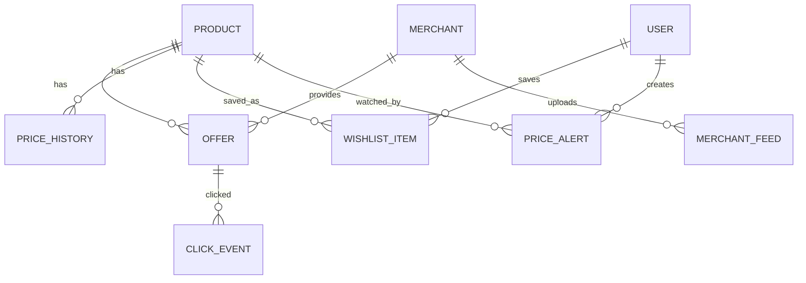
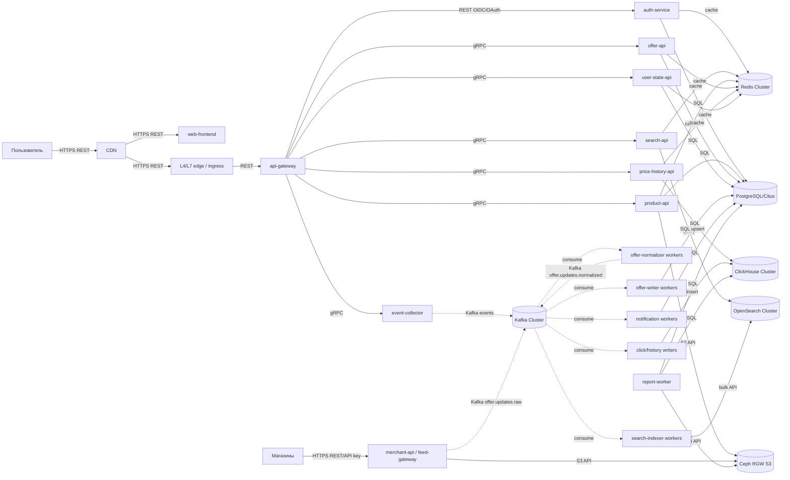

# Проектирование высоконагруженной системы: PriceCompare

Курсовой проект по дисциплине «Проектирование высоконагруженных систем».

PriceCompare — веб-сервис сравнения цен. Пользователь ищет товар, сравнивает предложения магазинов, смотрит историю цены, добавляет товар в избранное, создаёт уведомление о снижении цены и переходит в магазин для покупки.

## Содержание

1. [Тема и целевая аудитория](#1-тема-и-целевая-аудитория)
2. [Расчёт нагрузки](#2-расчёт-нагрузки)
3. [Глобальная балансировка нагрузки](#3-глобальная-балансировка-нагрузки)
4. [Локальная балансировка нагрузки](#4-локальная-балансировка-нагрузки)
5. [Логическая схема базы данных](#5-логическая-схема-базы-данных)
6. [Физическая схема базы данных](#6-физическая-схема-базы-данных)
7. [Алгоритмы](#7-алгоритмы)
8. [Технологии](#8-технологии)
9. [Обеспечение безопасности и надёжности](#9-обеспечение-безопасности-и-надёжности)
10. [Схема проекта](#10-схема-проекта)
11. [Список серверов](#11-список-серверов)
12. [Источники](#12-источники)

---

## 1. Тема и целевая аудитория

### 1.1. Краткое описание сервиса

PriceCompare проектируется как сервис сравнения цен по модели idealo. В рамках проекта рассматриваются только основные сценарии, необходимые для MVP:

1. поиск товара по строке, категории и фильтрам;
2. просмотр карточки товара;
3. просмотр предложений магазинов по выбранному товару;
4. просмотр истории цены;
5. добавление товара в избранное;
6. создание уведомления о снижении цены;
7. переход пользователя в магазин по выбранному предложению.

В работе используются следующие термины:

| Термин                 | Значение                                                                       |
|------------------------|--------------------------------------------------------------------------------|
| Товар                  | Нормализованная карточка товара в каталоге сервиса.                            |
| Предложение            | Конкретное предложение магазина: цена, доставка, наличие, ссылка на магазин.   |
| Магазин                | Продавец, передающий данные о товарах и ценах.                                 |
| История цены           | Временной ряд минимальной или агрегированной цены товара.                      |
| Уведомление о цене     | Пользовательское правило: уведомить при снижении цены ниже заданного значения. |
| Переход в магазин      | Событие перехода пользователя из PriceCompare на сайт магазина.                |
| Контур загрузки данных | Подсистема приёма, проверки и нормализации данных от магазинов.                |

### 1.2. Почему тема относится к высоконагруженным системам

В качестве ближайшего публичного аналога выбран idealo, так как это европейский сервис сравнения цен с близкой предметной областью. По публичному кейсу AWS idealo обслуживает более 72 млн посетителей в месяц и на пике поддерживает до 200 000 запросов в секунду к внутреннему хранилищу и до 60 000 обновлений в секунду [1]. В отчёте idealo за 2023 год указано, что сервис имеет более 2,5 млн посещений в день, около 50 000 магазинов и более 560 млн предложений [2]. В отдельных партнёрских материалах также указывается масштаб порядка сотен миллионов предложений и десятков тысяч магазинов [3].

Эти значения показывают, что даже минимальная версия сервиса должна учитывать:

1. большой каталог товаров и предложений;
2. интенсивный поток обновления цен и наличия;
3. высокую долю чтения со стороны пользователей;
4. необходимость отдельного поискового индекса;
5. необходимость кэширования популярных карточек и выдач;
6. хранение аналитических событий переходов в магазины.

### 1.3. Целевая аудитория

Основная целевая аудитория — пользователи, которые сравнивают цены перед покупкой бытовой техники, электроники, товаров для дома, одежды и других массовых категорий. Для расчётов используются метрики idealo как публичного аналога:

| Метрика                |                                         Значение | Основание                                                 |
|------------------------|-------------------------------------------------:|-----------------------------------------------------------|
| MAU                    |                 72 000 000 пользователей в месяц | AWS case study [1]                                        |
| DAU                    |                      2 500 000 посещений в сутки | idealo Sustainability Report 2023 [2]                     |
| Количество магазинов   |                                     около 50 000 | idealo Sustainability Report 2023 [2]                     |
| Количество предложений | более 560 млн; в отдельных материалах до 606 млн | idealo Sustainability Report и публичные материалы [2][3] |
| Количество стран       |                             6 европейских рынков | AWS case study [1]                                        |

Для дальнейших расчётов принимается более высокое значение `606 000 000` предложений. Это консервативное допущение: оно увеличивает оценку размера хранилища и нагрузки на контур обновления данных. Если преподаватель потребует использовать только официальные материалы idealo, это значение можно заменить на `560 000 000+` из Sustainability Report 2023; расчёты при этом уменьшатся примерно на `7,6%` [2].

---

## 2. Расчёт нагрузки

### 2.1. Исходные значения

Расчёт строится на публичных данных аналога и явно указанных инженерных допущениях.

| Параметр                                      |                  Значение | Тип значения                                                                            |
|-----------------------------------------------|--------------------------:|-----------------------------------------------------------------------------------------|
| MAU                                           |                72 000 000 | публичное значение [1]                                                                  |
| DAU                                           | 2 500 000 посещений/сутки | публичное значение [2]                                                                  |
| Среднее число просмотров страниц за посещение |                      4,48 | инженерное допущение для e-commerce-сценария; публичного значения для idealo не найдено |
| Количество предложений                        |               606 000 000 | публичное значение / консервативная оценка [2][3]                                       |
| Количество товаров                            |                 4 000 000 | инженерное допущение для MVP-каталога                                                   |
| Количество магазинов                          |                    50 000 | публичное значение [1][2]                                                               |
| Пиковые обновления предложений                |          60 000 updates/s | публичное значение из AWS case study [1]                                                |
| Пиковые внутренние запросы к offer store      |         200 000 queries/s | публичное значение из AWS case study [1]                                                |
| Коэффициент суточного пика                    |                       2,5 | инженерное допущение                                                                    |

Коэффициент суточного пика `2,5` выбран не как точное публичное значение, а как запас для проектирования. У сервиса сравнения цен трафик зависит от дневного цикла, рекламных кампаний и распродаж. Поэтому средний RPS недостаточен для выбора серверов и балансировщиков. В тексте это значение используется как инженерный коэффициент запаса, а не как метрика idealo.

### 2.2. Расчёт пользовательских действий

Количество просмотров страниц в сутки:

```text
PV_day = 2 500 000 * 4,48 = 11 200 000 page views/day
```

Для MVP принимается следующее распределение просмотров:

| Экран / действие               |                 Доля |            Расчёт | Значение в сутки |
|--------------------------------|---------------------:|------------------:|-----------------:|
| Поиск                          |       30% page views | 11 200 000 * 0,30 |        3 360 000 |
| Карточка товара                |       40% page views | 11 200 000 * 0,40 |        4 480 000 |
| Список предложений             |       20% page views | 11 200 000 * 0,20 |        2 240 000 |
| История цены                   |       10% page views | 11 200 000 * 0,10 |        1 120 000 |
| Переход в магазин              |        25% посещений |  2 500 000 * 0,25 |          625 000 |
| Добавление/удаление избранного |   1% карточек товара |  4 480 000 * 0,01 |           44 800 |
| Создание/удаление уведомления  | 0,5% карточек товара | 4 480 000 * 0,005 |           22 400 |

Переход от суточного объёма к RPS:

```text
RPS_avg = N_day / 86 400
RPS_peak = RPS_avg * 2,5
```

| Запрос                     |     N_day | RPS_avg |   RPS_peak |
|----------------------------|----------:|--------:|-----------:|
| Поиск                      | 3 360 000 |   38,89 |      97,22 |
| Карточка товара            | 4 480 000 |   51,85 |     129,63 |
| Список предложений         | 2 240 000 |   25,93 |      64,81 |
| История цены               | 1 120 000 |   12,96 |      32,41 |
| Избранное                  |    44 800 |    0,52 |       1,30 |
| Уведомления о цене         |    22 400 |    0,26 |       0,65 |
| Переход в магазин          |   625 000 |    7,23 |      18,08 |
| **Итого динамическое API** |         — |       — | **344,10** |

Итоговое значение `344,10 req/s` относится только к пользовательскому API. Оно не включает запросы к статике, изображениям и внутренний контур загрузки данных от магазинов.

### 2.3. Статика и сетевой трафик

По данным HTTP Archive Web Almanac 2024, медианная страница содержит 71 запрос на desktop и 66 запросов на mobile. Медианный вес страницы составляет 2 652 KB для desktop и 2 311 KB для mobile [4].

Для расчёта принимается доля mobile-трафика `58%`, так как в публичных материалах idealo указывается высокая доля мобильного пользовательского пути. Тогда среднее количество запросов на страницу:

```text
Requests_per_page = 0,58 * 66 + 0,42 * 71 = 68,1
Static_requests_day = 11 200 000 * 68,1 = 762 720 000 requests/day
Static_RPS_peak = 762 720 000 / 86 400 * 2,5 ≈ 22 069 req/s
```

Средний вес страницы:

```text
Page_weight = 0,58 * 2,311 MB + 0,42 * 2,652 MB = 2,454 MB
Traffic_day = 11 200 000 * 2,454 MB ≈ 27,49 TB/day
```

Средняя и пиковая полоса:

```text
BW_avg = 27,49 TB/day * 8 / 86 400 ≈ 2,55 Gbit/s
BW_peak = 2,55 * 2,5 ≈ 6,36 Gbit/s
```

Статика и изображения должны отдаваться через CDN. Для проектирования принимается целевой cache hit ratio CDN `95%` для статических ресурсов и оптимизированных изображений. Cache hit ratio определяется как отношение запросов, обслуженных из кэша, к общему числу запросов к кэшу; при hit ratio около `95%` только оставшаяся доля запросов уходит на origin [16]. Тогда:

| Показатель                         |     Значение |
|------------------------------------|-------------:|
| Общий трафик страниц               | 27,49 TB/day |
| Трафик через CDN при hit ratio 95% | 26,11 TB/day |
| Origin traffic при hit ratio 95%   |  1,37 TB/day |
| Пиковая полоса CDN                 |  6,04 Gbit/s |
| Пиковая полоса origin              |  0,32 Gbit/s |

Это приближение корректнее, чем делить трафик между origin и CDN только по количеству HTTP-запросов: HTML, JavaScript, CSS, изображения и шрифты имеют разный размер, поэтому распределение по числу запросов не отражает распределение байтов.

### 2.4. Контур обновления предложений

Для контура загрузки данных используется публичное пиковое значение idealo:

```text
Offer_updates_peak = 60 000 updates/s
```

Размер нормализованного события обновления предложения принимается равным `500 B`. Это инженерное допущение: в событие входят идентификаторы товара и магазина, цена, валюта, наличие, ссылка, версия данных и технические поля.

Пиковая входящая полоса:

```text
Ingestion_BW_peak = 60 000 * 500 B = 30 000 000 B/s ≈ 30 MB/s ≈ 0,24 Gbit/s
```

С учётом репликации Kafka с replication factor `3` внутренняя запись в брокеры создаёт примерно трёхкратный сетевой и дисковый объём. Для отказоустойчивых Kafka-топиков типовая конфигурация использует replication factor `3`, `min.insync.replicas = 2` и producer `acks=all`, чтобы запись считалась успешной только после подтверждения большинством синхронных реплик [15][26]:

```text
Kafka_internal_BW_peak ≈ 0,24 * 3 = 0,72 Gbit/s
```

Пиковое значение не используется как среднесуточное, потому что это привело бы к завышению хранилища. Для оценки буферов и аналитического хранилища отдельно принимается сценарий, где средняя нагрузка составляет 25% от пика:

```text
Offer_updates_avg = 60 000 * 0,25 = 15 000 updates/s
Raw_events_day = 15 000 * 500 B * 86 400 ≈ 648 GB/day
```

При коэффициенте сжатия ClickHouse 3–4 раза ожидаемый суточный объём сырых событий составляет примерно `162–216 GB/day`. Для хранения сырых событий 30 дней с двумя репликами требуется ориентировочно:

```text
Raw_events_30d_physical ≈ 162 GB/day * 30 * 2 = 9,72 TB
```

Для планирования принимается запас `15 TB` на сырые события обновления предложений за 30 дней.

### 2.5. Оценка объёма основных данных

| Тип данных            |  Количество | Размер элемента | Логический объём |
|-----------------------|------------:|----------------:|-----------------:|
| Предложения           | 606 000 000 |            2 KB |          1,21 TB |
| Товары                |   4 000 000 |            4 KB |            16 GB |
| Магазины              |      50 000 |            2 KB |           0,1 GB |
| История цены          |   4 000 000 |           12 KB |            48 GB |
| Профили пользователей |   7 200 000 |            1 KB |           7,2 GB |
| Избранное             | 144 000 000 |            24 B |          3,46 GB |
| Уведомления о цене    |  36 000 000 |            64 B |          2,30 GB |

Для физического sizing необходимо учитывать индексы, WAL/журналы, служебные данные, реплики и запас на рост. PostgreSQL использует WAL для записи изменений и восстановления после сбоев; этот же механизм применяется в continuous archiving и point-in-time recovery [19]. Для PostgreSQL/Citus принимается коэффициент `2,6` к логическому объёму: `1,3` на индексы и служебные структуры и `2` на основную реплику. Тогда для таблицы предложений:

```text
Offer_physical ≈ 1,21 TB * 2,6 ≈ 3,15 TB
```

С учётом роста и перераспределения шардов принимается запас не менее `5 TB` полезного SSD-объёма для хранилища актуальных предложений.

---

## 3. Глобальная балансировка нагрузки

### 3.1. Разделение доменов

Сервис разделяется на несколько доменов, так как трафик имеет разные свойства.

| Домен                           | Назначение                                                         | Тип трафика                        |
|---------------------------------|--------------------------------------------------------------------|------------------------------------|
| `www.pricecompare.example`      | сайт и HTML-страницы                                               | частично кэшируемый                |
| `api.pricecompare.example`      | карточки товара, предложения, история цены, избранное, уведомления | динамический                       |
| `search.pricecompare.example`   | поиск, подсказки, фильтры                                          | динамический, read-heavy           |
| `events.pricecompare.example`   | события переходов и аналитики                                      | write-heavy                        |
| `static.pricecompare.example`   | JS, CSS, шрифты, изображения                                       | CDN-кэшируемый                     |
| `merchant.pricecompare.example` | загрузка данных от магазинов                                       | write-heavy, внутренний B2B-контур |

Такое разделение позволяет независимо настраивать TTL, rate limiting, WAF-правила и маршрутизацию. Rate limiting применяется для ограничения частоты действий клиента в заданном временном окне и защиты API от злоупотреблений [21].

### 3.2. Расположение дата-центров

Так как основной аналог работает на европейских рынках, система проектируется для трёх европейских площадок:

1. Frankfurt — основной регион для Германии и Центральной Европы;
2. Amsterdam — резервный и балансирующий регион для Северной и Западной Европы;
3. Paris — дополнительный регион для Франции, Южной Европы и отказоустойчивости.

Все пользовательские контуры работают в active-active режиме. Запись в пользовательские таблицы маршрутизируется в ближайший доступный регион, но для данных, требующих строгой консистентности, используется лидерство на уровне конкретного шарда или домена данных.

### 3.3. DNS- и Anycast-балансировка

На глобальном уровне используются два механизма:

1. **GeoDNS / latency-based DNS** — возвращает пользователю ближайший доступный регион.
2. **Anycast для CDN и edge-слоя** — позволяет направлять запрос на ближайшую точку входа сети.

Anycast в CDN-сценариях обычно направляет входящие запросы в ближайший или наиболее подходящий дата-центр с учётом ёмкости и сетевого состояния [17]. DNS-балансировка подходит для выбора региона, но не обеспечивает мгновенное переключение при аварии из-за TTL и кэшей резолверов. Поэтому внутри каждого региона дополнительно используются L4/L7 балансировщики и health checks. Для DNS failover обычно используются health checks, которые исключают недоступный endpoint из ответов DNS [18].

### 3.4. Распределение трафика между регионами

Для нормального режима принимается следующее распределение:

| Регион    | Доля пользовательского трафика | Назначение             |
|-----------|-------------------------------:|------------------------|
| Frankfurt |                            50% | основной регион        |
| Amsterdam |                            30% | резерв и балансировка  |
| Paris     |                            20% | дополнительная ёмкость |

При отказе одного региона трафик перераспределяется между оставшимися регионами. Для этого каждый регион должен иметь запас ёмкости. Для пользовательского API целевая загрузка в нормальном режиме не должна превышать 60–65% доступной мощности, чтобы оставался резерв на аварийное перераспределение.

---

## 4. Локальная балансировка нагрузки

### 4.1. Схема балансировки внутри региона

В каждом регионе используется следующая цепочка обработки внешнего запроса:

```text
Пользователь
  -> CDN / edge
  -> региональный L4-балансировщик
  -> L7 reverse proxy / ingress
  -> Kubernetes Service
  -> pod приложения
```

L4-слой распределяет TCP/TLS-трафик между L7-балансировщиками. L7-слой выполняет маршрутизацию по `hostname` и `path`, завершение TLS для публичного API, первичный rate limiting, проверку заголовков и передачу запросов в Kubernetes. В Kubernetes `Service` используется как стабильная точка доступа к группе pod'ов и связанным `EndpointSlice` [25].

### 4.2. Резервирование балансировщиков

Для highload-системы двух L4-балансировщиков на регион недостаточно: при обслуживании, отказе узла или потере зоны такая схема быстро теряет запас. Поэтому принимается следующая production-конфигурация:

| Компонент                       | Количество на регион | Размещение                 | Обоснование                                          |
|---------------------------------|---------------------:|----------------------------|------------------------------------------------------|
| L4 edge-балансировщик           |                    6 | по 2 узла в каждой из 3 AZ | отказ одного узла или одной зоны не отключает регион |
| L7 reverse proxy / ingress      |                6 pod | по 2 pod в каждой из 3 AZ  | есть запас на rolling update и отказ pod/node        |
| Ingress controller в Kubernetes |                6 pod | по 2 pod в каждой из 3 AZ  | ingress не становится single point of failure        |

Минимально допустимая конфигурация для учебного стенда — 3 L7/ingress pod на регион, по одному pod на зону. Для production-расчёта используется 6 pod на регион, то есть по два экземпляра на зону.

Для L7-пула используется формула:

```text
N = ceil(RPS_peak_region / RPS_per_node / target_utilization) + reserve
```

Где:

- `RPS_peak_region` — пиковый RPS региона;
- `RPS_per_node` — безопасная производительность одного L7-узла после нагрузочного тестирования;
- `target_utilization` — целевая загрузка, в проекте не выше `0,60–0,65`;
- `reserve` — резерв на отказ узла и rolling update.

Даже если расчёт по RPS даёт меньше трёх экземпляров, для production-режима принимается минимум по одному экземпляру на каждую зону доступности. При rolling update Deployment постепенно создаёт новую ReplicaSet и уменьшает старую; параметры `maxUnavailable` и `maxSurge` ограничивают временную потерю доступности и избыточное число pod'ов [28].

### 4.3. Расчёт для пользовательского API

Пиковый RPS динамического пользовательского API:

```text
API_RPS_peak = 344,10 req/s
```

Для основного региона Frankfurt при доле 50%:

```text
API_RPS_peak_Frankfurt = 344,10 * 0,5 = 172,05 req/s
```

Даже с запасом `x5` основной регион получает:

```text
API_RPS_peak_Frankfurt_x5 = 172,05 * 5 ≈ 860 req/s
```

Это значение не является высоким для L7-балансировщика. Поэтому количество L4/L7 экземпляров выбирается не по предельному RPS, а по отказоустойчивости, распределению по зонам и возможности выполнять rolling update без потери доступности.

Для статических ресурсов основной объём должен обслуживаться CDN. Origin-слой проектируется на пиковую полосу около `0,32 Gbit/s` после CDN-кэширования. Это значение также не требует большого числа балансировщиков, но требует резервирования и защиты origin от cache miss storm.

### 4.4. Типы взаимодействия на уровне балансировки

На границе системы используются синхронные HTTP/HTTPS-запросы. Внутри Kubernetes внешние REST-запросы попадают в `api-gateway`, после чего gateway вызывает доменные сервисы по gRPC. Асинхронные операции, например запись событий кликов, обновление поискового индекса и обработка feed-файлов магазинов, выполняются через Kafka.

В схемах ниже используется следующее обозначение:

```text
сплошная стрелка  -->  синхронный REST/gRPC-запрос
пунктирная стрелка -.-> асинхронное событие Kafka
```

---

## 5. Логическая схема базы данных

### 5.1. Основные сущности

Логическая модель разделяется на каталожные данные, пользовательские данные, события и служебные данные.



### 5.2. Таблицы каталога

| Таблица               | Назначение                       | Ключ                         |
|-----------------------|----------------------------------|------------------------------|
| `products`            | нормализованные товары           | `product_id`                 |
| `product_attributes`  | характеристики товаров           | `(product_id, attribute_id)` |
| `categories`          | дерево категорий                 | `category_id`                |
| `merchants`           | магазины                         | `merchant_id`                |
| `offers_current`      | актуальные предложения магазинов | `(product_id, merchant_id)`  |
| `price_history_daily` | дневная история минимальной цены | `(product_id, date)`         |

### 5.3. Пользовательские таблицы

| Таблица                        | Назначение                                           | Ключ                     |
|--------------------------------|------------------------------------------------------|--------------------------|
| `users`                        | учётные записи                                       | `user_id`                |
| `auth_sessions`                | серверные refresh-сессии пользователя                | `session_id`             |
| `refresh_token_families`       | семейства refresh token для rotation/reuse detection | `family_id`              |
| `wishlist_items`               | избранные товары                                     | `(user_id, product_id)`  |
| `price_alerts_user`            | пользовательские правила уведомлений                 | `alert_id`               |
| `price_alert_rules_by_product` | проекция правил для проверки по товару               | `(product_id, alert_id)` |
| `notification_outbox`          | очередь уведомлений                                  | `event_id`               |

### 5.4. Событийные таблицы

| Таблица               | Назначение                           | Основные поля                                                             |
|-----------------------|--------------------------------------|---------------------------------------------------------------------------|
| `click_events`        | переходы пользователей в магазины    | `event_id`, `product_id`, `offer_id`, `merchant_id`, `created_at`         |
| `offer_update_events` | сырые события обновления предложений | `merchant_id`, `external_offer_id`, `price`, `availability`, `created_at` |
| `search_events`       | события поиска                       | `query`, `filters`, `created_at`                                          |

Событийные таблицы не должны находиться в основной OLTP-базе. Они имеют высокий объём записи и используются для аналитики, антифрода, отчётности и пересчёта агрегатов. Поэтому для них выбран ClickHouse: колоночное хранение и семейство MergeTree лучше подходят для больших append-only таблиц и аналитических запросов по времени [12][27].

### 5.5. Требования к консистентности

| Данные                 | Требование                                                                                                       |
|------------------------|------------------------------------------------------------------------------------------------------------------|
| Профиль пользователя   | строгая консистентность в пределах записи пользователя                                                           |
| Авторизационные сессии | строгая консистентность при refresh/logout, короткий Redis-кэш допустим только как производная модель            |
| Избранное              | read-after-write для пользователя                                                                                |
| Уведомления о цене     | консистентность при создании правила в пользовательской таблице, асинхронное обновление проекции по `product_id` |
| Актуальные предложения | eventual consistency допустима в пределах секунд или минут                                                       |
| Поисковый индекс       | eventual consistency допустима                                                                                   |
| История цены           | асинхронное обновление, допустима задержка агрегации                                                             |
| Click events           | at-least-once запись с дедупликацией по `event_id`                                                               |

Такая модель консистентности соответствует разделению на OLTP-операции, где важна транзакционность, и асинхронные read models, которые могут пересобираться из журналов событий. Для write-heavy потоков используется Kafka с партициями и репликацией [15][26], а для аналитических read models — ClickHouse и OpenSearch [12][13].

---

## 6. Физическая схема базы данных

### 6.1. Принципы выбора хранилищ

### 6.1. Принципы выбора хранилищ

| Контур                        | Хранилище           | Краткое обоснование                                                                                          |
|-------------------------------|---------------------|--------------------------------------------------------------------------------------------------------------|
| Пользовательские данные       | PostgreSQL + Citus  | Нужны транзакции, SQL, индексы, связи между таблицами и шардирование по пользователю.                        |
| Актуальные предложения        | PostgreSQL + Citus  | Нужны быстрые `upsert`, индексы и распределение сотен миллионов предложений по `product_id`.                 |
| Поиск товаров                 | OpenSearch          | Нужны полнотекстовый поиск, фильтры, фасеты, сортировка и отдельный поисковый индекс.                        |
| События и аналитика           | ClickHouse          | Нужны быстрые вставки, хранение событий, временные ряды и агрегации по большим объёмам данных.               |
| Кэш и rate limiting           | Redis Cluster       | Нужны быстрый доступ по ключу, TTL, атомарные операции и распределение нагрузки между узлами.                |
| Очереди и потоковая обработка | Apache Kafka        | Нужны буферизация событий, партиционирование, повторное чтение и параллельная обработка consumers.           |
| Объектное хранилище           | Ceph Object Gateway | Нужны хранение файлов, S3-совместимый API, масштабирование по дискам и отдельные политики доступа.           |
| Авторизационные сессии        | PostgreSQL + Redis  | PostgreSQL хранит refresh-сессии как источник истины, Redis ускоряет краткоживущие проверки и отзыв токенов. |

### 6.1.1. Обоснование выбора конкретных технологий

| Хранилище                                     | Почему выбран именно этот вариант                                                                                                                                                                                                   |
|-----------------------------------------------|-------------------------------------------------------------------------------------------------------------------------------------------------------------------------------------------------------------------------------------|
| PostgreSQL + Citus                            | PostgreSQL — зрелая open-source СУБД с транзакциями, SQL, индексами и большой экспертизой на рынке. Citus добавляет горизонтальное шардирование и co-location связанных таблиц, поэтому подходит для распределённой OLTP-модели.    |
| OpenSearch                                    | Open-source поисковая система, совместимая с типовыми сценариями полнотекстового поиска, фасетов и фильтрации. Хорошо подходит как отдельная read model для каталога товаров.                                                       |
| ClickHouse                                    | Open-source колоночная СУБД, хорошо подходящая для событий, временных рядов и аналитических запросов. Эффективно сжимает данные и быстро считает агрегаты по большим таблицам.                                                      |
| Redis Cluster                                 | Распространённое open-source key-value хранилище с очень низкой задержкой. В cluster-режиме распределяет ключи между узлами и подходит для кэша, счётчиков и rate limiting.                                                         |
| Apache Kafka                                  | Промышленный стандарт для потоковой обработки событий. Поддерживает партиции, consumer groups, репликацию, replay событий и хорошо подходит для ingestion-контура.                                                                  |
| Ceph Object Gateway                           | Open-source S3-совместимое объектное хранилище для собственной инфраструктуры. Масштабируется добавлением OSD-узлов, поддерживает bucket policies, lifecycle rules и multisite-репликацию.                                          |
| PostgreSQL + Redis для авторизационных сессий | PostgreSQL выбран для надёжного хранения refresh-сессий, token family и признаков отзыва. Redis используется только как быстрый вспомогательный слой для коротких проверок, чтобы не превращать его в единственный источник истины. |

### 6.2. Физическое распределение таблиц

| Таблица / данные               | Хранилище                        | Шардирование / партиционирование                                                 | Репликация                   |
|--------------------------------|----------------------------------|----------------------------------------------------------------------------------|------------------------------|
| `users`                        | PostgreSQL/Citus                 | `user_id`                                                                        | 1 primary + 1 replica        |
| `auth_sessions`                | PostgreSQL/Citus                 | `user_id`, партиции по `created_at`                                              | 1 primary + 1 replica        |
| `refresh_token_families`       | PostgreSQL/Citus                 | `user_id`                                                                        | 1 primary + 1 replica        |
| `wishlist_items`               | PostgreSQL/Citus                 | `user_id`, ключ `(user_id, product_id)`                                          | 1 primary + 1 replica        |
| `price_alerts_user`            | PostgreSQL/Citus                 | `user_id`                                                                        | 1 primary + 1 replica        |
| `price_alert_rules_by_product` | PostgreSQL/Citus                 | `product_id`                                                                     | 1 primary + 1 replica        |
| `products`                     | PostgreSQL/Citus                 | `product_id`                                                                     | 1 primary + 1 replica        |
| `offers_current`               | PostgreSQL/Citus                 | `product_id`                                                                     | 1 primary + 1 replica        |
| `merchants`                    | PostgreSQL/Citus reference table | полная копия на worker nodes                                                     | репликация reference table   |
| `categories`                   | PostgreSQL/Citus reference table | полная копия на worker nodes                                                     | репликация reference table   |
| `price_history_daily`          | ClickHouse                       | `PARTITION BY toYYYYMM(date)`, `ORDER BY (product_id, date)`                     | 2 реплики                    |
| `offer_update_events`          | ClickHouse                       | партиции по дню, сортировка по `(merchant_id, created_at, external_offer_id)`    | 2 реплики                    |
| `click_events`                 | ClickHouse                       | партиции по дню, сортировка по `(created_at, product_id, merchant_id, event_id)` | 2 реплики                    |
| поисковые документы            | OpenSearch                       | primary shards по индексу                                                        | 1 replica shard              |
| изображения и файлы            | Ceph RGW                         | bucket + CRUSH-распределение Ceph                                                | replication / erasure coding |
| кэш карточек и выдач           | Redis Cluster                    | 16 384 hash slots                                                                | master + replica             |

### 6.3. Шардирование PostgreSQL/Citus

Citus использует distribution column для распределения строк по шардам. Выбор этого столбца критичен: при правильном выборе связанные данные оказываются на одних и тех же worker nodes, что ускоряет join-запросы и уменьшает межузловой обмен [10]. Документация Citus также рекомендует выбирать столбец с высокой кардинальностью и частым использованием в фильтрах или join-условиях, а небольшие справочники выносить в reference tables [10][11].

#### 6.3.1. Каталог и предложения

Для каталожного контура основным ключом шардирования является `product_id`.

```sql
SELECT create_distributed_table('products', 'product_id');
SELECT create_distributed_table('offers_current', 'product_id', colocate_with => 'products');
```

Обоснование:

1. карточка товара почти всегда запрашивает товар и его предложения вместе;
2. список предложений строится по `product_id`;
3. co-location позволяет выполнять join `products` и `offers_current` локально на worker node;
4. `product_id` имеет высокую кардинальность, поэтому лучше распределяет данные по шардам.

Таблицы `merchants` и `categories` являются справочниками. Они существенно меньше таблицы предложений, поэтому размещаются как reference tables. Reference table копируется на worker nodes и может участвовать в локальных join-запросах [10][11].

```sql
SELECT create_reference_table('merchants');
SELECT create_reference_table('categories');
```

#### 6.3.2. Пользовательские данные и риск горячих пользователей

Пользовательские таблицы нельзя шардировать «просто по первичному ключу» каждой таблицы. Если `wishlist_items` шардировать по `product_id`, то запрос «показать избранное пользователя» превратится в scatter-gather по многим шардам. Поэтому пользовательские таблицы, которые читаются в контексте пользователя, распределяются по `user_id` и colocate'ятся с `users`:

```sql
SELECT create_distributed_table('users', 'user_id');
SELECT create_distributed_table('wishlist_items', 'user_id', colocate_with => 'users');
SELECT create_distributed_table('price_alerts_user', 'user_id', colocate_with => 'users');
SELECT create_distributed_table('auth_sessions', 'user_id', colocate_with => 'users');
```

Риск: если один пользователь создаст очень большой wishlist, его записи окажутся на одном логическом шарде. Для B2C-сервиса этот риск ограничивается продуктовой политикой и техническими лимитами:

1. wishlist ограничивается, например, `1000` товарами на пользователя;
2. выдача избранного всегда постраничная;
3. операции над wishlist используют ключ `(user_id, product_id)`;
4. для аномально больших B2B/служебных аккаунтов применяется отдельный tenant/dedicated shard или отдельный список с bucket-ключом.

Таким образом, `user_id` остаётся основным distribution column для пользовательского read-path, а риск «горячего пользователя» контролируется лимитами и мониторингом. Для обычного пользователя это лучше, чем scatter-gather на каждом чтении избранного.

#### 6.3.3. Уведомления о цене: две проекции

У уведомлений есть два разных сценария:

1. пользователь создаёт, удаляет и смотрит свои уведомления;
2. обработчик изменения цены ищет все правила по конкретному `product_id`.

Один ключ шардирования не покрывает оба сценария. Поэтому используются две проекции:

| Таблица                        | Ключ шардирования | Назначение                                      |
|--------------------------------|-------------------|-------------------------------------------------|
| `price_alerts_user`            | `user_id`         | управление уведомлениями в личном кабинете      |
| `price_alert_rules_by_product` | `product_id`      | быстрый подбор правил при изменении цены товара |

`price_alerts_user` является пользовательским источником истины. `price_alert_rules_by_product` обновляется асинхронно через outbox/Kafka и используется worker'ом уведомлений. Это убирает scatter-gather из сценария проверки уведомлений по товару.

#### 6.3.4. Почему не один общий ключ шардирования

Нельзя выбрать один универсальный ключ для всех таблиц без ухудшения части запросов. Если шардировать `offers_current` по `merchant_id`, то обновления от магазинов были бы удобнее, но чтение карточки товара потребовало бы собирать предложения по разным шардам. Так как пользовательский read-path является основным продуктовым сценарием, для актуальных предложений выбран `product_id`.

Для merchant ingestion используется отдельный поток: входные события сначала попадают в Kafka и ClickHouse, затем нормализаторы обновляют `offers_current` по `product_id`. Это отделяет B2B-загрузку от пользовательского чтения.

#### 6.3.5. Количество шардов

Для `offers_current` принимается `256` логических шардов Citus. Это значение больше числа физических worker nodes и оставляет возможность добавлять worker nodes без полной смены модели данных.

При `606 000 000` предложений:

```text
Rows_per_shard = 606 000 000 / 256 ≈ 2 367 188 rows/shard
Logical_size_per_shard = 1,21 TB / 256 ≈ 4,73 GB/shard
```

Размер одного логического шарда остаётся управляемым. При увеличении числа worker nodes шарды можно перераспределять между узлами.

Для пользовательских таблиц принимается `128` логических шардов, так как их объём существенно меньше:

```text
Users_per_shard = 7 200 000 / 128 ≈ 56 250 users/shard
```

### 6.4. Шардирование ClickHouse

ClickHouse используется для событий и временных рядов. Для таблиц ClickHouse применяется семейство MergeTree. В документации ClickHouse указано, что для большинства случаев не следует делать слишком гранулярные партиции; для временных данных обычно подходят месячные или дневные партиции в зависимости от объёма [12][27].

Для истории цен:

```sql
PARTITION BY toYYYYMM(date)
ORDER BY (product_id, date)
```

Для событий переходов:

```sql
PARTITION BY toYYYYMMDD(created_at)
ORDER BY (created_at, product_id, merchant_id, event_id)
```

Для сырых обновлений предложений:

```sql
PARTITION BY toYYYYMMDD(created_at)
ORDER BY (merchant_id, created_at, external_offer_id)
```

Репликация задаётся на уровне таблиц `ReplicatedMergeTree`. В ClickHouse репликация работает на уровне отдельных таблиц, а каждый shard имеет независимую репликацию [12].

### 6.5. Шардирование OpenSearch

OpenSearch используется как read model для поиска. Индекс `products_search_vN` содержит подготовленный документ товара: название, категория, бренд, характеристики, минимальная цена, количество предложений и агрегированные поля для фильтров.

Для индекса принимается:

```json
{
  "index.number_of_shards": 24,
  "index.number_of_replicas": 1
}
```

Обоснование:

1. OpenSearch требует указать число primary shards при создании индекса; `index.number_of_shards` относится к статическим настройкам индекса, а `index.number_of_replicas` может задавать число replica shards [13];
2. реплика `1` позволяет продолжать поиск при отказе одного data node;
3. 24 primary shards достаточно для распределения индекса по 6–12 data nodes;
4. при росте каталога используется новый индекс `products_search_vN+1` и атомарное переключение alias.

### 6.6. Объектное хранилище S3

Для изображений товаров и файлов магазинов используется Ceph Object Gateway. Bucket в S3 — это логический контейнер для объектов: изображений, feed-файлов, отчётов и резервных копий. Разные bucket'ы нужны, потому что у этих данных разные права доступа, сроки хранения и lifecycle policy.

| Bucket                  | Назначение                                | Примеры объектов                                                                     | Политика хранения                                               |
|-------------------------|-------------------------------------------|--------------------------------------------------------------------------------------|-----------------------------------------------------------------|
| `pc-product-images`     | оптимизированные изображения товаров      | `products/123/main.webp`, `products/123/thumb_300.webp`, `products/123/original.jpg` | длительное хранение, versioning только для служебных обновлений |
| `pc-merchant-raw-feeds` | исходные файлы магазинов                  | `merchant_id=1024/date=2026-04-24/feed.xml`, `validation_errors.json`                | TTL 30–90 дней                                                  |
| `pc-export-reports`     | выгрузки и отчёты                         | `merchants/1024/monthly/2026-03/clickout_report.csv`                                 | TTL по требованиям отчётности, доступ через signed URL          |
| `pc-backups`            | резервные копии конфигураций и метаданных | `postgres/base/...`, `opensearch/snapshots/...`, `configs/...`                       | отдельный доступ, encryption, lifecycle policy                  |

Расчёт для изображений:

```text
Products = 4 000 000
Images_per_product = 3
Optimized_image_size = 120 KB
Images_logical = 4 000 000 * 3 * 120 KB = 1 440 000 000 KB ≈ 1,44 TB
```

С учётом исходных изображений, версий, служебных файлов, индексов и роста принимается логический запас `5 TB`. При трёхкратной репликации и запасе 30%:

```text
S3_physical = 5 TB * 3 * 1,3 = 19,5 TB
```

Для расчёта серверов в разделе 11 дополнительно учитывается рост на один год. Доступ приложений к объектам выполняется через RGW gateway, а фактическое размещение объектов управляется Ceph Storage Cluster [8][23].

### 6.7. Кэширование и rate limiting

Redis Cluster используется для:

1. кэша карточек товара;
2. кэша популярных поисковых выдач;
3. распределённого rate limiting;
4. краткоживущих служебных ключей.

Redis Cluster распределяет ключевое пространство по 16 384 hash slots. Каждый master node отвечает за часть slots, а replica node может быть повышена до master при отказе [14].

Примеры ключей:

```text
product:{product_id}:card
product:{product_id}:offers
search:{query_hash}:page:{page}
ratelimit:{client_id}:{endpoint}:{window}
```

TTL `1–60 секунд` относится **только к ключам rate limiting**, а не к пользовательским сессиям. Например, для ограничения `100 запросов в минуту` создаётся короткоживущий счётчик или token bucket с TTL около длины окна. Redis подходит для такого сценария, потому что token bucket можно реализовать атомарно через Lua-скрипт [35]. На edge-уровне дополнительно может использоваться локальный Envoy rate limit filter, который возвращает `429`, если в token bucket нет доступных токенов [36].

| Данные                                |                       TTL |
|---------------------------------------|--------------------------:|
| карточка товара                       |                5–15 минут |
| список предложений                    |                 1–5 минут |
| поисковая выдача                      |                1–10 минут |
| rate limiting counters / token bucket |               1–60 секунд |
| кэш отозванных session/token version  | до истечения access token |

Пользовательская сессия не хранится 1–60 секунд. Access token короткоживущий, а refresh-сессия хранится отдельно в авторизационном контуре и имеет срок жизни порядка недель.

### 6.8. Резервное копирование

| Хранилище        | Способ резервного копирования                                    |               RPO |               RTO |
|------------------|------------------------------------------------------------------|------------------:|------------------:|
| PostgreSQL/Citus | base backup + WAL archiving / PITR                               |        5–15 минут |          1–2 часа |
| ClickHouse       | snapshot + репликация + TTL raw events                           |         до 1 часа |          2–4 часа |
| OpenSearch       | snapshot индексов в S3                                           |             1 час |          1–3 часа |
| Ceph RGW         | multisite / snapshot / lifecycle                                 | зависит от bucket | зависит от bucket |
| Redis            | RDB/AOF только для служебных данных; кэш считается восстановимым |       до 15 минут |            минуты |
| Kafka            | replication factor 3 + retention                                 |  зависит от topic |            минуты |

Кэш Redis и поисковый индекс OpenSearch не являются единственным источником истины. При полной потере они восстанавливаются из PostgreSQL/Citus, ClickHouse и Kafka. Для PostgreSQL выбран base backup вместе с WAL archiving, так как этот подход позволяет восстановить кластер и затем проиграть WAL до нужной точки времени [19].

---

## 7. Алгоритмы

### 7.1. Поиск товаров

Поиск выполняется через OpenSearch. В индекс заранее помещается документ товара с нормализованными полями. Выбор OpenSearch связан с тем, что поисковый индекс может масштабироваться через primary/replica shards и хранить заранее подготовленную read model для полнотекстового поиска и фасетов [13]:

```text
product_id, title, brand, category_id, attributes, min_price, offer_count, popularity_score
```

Этапы поиска:

1. нормализация запроса пользователя;
2. полнотекстовый поиск по названию, бренду и категории;
3. применение фильтров;
4. сортировка по релевантности, цене или популярности;
5. получение `product_id` из OpenSearch;
6. дозагрузка карточек из кэша или PostgreSQL/Citus.

Такое разделение нужно, потому что PostgreSQL не должен обслуживать тяжёлый полнотекстовый поиск по всему каталогу. Основная OLTP-база хранит источник истины, а OpenSearch хранит поисковую read model.

### 7.2. Обновление предложений

Обновление предложений выполняется асинхронно:

```text
merchant feed/API
  -> validation
  -> Kafka topic offer.updates.raw
  -> normalizer
  -> Kafka topic offer.updates.normalized
  -> offer writer
  -> PostgreSQL/Citus offers_current
  -> Kafka topic search.reindex.product
  -> OpenSearch updater
```

События в Kafka партиционируются по ключу:

```text
partition_key = hash(product_id)
```

Для событий, где `product_id` ещё неизвестен, временно используется:

```text
partition_key = hash(merchant_id, external_offer_id)
```

После сопоставления внешнего предложения с каноническим товаром событие получает `product_id`.

Kafka использует partitions как единицу параллелизма и replication factor для отказоустойчивости [15]. Для production-настроек дополнительно принимаются `acks=all` и `min.insync.replicas = 2`, так как такая связка с replication factor `3` обеспечивает подтверждение записи большинством синхронных реплик [26]. Для topic `offer.updates.normalized` принимается 384 partitions. При пике 60 000 сообщений/с средняя нагрузка на partition:

```text
60 000 / 384 ≈ 156 messages/s/partition
```

Это значение оставляет запас для параллельной обработки и увеличения числа consumer instances.

Для основных топиков принимаются следующие параметры:

| Topic                      | Partitions | Replication factor | min.insync.replicas | Ключ партиционирования                |
|----------------------------|-----------:|-------------------:|--------------------:|---------------------------------------|
| `offer.updates.raw`        |        384 |                  3 |                   2 | `merchant_id` / внешний идентификатор |
| `offer.updates.normalized` |        384 |                  3 |                   2 | `product_id`                          |
| `click.events`             |         96 |                  3 |                   2 | `event_id` / `product_id`             |
| `price.min.changed`        |         96 |                  3 |                   2 | `product_id`                          |

Связка replication factor `3`, `min.insync.replicas = 2` и producer `acks=all` выбрана как компромисс между доступностью и сохранностью сообщений [26].

### 7.3. Дедупликация событий

Для событий переходов и обновлений используется идентификатор события:

```text
event_id = UUIDv7 или hash(source, external_id, timestamp_bucket, payload_hash)
```

Дедупликация выполняется на двух уровнях:

1. в Kafka consumers — краткоживущий Redis/set или локальный state store для повторов в пределах окна;
2. в целевом хранилище — уникальный ключ или idempotent upsert.

Для `offers_current` используется idempotent upsert по ключу:

```text
(product_id, merchant_id)
```

Если новое событие имеет более старую версию или timestamp, оно не должно перезаписывать актуальное предложение.

### 7.4. История цены

История цены не строится из каждого пользовательского запроса. Она пересчитывается асинхронно из обновлений предложений. Для хранения временных рядов используется ClickHouse с партиционированием по времени и сортировкой по ключам запроса [12][27].

На уровне товара хранится дневная агрегированная цена:

```text
(product_id, date, min_price, median_price, offer_count)
```

Для карточки товара достаточно получить готовый временной ряд из ClickHouse или материализованной витрины. Это снижает нагрузку на `offers_current`.

### 7.5. Уведомления о цене

Проверка уведомлений выполняется не полным сканированием всех правил, а через поток обновления предложений:

1. пришло обновление минимальной цены товара;
2. событие попало в topic `price.min.changed`;
3. consumer получает активные правила по `product_id`;
4. подходящие уведомления записываются в `notification_outbox`;
5. отдельный сервис отправляет email/push/Telegram-уведомление.

Для ускорения проверки активных правил используется отдельная проекция `price_alert_rules_by_product`, шардированная по `product_id`. Такой подход сохраняет нагрузку локальной: worker проверяет только правила, связанные с конкретным товаром, а не выполняет scatter-gather по пользовательской таблице уведомлений.

```sql
CREATE INDEX idx_price_alert_rules_product_threshold
ON price_alert_rules_by_product (product_id, target_price)
WHERE status = 'active';
```

---

## 8. Технологии

| Задача            | Технология                                    | Обоснование                                                                                                                                                       |
|-------------------|-----------------------------------------------|-------------------------------------------------------------------------------------------------------------------------------------------------------------------|
| Backend API       | Go                                            | высокая производительность, простая конкурентность, удобство для микросервисов                                                                                    |
| Public API        | REST/JSON + OpenAPI                           | простота интеграции и документирования                                                                                                                            |
| Внутренние вызовы | gRPC                                          | строгие контракты, эффективная сериализация                                                                                                                       |
| Frontend          | React / Next.js                               | SSR/SPA для пользовательского сайта                                                                                                                               |
| Контейнеризация   | Docker                                        | единый формат поставки сервисов                                                                                                                                   |
| Оркестрация       | Kubernetes                                    | управление репликами, rolling updates, service discovery; Deployment и Service являются базовыми механизмами управления workload'ами и доступом к pod'ам [25][28] |
| Ingress           | NGINX Ingress или Envoy Gateway               | L7-маршрутизация и TLS termination                                                                                                                                |
| Очереди           | Apache Kafka                                  | потоковая обработка, partitions, replication factor, `acks=all` и `min.insync.replicas` для отказоустойчивой записи [15][26]                                      |
| OLTP              | PostgreSQL + Citus                            | SQL, транзакции, горизонтальное шардирование; ключ шардирования выбирается по основным фильтрам и join-условиям [10][11]                                          |
| Поиск             | OpenSearch                                    | полнотекстовый поиск и фасеты; индекс масштабируется через primary и replica shards [13]                                                                          |
| Аналитика         | ClickHouse                                    | колоночное хранение, MergeTree, партиционирование по времени и репликация таблиц [12][27]                                                                         |
| Кэш               | Redis Cluster                                 | низкая задержка и распределение ключей по 16 384 hash slots [14]                                                                                                  |
| Object storage    | Ceph RGW                                      | S3-совместимое open-source хранилище поверх Ceph Storage Cluster [8][23]                                                                                          |
| Мониторинг        | Prometheus + Grafana                          | метрики и дашборды для контроля RPS, задержек, ошибок и ёмкости                                                                                                   |
| Логи              | Loki или OpenSearch Dashboards                | централизованный просмотр логов                                                                                                                                   |
| Трейсинг          | OpenTelemetry + Jaeger/Tempo                  | анализ распределённых запросов через trace/span модель [22]                                                                                                       |
| Secrets           | HashiCorp Vault или External Secrets Operator | централизованное управление секретами; секреты не должны храниться в Git                                                                                          |
| CI/CD             | GitLab CI/CD                                  | сборка, тесты, деплой в Kubernetes                                                                                                                                |

Выбор технологий ориентирован на возможность самостоятельного развёртывания. Managed-сервисы в работе не являются обязательными, так как задача курсового проекта — показать архитектуру и расчёт собственной инфраструктуры. Для компонентов, где выбор основан на конкретных свойствах технологии, ссылки приведены непосредственно в таблице и в разделах 6–9.

---

## 9. Обеспечение безопасности и надёжности

### 9.1. Зоны доступности Kubernetes

В каждом регионе Kubernetes-кластер разворачивается минимум в трёх зонах доступности. Kubernetes рекомендует при высокой доступности использовать не менее трёх failure zones и размещать компоненты control plane по разным зонам [5]. Для пользовательских workload'ов применяются `topologySpreadConstraints`, которые позволяют распределять pod'ы по failure domains, включая зоны и узлы [6].

Для stateless-сервисов принимаются правила:

1. минимум 3 реплики production-сервиса;
2. для критичных сервисов — 6 реплик, по 2 на зону;
3. распределение pod'ов по зонам через `topology.kubernetes.io/zone`;
4. распределение по узлам через `kubernetes.io/hostname`;
5. `PodDisruptionBudget`, чтобы voluntary disruptions не удаляли слишком много pod'ов одновременно [7];
6. `readinessProbe` и `livenessProbe` для исключения неготовых pod'ов из балансировки и перезапуска зависших контейнеров [24].

Пример фрагмента Deployment:

```yaml
spec:
  replicas: 6
  strategy:
    type: RollingUpdate
    rollingUpdate:
      maxUnavailable: 1
      maxSurge: 1
  template:
    metadata:
      labels:
        app: product-api
    spec:
      topologySpreadConstraints:
        - maxSkew: 1
          topologyKey: topology.kubernetes.io/zone
          whenUnsatisfiable: DoNotSchedule
          labelSelector:
            matchLabels:
              app: product-api
        - maxSkew: 1
          topologyKey: kubernetes.io/hostname
          whenUnsatisfiable: ScheduleAnyway
          labelSelector:
            matchLabels:
              app: product-api
```

Пример PodDisruptionBudget:

```yaml
apiVersion: policy/v1
kind: PodDisruptionBudget
metadata:
  name: product-api-pdb
spec:
  minAvailable: 4
  selector:
    matchLabels:
      app: product-api
```

PDB ограничивает число pod'ов, которые могут быть одновременно недоступны при добровольных disruptions, например при drain узла [7].

### 9.2. Авторизация и управление сессиями

Авторизация нужна, потому что в системе есть персональные сценарии: избранное, уведомления о цене, отчёты магазинов и merchant API. Публичный поиск и просмотр карточек могут быть доступны анонимно, но все операции с пользовательским состоянием и B2B-интеграциями требуют аутентификации.

Используется отдельный `auth-service`:

1. пользователь проходит login через Authorization Code + PKCE;
2. `auth-service` выдаёт короткоживущий access token в формате JWT;
3. refresh token является opaque-токеном, хранится на клиенте в `HttpOnly Secure SameSite` cookie;
4. в базе хранится только hash refresh token и token family;
5. при refresh выполняется rotation: старый refresh token инвалидируется, новый выдаётся вместе с новым access token;
6. для параллельных refresh-запросов из нескольких вкладок используется небольшой leeway window, чтобы не «кирпичить» клиента из-за гонки запросов;
7. при повторном использовании уже инвалидированного refresh token вся token family отзывается, а пользователь должен пройти повторную аутентификацию.

Такой подход нужен потому, что один только JWT не решает все задачи безопасности. Если access token является самодостаточным JWT, его нельзя мгновенно отозвать без дополнительного состояния до истечения срока жизни. Поэтому access token делается короткоживущим, а долгоживущая сессия контролируется через refresh token rotation и server-side session store. OAuth 2.0 Security BCP описывает современные требования к безопасности OAuth 2.0 [30], а refresh token rotation с reuse detection является распространённой практикой для снижения риска replay-атак [31].

Принятые параметры:

| Параметр               |                 Значение | Обоснование                                                         |
|------------------------|-------------------------:|---------------------------------------------------------------------|
| Access token TTL       |              10–15 минут | уменьшает окно риска при компрометации JWT                          |
| Refresh token lifetime |                  30 дней | сохраняет пользовательскую сессию без постоянного login             |
| Refresh rotation       |                 включена | каждый refresh инвалидирует предыдущий refresh token                |
| Refresh leeway         |              3–10 секунд | защита от гонок между вкладками/повторными запросами                |
| Session store          | PostgreSQL + Redis cache | PostgreSQL как source of truth, Redis только для ускорения проверок |

Проверка доступа выполняется на двух уровнях:

1. `api-gateway` проверяет подпись JWT, issuer, audience, срок жизни и базовые scopes;
2. доменные сервисы проверяют владение ресурсом: например, `user-state-api` берёт `user_id` из токена, а не из параметров клиента.

Для merchant API используются отдельные service credentials / API keys с привязкой к `merchant_id`, ротацией ключей и rate limiting. Merchant не может передать произвольный `merchant_id` в теле запроса и получить доступ к чужим feed'ам или отчётам.

### 9.3. mTLS и service-to-service безопасность

Для внутренних сервисов используется service mesh на базе Istio. mTLS реализуется через Envoy sidecar-прокси рядом с каждым pod. Istio `PeerAuthentication` в режиме `STRICT` требует mTLS для входящих соединений workload'а [32]. Для проверки пользовательских JWT на уровне mesh может использоваться `RequestAuthentication`, а запрет неавторизованных запросов задаётся через `AuthorizationPolicy` [33].

Пример namespace-level mTLS:

```yaml
apiVersion: security.istio.io/v1
kind: PeerAuthentication
metadata:
  name: default
  namespace: pricecompare
spec:
  mtls:
    mode: STRICT
```

Пример политики доступа между сервисами:

```yaml
apiVersion: security.istio.io/v1
kind: AuthorizationPolicy
metadata:
  name: product-api-policy
  namespace: pricecompare
spec:
  selector:
    matchLabels:
      app: product-api
  rules:
    - from:
        - source:
            principals:
              - cluster.local/ns/pricecompare/sa/api-gateway
              - cluster.local/ns/pricecompare/sa/offer-api
```

В результате даже если злоумышленник получит сетевой доступ внутрь кластера, он не сможет вызвать произвольный сервис без корректной workload identity. mTLS защищает транспорт между сервисами, а доменная авторизация всё равно остаётся внутри приложений.

### 9.4. Надёжность компонентов

| Компонент             | Механизм надёжности                                                    |
|-----------------------|------------------------------------------------------------------------|
| Kubernetes API server | 3 control-plane node по разным зонам                                   |
| etcd                  | нечётное число участников, размещение по зонам                         |
| Stateless API         | 3–6 replicas, topology spread, PDB, HPA                                |
| Kafka                 | replication factor 3, min.insync.replicas 2, rack awareness            |
| PostgreSQL/Citus      | primary + replica, регулярные backup, WAL archiving                    |
| ClickHouse            | 2 replicas на shard, ClickHouse Keeper                                 |
| OpenSearch            | dedicated master nodes, replica shards                                 |
| Redis Cluster         | master + replica, распределение slots                                  |
| Ceph RGW              | несколько RGW gateway, несколько OSD nodes, replication/erasure coding |
| CDN                   | кэширование статики и изображений                                      |

### 9.5. Межрегиональная репликация данных

Сервис работает в нескольких регионах, но не все данные реплицируются одинаково. Для предотвращения split-brain используется модель single-writer на уровне домена данных или шарда.

| Данные                    | Модель записи                                                  | Репликация между регионами                                  |            Допустимый лаг |
|---------------------------|----------------------------------------------------------------|-------------------------------------------------------------|--------------------------:|
| Публичный каталог товаров | основной write-region + read replicas                          | PostgreSQL logical replication / события Kafka              |            секунды–минуты |
| Актуальные предложения    | ingestion в основном регионе, локальные read models в регионах | Kafka MirrorMaker 2 + consumers в регионах                  |              до 1–5 минут |
| Пользовательские данные   | home region по `user_id`                                       | асинхронная logical replication для DR                      | до секунд/десятков секунд |
| Click/search events       | локальная запись в Kafka региона                               | MirrorMaker 2 в аналитический регион                        |                    минуты |
| ClickHouse analytics      | локальные/центральные витрины                                  | репликация через Kafka events, не синхронная SQL-репликация |               минуты–часы |
| OpenSearch                | локальный индекс региона                                       | пересборка из Kafka/PostgreSQL                              |                    минуты |
| S3/Ceph RGW               | запись в ближайшую writable zone с правилами bucket            | Ceph RGW multisite sync                                     | минуты, зависит от объёма |

Kafka MirrorMaker 2 используется для межкластерной репликации топиков: Apache Kafka описывает MirrorMaker 2 как механизм потоковой репликации данных между Kafka-кластерами, включая geo-replication и disaster recovery [38]. PostgreSQL logical replication использует модель publication/subscription и передаёт изменения таблиц подписчикам [39]. Ceph RGW multisite синхронизирует object data и metadata между зонами, при этом синхронизация является асинхронной [37].

При большом лаге репликации:

1. поисковая выдача может показывать немного устаревшую цену;
2. карточка товара должна брать критичные цены из `offers_current`, а не только из OpenSearch;
3. пользовательские write-запросы маршрутизируются в home region пользователя;
4. если home region недоступен, операции изменения пользовательского состояния временно отклоняются или ставятся в очередь только при наличии идемпотентного ключа;
5. события кликов могут буферизоваться в локальной Kafka до восстановления связи;
6. при потере связности между регионами система не включает два независимых primary для одного и того же пользовательского шарда.

Для пользовательского интерфейса это означает: чтение каталога и поиск могут деградировать до слегка устаревших данных, но операции изменения состояния пользователя не должны silently split-brain'иться.

### 9.6. Сетевая безопасность

Публично доступны только edge/L7-компоненты. Остальные сервисы находятся во внутренней сети Kubernetes или в закрытых подсетях.

Меры:

1. TLS 1.2+ / TLS 1.3 на публичных endpoints;
2. WAF на edge-уровне;
3. rate limiting для публичного API и merchant API;
4. Kubernetes NetworkPolicy между namespace'ами; NetworkPolicy позволяет задавать ingress- и egress-правила для выбранных pod'ов [29];
5. отдельные service accounts для сервисов;
6. запрет прямого доступа к базам данных из публичной сети;
7. mTLS для внутренних сервисов через Istio/Envoy.

### 9.7. Безопасность данных

| Данные               | Меры защиты                                                                                                                                                                           |
|----------------------|---------------------------------------------------------------------------------------------------------------------------------------------------------------------------------------|
| Пароли пользователей | Argon2id/bcrypt, соль, запрет хранения открытого пароля; OWASP рекомендует Argon2id как основной современный алгоритм хранения паролей, а bcrypt — как вариант для legacy-систем [20] |
| Access tokens        | короткий TTL, подпись ключом auth-service, проверка issuer/audience                                                                                                                   |
| Refresh tokens       | opaque token, hash в БД, rotation, reuse detection, token family                                                                                                                      |
| Персональные данные  | минимизация состава данных, разграничение доступа                                                                                                                                     |
| Секреты сервисов     | хранение в Vault/External Secrets, не в Git                                                                                                                                           |
| Резервные копии      | шифрование, отдельные ключи доступа                                                                                                                                                   |
| S3 bucket'ы          | bucket policies, отдельные access keys, запрет публичной записи                                                                                                                       |
| Логи                 | маскирование персональных данных и токенов                                                                                                                                            |

### 9.8. Защита от перегрузки

Для защиты системы от всплесков используются:

1. CDN для статики и изображений; cache hit ratio позволяет контролировать долю запросов, не доходящих до origin [16];
2. rate limiting на edge-уровне и распределённый rate limiting через Redis для чувствительных endpoints [21][35][36];
3. request timeout и circuit breaker во внутренних клиентах;
4. Kafka как буфер для write-heavy контуров;
5. backpressure в consumer'ах;
6. HPA для stateless-сервисов по CPU и custom metrics; Kubernetes HPA масштабирует Deployment/StatefulSet на основе наблюдаемых метрик, например CPU utilization [34];
7. отдельные autoscaling policies для API, ingestion и workers;
8. деградация неключевых функций при перегрузке.

Для диагностики деградаций используется трассировка: OpenTelemetry описывает trace как путь запроса через приложение, состоящий из связанных span'ов, что важно для микросервисной схемы [22].

Пример деградации: если OpenSearch недоступен, карточка товара продолжает открываться по прямой ссылке через PostgreSQL/Citus и Redis, но полнотекстовый поиск временно возвращает ошибку или ограниченную выдачу из кэша.

---

## 10. Схема проекта

### 10.1. Логическая схема микросервисов

В схеме `Public API` не рассматривается как один монолитный сервис. Это логический слой, состоящий из нескольких stateless-микросервисов. Такое разделение необходимо, потому что поиск, карточка товара, пользовательские данные, события и загрузка данных от магазинов имеют разные профили нагрузки и используют разные хранилища.

Обозначения на схеме:

```text
сплошная стрелка  -->  синхронное взаимодействие REST/gRPC
пунктирная стрелка -.-> асинхронное взаимодействие через Kafka
```



### 10.2. Назначение микросервисов

| Сервис                        | Назначение                                                            | Основные зависимости                   | Тип взаимодействия |
|-------------------------------|-----------------------------------------------------------------------|----------------------------------------|--------------------|
| `web-frontend`                | SSR/SPA frontend                                                      | CDN, `api-gateway`                     | HTTPS REST         |
| `api-gateway`                 | внешний API, проверка access token, маршрутизация, edge rate limiting | `auth-service`, внутренние API         | REST/gRPC          |
| `auth-service`                | login, refresh token rotation, logout, JWKS                           | PostgreSQL/Citus, Redis                | REST + SQL/cache   |
| `search-api`                  | поиск, подсказки, фильтры, фасеты                                     | OpenSearch, Redis                      | gRPC               |
| `product-api`                 | карточка товара                                                       | Redis, PostgreSQL/Citus, Ceph RGW      | gRPC               |
| `offer-api`                   | список предложений по товару                                          | Redis, PostgreSQL/Citus                | gRPC               |
| `price-history-api`           | график истории цены                                                   | ClickHouse, Redis                      | gRPC               |
| `user-state-api`              | избранное и уведомления                                               | PostgreSQL/Citus, Redis                | gRPC               |
| `event-collector`             | сбор событий кликов, поиска и просмотров                              | Kafka                                  | gRPC + Kafka async |
| `merchant-api / feed-gateway` | загрузка файлов магазинов и приём offer updates                       | Ceph RGW, Kafka                        | REST + Kafka async |
| `offer-normalizer`            | валидация и нормализация данных магазинов                             | Kafka, PostgreSQL/Citus                | Kafka async        |
| `offer-writer`                | обновление актуальных предложений                                     | Kafka, PostgreSQL/Citus                | Kafka async + SQL  |
| `search-indexer`              | обновление поискового индекса                                         | Kafka, OpenSearch                      | Kafka async        |
| `price-history-writer`        | запись истории цен и агрегатов                                        | Kafka, ClickHouse                      | Kafka async        |
| `notification-worker`         | отправка уведомлений о снижении цены                                  | Kafka, PostgreSQL/Citus                | Kafka async        |
| `report-worker`               | формирование отчётов                                                  | ClickHouse, PostgreSQL/Citus, Ceph RGW | async job          |

### 10.3. Инфраструктурные кластеры

| Компонент        | Состав                                  | Что важно для защиты                                                          |
|------------------|-----------------------------------------|-------------------------------------------------------------------------------|
| Redis Cluster    | 6 master + 6 replica                    | это не один Redis, а кластер с 16 384 hash slots и репликами [14]             |
| Kafka Cluster    | 9 brokers, RF=3                         | partitions распределяются по brokers, каждая partition имеет 3 копии [15][26] |
| PostgreSQL/Citus | 3 coordinators, 12 workers, 12 replicas | coordinator принимает SQL, workers хранят распределённые шарды                |
| ClickHouse       | 6 shards × 2 replicas                   | данные событий распределены по shards, каждый shard имеет replica             |
| OpenSearch       | 3 master nodes + 9 data nodes           | master управляют кластером, data nodes хранят primary/replica shards          |
| Ceph RGW         | 3–6 RGW gateway, 6–9 OSD nodes          | RGW даёт S3 API, OSD nodes хранят данные [8][23]                              |

### 10.4. Основные потоки данных

| Поток                  | Описание                                                                                                                       |
|------------------------|--------------------------------------------------------------------------------------------------------------------------------|
| Пользовательский поиск | пользовательский запрос -> `api-gateway` -> `search-api` -> OpenSearch -> дозагрузка карточек из Redis/PostgreSQL              |
| Карточка товара        | `product-api` -> Redis -> PostgreSQL/Citus -> URL изображений из Ceph RGW/CDN                                                  |
| Список предложений     | `offer-api` -> Redis/PostgreSQL -> сортировка -> ответ                                                                         |
| История цены           | `price-history-api` -> ClickHouse/materialized view -> ответ                                                                   |
| Переход в магазин      | `event-collector` -> Kafka -> ClickHouse writer -> redirect                                                                    |
| Загрузка предложений   | `merchant-api` -> Ceph RGW/Kafka -> `offer-normalizer` -> `offer-writer` -> PostgreSQL/Citus -> `search-indexer` -> OpenSearch |
| Уведомление о цене     | `price-history-writer`/`offer-writer` -> Kafka `price.min.changed` -> `notification-worker` -> outbox                          |
| Отчёты                 | `report-worker` -> ClickHouse/PostgreSQL -> файл в Ceph RGW -> signed URL                                                      |

### 10.5. Разделение source of truth и read models

| Данные                  | Source of truth       | Read model                         |
|-------------------------|-----------------------|------------------------------------|
| Товары                  | PostgreSQL/Citus      | OpenSearch, Redis                  |
| Предложения             | PostgreSQL/Citus      | Redis, OpenSearch aggregate fields |
| История цены            | ClickHouse / агрегаты | API cache                          |
| Пользовательские данные | PostgreSQL/Citus      | Redis для краткоживущего кэша      |
| Сессии                  | PostgreSQL/Citus      | Redis для краткоживущих проверок   |
| События                 | Kafka + ClickHouse    | аналитические витрины              |
| Изображения             | Ceph RGW              | CDN                                |

Такое разделение уменьшает связанность компонентов: отказ поискового индекса не приводит к потере каталожных данных, а отказ Redis не приводит к потере пользовательского состояния. Этот подход также упрощает восстановление: source of truth восстанавливается из OLTP/аналитических хранилищ и журналов, а read models пересобираются асинхронно.

---

## 11. Список серверов

### 11.1. Принципы sizing

Список серверов отражает стартовую production-конфигурацию для рассчитанной нагрузки. Серверы не рассчитываются на 100% загрузки. Для stateless-приложений целевая средняя загрузка CPU принимается не выше `60–65%`. Оставшийся запас нужен для:

1. кратковременных пиков;
2. rolling update;
3. отказа pod/node;
4. отказа зоны доступности;
5. фоновых системных процессов Kubernetes;
6. временного роста latency внешних зависимостей;
7. rebalance stateful-компонентов.

Для Kubernetes используются три зоны доступности в каждом регионе. Stateful-хранилища могут разворачиваться как вне Kubernetes, так и через операторов, но в обоих случаях они должны быть распределены по зонам. Kubernetes HPA масштабирует Deployment/StatefulSet на основе наблюдаемых метрик, например CPU utilization или custom metrics [34].

Точные CPU/RAM-профили конкретных микросервисов нельзя подтвердить внешним источником до нагрузочного тестирования именно этого кода. Поэтому ниже используются прозрачные проектные бюджеты: целевой RPS на pod, requests/limits и запас. После реализации эти значения должны уточняться нагрузочным тестом и метриками Prometheus.

### 11.2. Расчёт нагрузки по сервисам

Пиковый RPS динамического пользовательского API из раздела 2:

```text
API_RPS_peak = 344,10 req/s
```

Для sizing stateless-сервисов применяется дополнительный запас `x5` на неравномерность маршрутов, рекламные кампании и локальные пики:

```text
API_RPS_design = 344,10 * 5 = 1 720,5 req/s
```

Распределение по сервисам строится из продуктовых сценариев:

| Сервис              | Исходный peak RPS | Design RPS с x5 | Минимум replicas | Целевой RPS на pod |
|---------------------|------------------:|----------------:|-----------------:|-------------------:|
| `search-api`        |             97,22 |          486,10 |                6 |              81,02 |
| `product-api`       |            129,63 |          648,15 |                6 |             108,03 |
| `offer-api`         |             64,81 |          324,05 |                6 |              54,01 |
| `price-history-api` |             32,41 |          162,05 |                3 |              54,02 |
| `user-state-api`    |              1,95 |            9,75 |                3 |               3,25 |
| `event-collector`   |             18,08 |           90,40 |                6 |              15,07 |
| `api-gateway`       |            344,10 |        1 720,50 |                6 |             286,75 |

Даже после запаса `x5` пользовательский API не является главным потребителем ресурсов. Основной sizing определяется ingestion-контуром, Kafka, ClickHouse, PostgreSQL/Citus и хранилищем объектов.

### 11.3. Kubernetes worker nodes

Один worker node имеет `16 vCPU` и `64 GB RAM`. В каждом регионе используется отдельный API-пул из 9 worker nodes:

```text
CPU_total = 9 * 16 = 144 vCPU
RAM_total = 9 * 64 = 576 GB
CPU_working_budget_60 = 144 * 0,60 = 86,4 vCPU
RAM_working_budget_60 = 576 * 0,60 = 345,6 GB
```

Пользовательские сервисы размещаются в API-пуле:

| Сервис              | Replicas | CPU request/pod | RAM request/pod |   CPU всего | RAM всего |
|---------------------|---------:|----------------:|----------------:|------------:|----------:|
| `web-frontend`      |        6 |        0,5 vCPU |            1 GB |      3 vCPU |      6 GB |
| `api-gateway`       |        6 |        0,5 vCPU |            1 GB |      3 vCPU |      6 GB |
| `auth-service`      |        3 |        0,5 vCPU |            1 GB |    1,5 vCPU |      3 GB |
| `search-api`        |        6 |          1 vCPU |            2 GB |      6 vCPU |     12 GB |
| `product-api`       |        6 |          1 vCPU |            2 GB |      6 vCPU |     12 GB |
| `offer-api`         |        6 |          1 vCPU |            2 GB |      6 vCPU |     12 GB |
| `price-history-api` |        3 |        0,5 vCPU |            1 GB |    1,5 vCPU |      3 GB |
| `user-state-api`    |        3 |        0,5 vCPU |            1 GB |    1,5 vCPU |      3 GB |
| `event-collector`   |        6 |          1 vCPU |            2 GB |      6 vCPU |     12 GB |
| `notification-api`  |        3 |        0,5 vCPU |            1 GB |    1,5 vCPU |      3 GB |
| **Итого requests**  |        — |               — |               — | **36 vCPU** | **72 GB** |

API-пул имеет рабочий бюджет `86,4 vCPU` при целевой загрузке 60%, а суммарные requests пользовательских сервисов составляют около `36 vCPU`. Оставшийся запас используется для sidecar-прокси service mesh, системных DaemonSet, HPA scale-out, rolling update и кратковременных пиков.

Для ingestion-контуров выделяется отдельный пул из 6 worker nodes в основном регионе:

```text
CPU_total_ingestion = 6 * 16 = 96 vCPU
RAM_total_ingestion = 6 * 64 = 384 GB
CPU_working_budget_ingestion_60 = 96 * 0,60 = 57,6 vCPU
```

| Сервис                 | Replicas | CPU request/pod | RAM request/pod |     CPU всего |  RAM всего |
|------------------------|---------:|----------------:|----------------:|--------------:|-----------:|
| `merchant-api`         |        6 |          1 vCPU |            2 GB |        6 vCPU |      12 GB |
| `offer-normalizer`     |       12 |          2 vCPU |            4 GB |       24 vCPU |      48 GB |
| `offer-writer`         |       12 |          1 vCPU |            2 GB |       12 vCPU |      24 GB |
| `search-indexer`       |        6 |          1 vCPU |            2 GB |        6 vCPU |      12 GB |
| `price-history-writer` |        6 |          1 vCPU |            2 GB |        6 vCPU |      12 GB |
| `notification-worker`  |        3 |        0,5 vCPU |            1 GB |      1,5 vCPU |       3 GB |
| `report-worker`        |        3 |          1 vCPU |            2 GB |        3 vCPU |       6 GB |
| **Итого requests**     |        — |               — |               — | **58,5 vCPU** | **117 GB** |

Значение `58,5 vCPU` немного выше 60% бюджета ingestion-пула (`57,6 vCPU`), поэтому для production-конфигурации принимается один из двух вариантов:

1. увеличить ingestion-пул до 7 nodes;
2. оставить 6 nodes, но уменьшить requests части workers после нагрузочного тестирования.

В итоговой таблице ниже выбран безопасный вариант: `7 ingestion worker nodes` в основном регионе.

### 11.4. Edge и Kubernetes

| Группа                   |           Количество | Конфигурация узла                | Размещение     | Назначение                          |
|--------------------------|---------------------:|----------------------------------|----------------|-------------------------------------|
| L4 edge                  |          6 на регион | 8 vCPU, 16 GB RAM, 10 Gbit/s NIC | по 2 на AZ     | входной TCP/TLS-трафик              |
| L7 ingress               |      6 pod на регион | 2 vCPU, 2–4 GB RAM на pod        | по 2 pod на AZ | HTTP routing, TLS, rate limiting    |
| Kubernetes control plane |          3 на регион | 4–8 vCPU, 16 GB RAM              | 3 AZ           | API server, scheduler, controller   |
| Kubernetes worker nodes  |          9 на регион | 16 vCPU, 64 GB RAM               | 3 AZ           | пользовательский API, frontend      |
| Ingestion worker nodes   | 7 в основном регионе | 16 vCPU, 64 GB RAM               | 3 AZ           | нормализация и запись offer updates |

### 11.5. Объём данных: текущий объём + рост на 1 год

Для дискового sizing используется не только текущий объём, но и рост на один год. В отчёте idealo указано около `3 800` новых товаров в день [2]. При текущем допущении `4 000 000` товаров и `606 000 000` предложений среднее число предложений на товар:

```text
Offers_per_product = 606 000 000 / 4 000 000 = 151,5
New_products_year = 3 800 * 365 = 1 387 000
Products_1y = 4 000 000 + 1 387 000 = 5 387 000
New_offers_year = 1 387 000 * 151,5 ≈ 210 130 500
Offers_1y = 606 000 000 + 210 130 500 ≈ 816 130 500
```

| Тип данных                  | Текущий объём | Объём через 1 год | Комментарий                                      |
|-----------------------------|--------------:|------------------:|--------------------------------------------------|
| Товары                      |      4,00 млн |          5,39 млн | рост по 3 800 новых товаров/день [2]             |
| Предложения                 |    606,00 млн |        816,13 млн | через среднее `151,5` предложения/товар          |
| `offers_current` logical    |       1,21 TB |           1,63 TB | `816,13 млн * 2 KB`                              |
| `offers_current` physical   |       3,15 TB |           4,24 TB | коэффициент `2,6` на индексы и реплику           |
| Изображения товаров logical |       1,44 TB |           1,94 TB | `products * 3 * 120 KB`                          |
| S3 logical с запасом        |       5,00 TB |           6,73 TB | масштабирование текущего запаса по росту товаров |
| S3 physical                 |      19,50 TB |          26,25 TB | `6,73 TB * 3 * 1,3`                              |

Для ClickHouse raw events действует TTL. Если хранить сырые события обновления предложений только 30 дней, то диск рассчитывается по steady-state окну 30 дней, а не по бесконечному накоплению. Если требуется хранить raw events 1 год, объём резко возрастает:

```text
Offer_updates_avg = 15 000 events/s
Event_size = 500 B
Raw_events_year = 15 000 * 500 B * 86 400 * 365 ≈ 236,5 TB/year
Compressed_year_3x = 236,5 / 3 ≈ 78,8 TB/year
Compressed_year_4x = 236,5 / 4 ≈ 59,1 TB/year
With_2_replicas = 118–158 TB/year
```

Поэтому в проекте принимается политика: сырые `offer_update_events` хранятся 30 дней, а долгосрочно хранятся агрегаты истории цены и аналитические витрины. Это снижает требуемый объём ClickHouse с сотен TB до десятков TB.

### 11.6. Базы данных и хранилища

| Группа                       |                       Количество | Конфигурация                     | Обоснование                                                       |
|------------------------------|---------------------------------:|----------------------------------|-------------------------------------------------------------------|
| PostgreSQL/Citus coordinator |                                3 | 8 vCPU, 32 GB RAM, SSD           | HA для координаторов запросов                                     |
| PostgreSQL/Citus workers     |                               12 | 32 vCPU, 128 GB RAM, 2–4 TB NVMe | 256 logical shards, текущий + 1 год объёма, запас под индексы/WAL |
| PostgreSQL replicas          |                               12 | аналогично workers               | отказоустойчивость и read capacity                                |
| ClickHouse shards            | 6 shards * 2 replicas = 12 nodes | 32 vCPU, 128 GB RAM, 8–16 TB SSD | события, история цены, 30d raw retention + агрегаты               |
| OpenSearch master            |                                3 | 4 vCPU, 16 GB RAM                | dedicated master-узлы                                             |
| OpenSearch data              |                                9 | 16–32 vCPU, 64–128 GB RAM, SSD   | 24 primary shards + 1 replica                                     |
| Redis Cluster                |             6 master + 6 replica | 8 vCPU, 32 GB RAM                | кэш, rate limiting, hash slots                                    |
| Kafka brokers                |                                9 | 16 vCPU, 64 GB RAM, NVMe         | 384 partitions, RF=3, запас на broker failover                    |
| Ceph RGW gateway             |                                6 | 8 vCPU, 16–32 GB RAM             | S3 API endpoints, по 2 на AZ                                      |
| Ceph OSD nodes               |                                9 | 16 vCPU, 64 GB RAM, HDD/SSD pool | не менее 30 TB physical для current+1y S3                         |
| Monitoring                   |                                3 | 8 vCPU, 32 GB RAM                | Prometheus/VictoriaMetrics, Grafana                               |
| Logs/traces                  |                              3–6 | 16 vCPU, 64 GB RAM               | Loki/OpenSearch, Jaeger/Tempo                                     |

### 11.7. Kafka sizing

Для основного потока обновления предложений используется topic `offer.updates.normalized`:

```text
Peak = 60 000 messages/s
Partitions = 384
Messages_per_partition = 60 000 / 384 ≈ 156 messages/s/partition
```

Kafka-кластер состоит из 9 brokers. При replication factor 3:

```text
Physical_partition_replicas = 384 * 3 = 1152
Replicas_per_broker = 1152 / 9 = 128
Partition_leaders_per_broker = 384 / 9 ≈ 43
```

Такой размер кластера позволяет распределить нагрузку между brokers и выдерживать отказ broker без потери доступности при настройках `min.insync.replicas = 2` и `acks=all` [15][26]. Нормальная загрузка broker не должна быть близка к 100%, потому что при отказе одного broker его leaders перераспределяются между оставшимися узлами.

### 11.8. PostgreSQL/Citus sizing

Для `offers_current` через один год принимается `816,13 млн` предложений и логический объём около `1,63 TB`. Таблица шардируется по `product_id` на 256 логических шардов.

```text
Rows_per_shard_1y = 816 130 500 / 256 ≈ 3 188 010
Logical_size_per_shard_1y = 1,63 TB / 256 ≈ 6,37 GB
```

При 12 Citus workers:

```text
Logical_shards_per_worker = 256 / 12 ≈ 21,3
Logical_data_per_worker_1y = 1,63 TB / 12 ≈ 136 GB
Physical_data_per_worker_1y = 136 GB * 2,6 ≈ 354 GB
```

Диски `2–4 TB NVMe` выбраны с большим запасом, потому что кроме таблицы `offers_current` есть индексы, WAL, временные файлы, пользовательские таблицы, рост каталога и rebalance шардов. PostgreSQL использует WAL для восстановления и PITR [19].

### 11.9. Redis Cluster sizing

Redis используется как кэш и не является source of truth. Кластер состоит из 6 master и 6 replica:

```text
Redis hash slots = 16 384
Slots_per_master = 16 384 / 6 ≈ 2 731
```

Оценка памяти для кэша:

```text
Hot_products = 200 000
Average_card_cache = 10 KB
Product_card_cache = 200 000 * 10 KB ≈ 2 GB
Offer_cache = 200 000 * 20 KB ≈ 4 GB
Search_cache = 500 000 keys * 5 KB ≈ 2,5 GB
Rate_limit_and_session_cache ≈ 1–2 GB
Total_logical_cache ≈ 10–12 GB
```

При 6 master это около `2 GB` logical data на master без учёта overhead. Узлы по `32 GB RAM` дают большой запас под overhead Redis, hot keys, failover и временный рост. Реплики нужны для отказоустойчивости; при отказе master-узла replica может быть повышена до master [14].

### 11.10. OpenSearch sizing

Индекс товаров создаётся с 24 primary shards и 1 replica:

```text
Primary_shards = 24
Replica_factor = 1
Total_shard_copies = 24 * 2 = 48
Data_nodes = 9
Shard_copies_per_data_node = 48 / 9 ≈ 5,3
```

Оценка объёма индекса:

```text
Products_1y = 5 387 000
Average_search_document = 4 KB
Index_logical = 5 387 000 * 4 KB ≈ 21,5 GB
With_replica = 21,5 * 2 ≈ 43 GB
With_overhead_and_growth ≈ 100–150 GB
```

9 data nodes выбраны не только по диску, а по отказоустойчивости, параллелизму поиска, reindex и segment merges. 3 dedicated master nodes используются для управления кластером.

### 11.11. ClickHouse sizing

ClickHouse используется для событий, истории цены и аналитики. Конфигурация:

```text
6 shards * 2 replicas = 12 nodes
```

Для сырых offer events при среднем сценарии `15 000 events/s` и размере события `500 B`:

```text
Raw_events_day = 15 000 * 500 B * 86 400 ≈ 648 GB/day
Compressed_events_day ≈ 162–216 GB/day
30d_with_2_replicas ≈ 9,7–13,0 TB
```

12 nodes по `8–16 TB SSD` дают запас под события, историю цены, аналитические витрины, фоновые merge-операции и рост нагрузки. Если требуется хранить сырые события не 30 дней, а 1 год, нужно увеличивать ClickHouse-кластер до сотен TB физического объёма, как показано в разделе 11.5.

### 11.12. Ceph RGW sizing

Для изображений товаров через один год:

```text
Products_1y = 5 387 000
Images_per_product = 3
Optimized_image_size = 120 KB
Images_logical_1y = 5 387 000 * 3 * 120 KB ≈ 1,94 TB
```

С учётом исходных файлов, версий, feed-файлов, отчётов и роста принимается логический запас `6,73 TB`. При трёхкратной репликации и 30% запасе:

```text
S3_physical_1y = 6,73 TB * 3 * 1,3 ≈ 26,25 TB
```

Поэтому стартовая конфигурация Ceph OSD должна давать не менее `30 TB` физического объёма под объектное хранилище с возможностью горизонтального расширения. Ceph RGW предоставляет S3-совместимый HTTP gateway поверх Ceph Storage Cluster, поэтому gateway-узлы и storage-узлы можно масштабировать независимо [8][23].

---

## 12. Источники

[1] AWS Partner Case Study: idealo Increases Traffic 6x for Black Friday Using MongoDB Atlas on AWS.  
https://aws.amazon.com/partners/success/idealo-mongodb/

[2] idealo Sustainability Report 2023.  
https://www.idealo.co.uk/dam/jcr%3A121765b3-d53f-4ef7-908f-ef200a2a2c0c/idealo_SustainabilityReport_2023.pdf

[3] Productsup: idealo partner profile.  
https://www.productsup.com/partners/idealo/

[4] HTTP Archive Web Almanac 2024: Page Weight.  
https://almanac.httparchive.org/en/2024/page-weight

[5] Kubernetes Documentation: Running in multiple zones.  
https://kubernetes.io/docs/setup/best-practices/multiple-zones

[6] Kubernetes Documentation: Pod Topology Spread Constraints.  
https://kubernetes.io/docs/concepts/scheduling-eviction/topology-spread-constraints/

[7] Kubernetes Documentation: Disruptions and PodDisruptionBudget.  
https://kubernetes.io/docs/concepts/workloads/pods/disruptions/

[8] Ceph Documentation: Ceph Object Gateway.  
https://docs.ceph.com/en/latest/radosgw/

[9] GitHub: minio/minio repository.  
https://github.com/minio/minio

[10] Citus Documentation: Choosing Distribution Column.  
https://learn.microsoft.com/en-us/postgresql/citus/data-modeling

[11] Citus Documentation: Table co-location and reference tables.  
https://docs.citusdata.com/en/v10.1/sharding/data_modeling.html

[12] ClickHouse Documentation: Replication in MergeTree family.  
https://docs-content.clickhouse.tech/docs/en/engines/table-engines/mergetree-family/replication

[13] OpenSearch Documentation: Index settings.  
https://docs.opensearch.org/latest/install-and-configure/configuring-opensearch/index-settings/

[14] Redis Cluster Specification.  
https://redis.io/docs/latest/operate/oss_and_stack/reference/cluster-spec/

[15] Apache Kafka Documentation.  
https://kafka.apache.org/documentation/

[16] Cloudflare Learning Center: What is a cache hit ratio?  
https://www.cloudflare.com/learning/cdn/what-is-a-cache-hit-ratio/

[17] Cloudflare Learning Center: What is Anycast?  
https://www.cloudflare.com/learning/cdn/glossary/anycast-network/

[18] AWS Route 53 Documentation: Creating health checks and DNS failover.  
https://docs.aws.amazon.com/Route53/latest/DeveloperGuide/dns-failover.html

[19] PostgreSQL Documentation: Continuous Archiving and Point-in-Time Recovery.  
https://www.postgresql.org/docs/current/continuous-archiving.html

[20] OWASP Cheat Sheet Series: Password Storage Cheat Sheet.  
https://cheatsheetseries.owasp.org/cheatsheets/Password_Storage_Cheat_Sheet.html

[21] Cloudflare WAF Documentation: Rate limiting rules.  
https://developers.cloudflare.com/waf/rate-limiting-rules/

[22] OpenTelemetry Documentation: Traces.  
https://opentelemetry.io/docs/concepts/signals/traces/

[23] Ceph Documentation: Ceph Object Gateway S3 API.  
https://docs.ceph.com/en/latest/radosgw/s3/

[24] Kubernetes Documentation: Liveness, Readiness, and Startup Probes.  
https://kubernetes.io/docs/concepts/configuration/liveness-readiness-startup-probes/

[25] Kubernetes Documentation: Service.  
https://kubernetes.io/docs/concepts/services-networking/service/

[26] Apache Kafka Documentation: Topic-level min.insync.replicas and durability settings.  
https://kafka.apache.org/42/configuration/topic-configs/

[27] ClickHouse Documentation: Custom partitioning key for MergeTree tables.  
https://clickhouse.com/docs/engines/table-engines/mergetree-family/custom-partitioning-key

[28] Kubernetes Documentation: Deployments and RollingUpdate strategy.  
https://kubernetes.io/docs/concepts/workloads/controllers/deployment/

[29] Kubernetes Documentation: Network Policies.  
https://kubernetes.io/docs/concepts/services-networking/network-policies/

[30] RFC 9700: Best Current Practice for OAuth 2.0 Security.  
https://www.ietf.org/rfc/rfc9700.html

[31] Auth0 Docs: Refresh Token Rotation and reuse detection.  
https://auth0.com/docs/secure/tokens/refresh-tokens/refresh-token-rotation

[32] Istio Documentation: PeerAuthentication and mutual TLS.  
https://istio.io/latest/docs/reference/config/security/peer_authentication/

[33] Istio Documentation: RequestAuthentication.  
https://istio.io/latest/docs/reference/config/security/request_authentication/

[34] Kubernetes Documentation: Horizontal Pod Autoscaling.  
https://kubernetes.io/docs/concepts/workloads/autoscaling/horizontal-pod-autoscale/

[35] Redis Docs: Token bucket rate limiter with Redis.  
https://redis.io/docs/latest/develop/use-cases/rate-limiter/

[36] Envoy Documentation: HTTP local rate limit filter.  
https://www.envoyproxy.io/docs/envoy/latest/configuration/http/http_filters/local_rate_limit_filter

[37] Ceph Documentation: RGW Multi-Site.  
https://docs.ceph.com/en/reef/radosgw/multisite/

[38] Apache Kafka Documentation: Geo-Replication with MirrorMaker 2.  
https://kafka.apache.org/39/operations/geo-replication-cross-cluster-data-mirroring/

[39] PostgreSQL Documentation: Logical Replication.  
https://www.postgresql.org/docs/current/logical-replication.html