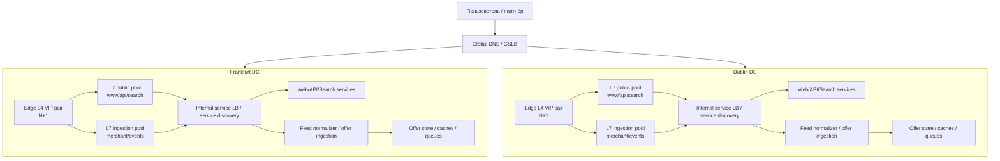

# Проектирование высоконагруженной системы: PriceCompare

Курсовой проект по дисциплине «Проектирование высоконагруженных систем» (НИУ ВШЭ).

PriceCompare — веб‑сервис сравнения цен по модели idealo: пользователь ищет товар, сравнивает предложения (offers) разных магазинов, смотрит историю цены, добавляет товар в избранное/уведомления и переходит в магазин для покупки (click‑out).

## Содержание

- [1. Тема и целевая аудитория](#1-тема-и-целевая-аудитория)
  - [1.1 Короткое описание сервиса](#11-короткое-описание-сервиса)
  - [1.2 Почему тема подходит под highload](#12-почему-тема-подходит-под-highload)
  - [1.3 Отличительные черты сервиса](#13-отличительные-черты-сервиса)
  - [1.4 Целевая аудитория](#14-целевая-аудитория)
  - [1.5 MVP‑функционал](#15-mvpфункционал)
  - [1.6 Ключевые продуктовые решения](#16-ключевые-продуктовые-решения)
  - [1.7 Термины](#17-термины)
- [2. Расчёт нагрузки](#2-расчёт-нагрузки)
  - [2.1 Продуктовые метрики](#21-продуктовые-метрики)
  - [2.2 Технические метрики](#22-технические-метрики)
- [3. Глобальная балансировка нагрузки](#3-глобальная-балансировка-нагрузки)
  - [3.1 Функциональное разбиение по доменам](#31-функциональное-разбиение-по-доменам)
  - [3.2 Обоснование расположения ДЦ](#32-обоснование-расположения-дц)
  - [3.3 Распределение запросов по ДЦ](#33-распределение-запросов-по-дц)
  - [3.4 DNS‑балансировка](#34-dns-балансировка)
  - [3.5 Anycast‑балансировка](#35-anycast-балансировка)
  - [3.6 Механизм регулировки трафика между ДЦ](#36-механизм-регулировки-трафика-между-дц)
- [4. Локальная балансировка нагрузки](#4-локальная-балансировка-нагрузки)
  - [4.1 Схема локальной балансировки и резервирования](#41-схема-локальной-балансировки-и-резервирования)
  - [4.2 Выбор схемы резервирования](#42-выбор-схемы-резервирования)
  - [4.3 Производительность одного балансировщика](#43-производительность-одного-балансировщика)
  - [4.4 Формула расчёта количества балансировщиков](#44-формула-расчёта-количества-балансировщиков)
  - [4.5 Расчёт по пулам](#45-расчёт-по-пулам)
  - [4.6 Локальные edge L4 балансировщики](#46-локальные-edge-l4-балансировщики)
  - [4.7 Сводная таблица по количеству балансировщиков](#47-сводная-таблица-по-количеству-балансировщиков)
  - [4.8 Вывод](#48-вывод)
- [5. Источники](#5-источники)

## 1. Тема и целевая аудитория

### 1.1 Короткое описание сервиса

PriceCompare — сервис сравнения цен (price comparison).

Основной пользовательский сценарий:
1) поиск товара (по строке/категории/фильтрам),
2) карточка товара,
3) сравнение предложений магазинов (цена/доставка/наличие/продавец),
4) история цены (price history),
5) избранное и price alert,
6) переход в магазин (click‑out).

### 1.2 Почему тема подходит под highload

Аналог idealo находится на масштабе десятков миллионов пользователей в месяц и сотен миллионов предложений.

Публично подтверждённые масштабы idealo:
- 78 млн визитов/мес в Германии и 96 млн визитов/мес суммарно в 5 других странах (FR, UK, IT, AT, ES) [2];
- >606 млн предложений (offers) от ~50 000 магазинов [2];
- >4 млн товаров в каталоге [4][5];
- ёмкость внутреннего хранилища под нагрузкой: до 200 000 queries/s и до 60 000 updates/s (кейс AWS) [1].

### 1.3 Отличительные черты сервиса

1) Агрегация предложений продавцов (offer store) и нормализация данных.
2) Высокая динамика цен/наличия и необходимость быстро отражать обновления.
3) Разделение heavy‑трафика (статические ресурсы/изображения) и динамики (поиск/карточки/сравнение/история/события).
4) Click‑out как важный бизнес‑событийный поток для аналитики и атрибуции.

### 1.4 Целевая аудитория

Масштаб целевой аудитории берётся по аналогам idealo (Европа, 6 стран: Германия, Австрия, Великобритания, Испания, Франция, Италия) [3][4].

- MAU: 72 000 000 пользователей/месяц (ориентир по кейсу AWS) [1]
- DAU: 2 500 000 пользователей/день (ориентир по отчётам idealo) [3][4]

### 1.5 MVP‑функционал

1. Поиск и выдача товаров (фильтры/сортировка).
2. Карточка товара.
3. Список предложений (offers) по товару.
4. История цены (price history).
5. Избранное (wishlist/favorites).
6. Price alert (уведомление о снижении цены).
7. Click‑out (переход в магазин).

### 1.6 Ключевые продуктовые решения

- Нейтральное ранжирование: “топ‑позиции не покупаются”, сравнение идёт по цене/условиям.
- Mobile‑first производительность: существенная доля customer journey начинается на мобильных устройствах (58%) [10].
- Разделение статики и динамики: heavy‑контент уходит в CDN, динамика остаётся в API/SSR.
- Click‑out — отдельный поток событий (аналитика, антифрод, партнёрская атрибуция).

### 1.7 Термины

- Product — товар в каталоге.
- Offer — предложение продавца по товару (цена, доставка, наличие, ссылка).
- Click‑out — переход пользователя в магазин по выбранному offer.
- Price history — временной ряд цен по товару (для графика).
- Price alert — правило уведомления о снижении цены.

## 2. Расчёт нагрузки

### 2.1 Продуктовые метрики

Опорные значения (по idealo, публичные источники):

| Метрика                                     |          Значение |
|---------------------------------------------|------------------:|
| MAU                                         |    72 000 000 [1] |
| DAU                                         |  2 500 000 [3][4] |
| Визиты/месяц в Германии                     |    78 000 000 [2] |
| Визиты/месяц суммарно в 5 других странах    |    96 000 000 [2] |
| Offers (предложения)                        |   606 000 000 [2] |
| Shops/Merchants                             |        50 000 [2] |
| Products (товары)                           | 4 000 000+ [4][5] |
| Среднее page views per session (benchmark)  |          4,48 [7] |
| Доля customer journey, стартующая на mobile |          58% [10] |

Производные метрики:

- Page views/day = DAU * pageviews/session = 2 500 000 * 4,48 = 11 200 000 просмотров страниц/сутки.

Для разбиения по страницам MVP (инженерное допущение):
- Search: 30%
- Product: 40%
- Offers: 20%
- Price history: 10%

Тогда:

| Тип действия  | Действий/сутки |
|---------------|---------------:|
| Search        |      3 360 000 |
| Product page  |      4 480 000 |
| Offers list   |      2 240 000 |
| Price history |      1 120 000 |

Действия, которые создают write‑нагрузку (инженерные допущения, калиброваны сезонной статистикой):
- Click‑out: 25% сессий → 625 000/сутки
- Wishlist add/remove: 1% product views → 44 800/сутки
- Price alert create/delete: 0,5% product views → 22 400/сутки

Отдельный контур нагрузки — **ingestion обновлений офферов** со стороны магазинов/партнёров (merchant feed → нормализация → запись в offer store). В публичном кейсе AWS для idealo указана величина **до 60 000 updates/s на пике** [1]. Для оценки среднесуточного объёма обновлений используем коэффициент peak/mean для ingestion `k_ingestion = 2,5` (инженерная оценка; понятие peak-to-mean ratio) [9]:
- `Updates_avg ≈ 60 000 / 2,5 = 24 000 updates/s`
- `Updates_day ≈ 24 000 * 86 400 = 2 073 600 000 обновлений/сутки`

### 2.2 Технические метрики

#### 2.2.1 RPS по основным запросам (средний и пиковый)

Формулы:
- RPS_avg = N_day / 86 400
- RPS_peak = 3 * RPS_avg (k_peak = 3 как консервативная оценка суточного пика для одного региона; термин peak‑to‑mean ratio) [9]

| Запрос                    |         N_day |   RPS_avg |  RPS_peak |
|---------------------------|--------------:|----------:|----------:|
| Search                    |     3 360 000 |     38,89 |    116,67 |
| Product                   |     4 480 000 |     51,85 |    155,56 |
| Offers                    |     2 240 000 |     25,93 |     77,78 |
| Price history             |     1 120 000 |     12,96 |     38,89 |
| Wishlist                  |        44 800 |      0,52 |      1,56 |
| Price alert               |        22 400 |      0,26 |      0,78 |
| Click‑out                 |       625 000 |      7,23 |     21,70 |
| Offer updates (ingestion) | 2 073 600 000 | 24 000,00 | 60 000,00 |

Дополнительно (ориентир внутренней нагрузки offer store по публичному кейсу AWS):
- до 200 000 queries/s (peak) [1]
- до 60 000 updates/s (peak) [1]

Проверка порядка величины: рассчитанный ingestion-пик `60 000 updates/s` совпадает по порядку с публичным значением из AWS кейса [1].

#### 2.2.2 RPS для статики/изображений (CDN)

По данным HTTP Archive Web Almanac (медиана inner page): 71 запрос на страницу — 3 HTML, 4 fonts, 8 CSS, 13 images, 23 JS и прочие [8].

| Тип ресурса | Запросов/страница |  Запросов/сутки |      RPS_avg |      RPS_peak |
|-------------|------------------:|----------------:|-------------:|--------------:|
| HTML        |                 3 |      33 600 000 |       388,89 |      1 166,67 |
| JS          |                23 |     257 600 000 |     2 981,48 |      8 944,44 |
| CSS         |                 8 |      89 600 000 |     1 037,04 |      3 111,11 |
| Fonts       |                 4 |      44 800 000 |       518,52 |      1 555,56 |
| Images      |                13 |     145 600 000 |     1 685,19 |      5 055,56 |
| Other       |                20 |     224 000 000 |     2 592,59 |      7 777,78 |
| **Итого**   |            **71** | **795 200 000** | **9 203,70** | **27 611,11** |

#### 2.2.3 Сетевой трафик

По данным HTTP Archive Web Almanac (медиана inner page): 1,8 MB mobile и 2,0 MB desktop [8].

Доля mobile трафика: 60% (ориентир по доле mobile customer journeys 58%) [10].

Объём трафика страниц:
- 11,2 млн page views/day * (0,6*1,8MB + 0,4*2,0MB) ≈ 21,1 TB/day

Разбиение (оценка на основании медианного вклада HTML в вес страницы):
- Origin (HTML): ~0,23 TB/day
- CDN (остальное): ~20,8 TB/day

Средняя полоса:
- CDN BW_avg ≈ 1,93 Gbit/s, пиковая (×3) ≈ 5,79 Gbit/s
- Origin BW_avg ≈ 0,021 Gbit/s, пиковая (×3) ≈ 0,063 Gbit/s

Трафик ingestion (входящий) для обновлений офферов (оценка):
- средний payload события обновления: 500 B (нормализованное событие/patch)
- `Inbound_day ≈ 2 073 600 000 * 500 B ≈ 1,04 TB/сутки`
- `BW_avg ≈ 0,096 Gbit/s`, `BW_peak ≈ 0,24 Gbit/s` (при пике 60 000 updates/s)

#### 2.2.4 Размер хранения (существенные блоки)

База (твёрдые количества по источникам idealo):
- Offers: 606 млн [2]
- Products: 4 млн+ [4][5]
- Shops: 50 тыс [2]

Инженерные оценки размера элемента:
- Offer: 2 KB
- Product: 4 KB
- Shop: 2 KB
- Price history: 12 KB/товар (2 года, агрегация по дням)

Пользовательские данные:
- 10% от MAU имеют аккаунт (оценка)
- Wishlist: 20 товаров на пользователя
- Alerts: 5 правил на пользователя

| Тип данных       |           Кол-во | Размер элемента | Хранение |
|------------------|-----------------:|----------------:|---------:|
| Offers           |  606 000 000 [2] |            2 KB |  ~1,2 TB |
| Products         | 4 000 000 [4][5] |            4 KB |   ~16 GB |
| Shops            |       50 000 [2] |            2 KB |  ~0,1 GB |
| Price history    | 4 000 000 [4][5] |           12 KB |   ~48 GB |
| User profiles    |        7 200 000 |            1 KB |  ~7,2 GB |
| Wishlist records |      144 000 000 |            24 B |  ~3,5 GB |
| Price alerts     |       36 000 000 |            64 B |  ~2,3 GB |

Сезонная «массовость» функций wishlist/alerts подтверждается пресс‑материалами idealo: в октябре–ноябре 2025 в Германии было создано >3 млн price alerts и добавлено >5,2 млн товаров в wishlists [6].

## 3. Глобальная балансировка нагрузки

### 3.1 Функциональное разбиение по доменам

Публичные точки входа разделены по типам трафика, чтобы независимо масштабировать контуры, применять разные политики кэширования и маршрутизации.

| Контур                   | Домен                           | Назначение                                                                | Тип трафика         |
|--------------------------|---------------------------------|---------------------------------------------------------------------------|---------------------|
| Web                      | `www.pricecompare.example`      | сайт (SSR/SPA shell)                                                      | частично кэшируемый |
| Public API               | `api.pricecompare.example`      | покупательские сценарии (product/offers/history/wishlist/alert/click-out) | динамический        |
| Search API               | `search.pricecompare.example`   | поиск, подсказки, фасеты/фильтры                                          | динамический        |
| Events                   | `events.pricecompare.example`   | сбор событий (click-out, аналитика)                                       | write-поток         |
| Merchant                 | `merchant.pricecompare.example` | B2B: загрузка фидов/обновлений продавцов                                  | write-поток         |
| Static CDN               | `static.pricecompare.example`   | JS/CSS/fonts                                                              | CDN                 |
| Media CDN                | `img.pricecompare.example`      | изображения товаров/логотипы магазинов                                    | CDN                 |
| Static origin (internal) | `static-origin.internal`        | origin для CDN (статические файлы)                                        | внутренний          |
| Media origin (internal)  | `img-origin.internal`           | origin для CDN (объектное хранилище изображений)                          | внутренний          |

### 3.2 Обоснование расположения ДЦ

Аудитория распределена по Европе (6 стран) [3][4]. idealo публикует разрез по визитам: Германия 78 млн/мес и остальные 5 стран 96 млн/мес суммарно [2].

Выбор ДЦ (MVP):
- **Frankfurt (DE)** — основной (низкая задержка для крупнейшего рынка и центральной Европы).
- **Dublin (IE)** — резервный/второй регион (географически независимая площадка внутри Европы; удобен для UK и западной Европы).

Статика и изображения обслуживаются через CDN и выдаются с edge-узлов ближе к пользователю; поэтому основной объём «тяжёлого» трафика не привязан к конкретному ДЦ [13].

### 3.3 Распределение запросов по ДЦ

Фактическая маршрутизация `www/api/search/events/merchant` выполняется DNS-политиками (latency-based + health checks), поэтому распределение по ДЦ зависит от сетевой задержки и состояния площадок. Для расчёта ёмкости вводятся стартовые доли, которые затем регулируются weighted routing.

Стартовые доли динамического трафика (steady-state):
- **Frankfurt: 60%**
- **Dublin: 40%**

Обоснование: Германия даёт ≈45% визитов сама по себе, а часть трафика Австрии и части южной/центральной Европы по задержкам часто будет «тяготеть» к Frankfurt; Dublin остаётся вторым регионом и DR-площадкой [2].

Промежуточный расчёт:
- `Share_FRA = 0.6`
- `Share_DUB = 0.4`

Формула распределения:
- `RPS_DC = RPS_total * Share_DC`

Распределение **пиковых** RPS по основным API-запросам (из раздела 2.2.1):

| Запрос (API)  | RPS_peak всего | Frankfurt (RPS_peak) | Dublin (RPS_peak) |
|---------------|---------------:|---------------------:|------------------:|
| Search        |         116,67 |                70,00 |             46,67 |
| Product       |         155,56 |                93,34 |             62,22 |
| Offers        |          77,78 |                46,67 |             31,11 |
| Price history |          38,89 |                23,33 |             15,56 |
| Wishlist      |           1,56 |                 0,94 |              0,62 |
| Price alert   |           0,78 |                 0,47 |              0,31 |
| Click-out     |          21,70 |                13,02 |              8,68 |

Failover:
- при недоступности Frankfurt: `Share_FRA = 0`, `Share_DUB = 1` (100% на Dublin)
- при восстановлении: постепенный возврат весов (weighted routing)

CDN-трафик (`static/img`) распределяется по edge автоматически.

### 3.4 DNS-балансировка

DNS используется как механизм глобальной балансировки между датацентрами для динамических доменов (`www/api/search/events/merchant`) и как механизм «вывода» статических доменов на CDN (`static/img`).

#### Выбор geo-based vs latency-based

Geo-based (geolocation routing) закрепляет страны за датацентрами и даёт предсказуемое и управляемое распределение трафика; этот подход подходит для локализации и сценариев, где важно консистентно маршрутизировать пользователей по регионам, также требуется default-запись на случай нераспознанной геолокации [15].

Latency-based routing выбирает AWS-регион с минимальной задержкой для пользователя [11], но точность гео/latency решений зависит от DNS-резолвера: без EDNS Client Subnet Route 53 ориентируется на IP резолвера, а не клиента [16].

Выбор для PriceCompare: используем geo-based (geolocation) как основной механизм маршрутизации для `www/api/search`, так как сервис работает в фиксированном наборе стран, и важно предсказуемо закреплять трафик по рынкам. Для тонкой настройки долей и плавных переключений используем weighted routing [17].

Пример базовой гео-схемы для `www/api/search`:
* DE, AT, IT → Frankfurt (primary)
* UK, FR, ES → Dublin (secondary)
* Default → Frankfurt

Политики и типы записей
**Политики маршрутизации:**
- **Latency-based routing** для направления пользователя в регион с меньшей задержкой [11].
- **Health checks + failover** для автоматического переключения при недоступности региона [12].
- **Weighted routing** для управляемого изменения долей (degradation/recovery) [11].

**Типы записей:**
- `www/api/search/events/merchant`: A/AAAA на L7 VIP/ingress в Frankfurt и Dublin.
- `static/img`: CNAME на домены CDN-провайдера (edge), origin скрыт за внутренними доменами.

Логика резолвинга (упрощённо):
1) клиент обращается к рекурсивному DNS,
2) рекурсивный DNS запрашивает authoritative DNS зоны,
3) authoritative DNS возвращает A/AAAA (Frankfurt или Dublin) по latency+health либо CNAME на CDN,
4) далее трафик идёт на L7 VIP в выбранном ДЦ или на ближайший CDN edge.

### 3.5 Anycast-балансировка

**Anycast** обычно применяется на стороне CDN: один и тот же IP объявляется из множества точек присутствия, и пользователь попадает на ближайший edge-узел по BGP-маршрутизации. Это снижает задержки и повышает устойчивость к всплескам/атакам на «тяжёлых» доменах `static` и `img` [13].

Для `api` Anycast в MVP не обязателен; опционально можно использовать AWS Global Accelerator (anycast IP на edge сети), чтобы дополнительно стабилизировать задержку и ускорить failover на уровне сетевого входа [14].

**Выбор областей применимости Anycast**
Anycast широко используется CDN-провайдерами: один IP объявляется из многих точек присутствия, и пользователь попадает на ближайший edge-узел, что снижает задержку и повышает устойчивость к всплескам нагрузки и DDoS [13].

Для API anycast обычно реализуют через AWS Global Accelerator: он предоставляет статические anycast IP и заводит трафик в глобальную сеть AWS на ближайшем edge, что может снизить задержку [18][14]. В MVP для `api` выбран DNS-based GSLB, потому что требуется предсказуемая привязка по странам (geolocation) [15] и управляемое изменение долей трафика (weighted routing) для деградации/восстановления [17], а отказоустойчивость обеспечивается health-check/failover логикой Route 53 [12].

### 3.6 Механизм регулировки трафика между ДЦ

Регулировка трафика выполняется на уровне DNS:
- **автоматический failover** по health check (Frankfurt → Dublin) [12]
- **weighted routing** для поэтапного изменения долей при деградации и восстановлении [11]

Типовые сценарии:
- штатно: 60/40
- деградация: 50/50 → 30/70
- авария: 0/100
- восстановление: 20/80 → 40/60 → 60/40

## 4. Локальная балансировка нагрузки

### 4.1 Схема локальной балансировки и резервирования

Локальная балансировка строится отдельно внутри каждого ДЦ. После выбора региона на уровне GSLB трафик попадает в локальный контур балансировки выбранного датацентра.

Выделяются три уровня:

1. **Edge L4 VIP** — точка входа в ДЦ.
   - принимает внешний трафик на `443/tcp`;
   - выполняет локальное распределение на пул L7-балансировщиков;
   - резервируется по схеме **N+1**.

2. **L7-балансировщики публичного трафика** — обслуживают:
   - `www.pricecompare.example`
   - `api.pricecompare.example`
   - `search.pricecompare.example`

   На этом уровне выполняются:
   - SSL termination;
   - HTTP routing;
   - health checks upstream-контуров;
   - распределение запросов по backend-сервисам.

3. **L7-балансировщики ingestion-контура** — обслуживают:
   - `merchant.pricecompare.example`
   - при необходимости отдельный write-контур для `events.pricecompare.example`

   На этом уровне выполняются:
   - SSL termination для B2B-трафика;
   - приём и маршрутизация обновлений офферов;
   - изоляция ingestion-нагрузки от пользовательского контура.

Упрощённая схема локальной балансировки:

### 4.2 Выбор схемы резервирования

Для локальных балансировщиков рассматриваются две стандартные схемы резервирования:

- **2N**:  
  `Total_2N = 2 * N_active`
- **N+1**:  
  `Total_N+1 = N_active + 1`

где:
- `N_active` — минимальное число активных балансировщиков, необходимое для обслуживания пикового трафика;
- `Total` — суммарное число экземпляров с резервированием.

Для PriceCompare выбирается **N+1**, потому что:
- нагрузка горизонтально распределяется по пулу однотипных балансировщиков;
- требуется переживать отказ одного экземпляра без полной дубликации всего контура;
- схема 2N для балансировщиков даёт избыточный запас относительно рассчитанной нагрузки.

### 4.3 Производительность одного балансировщика

Для расчёта используются только заданные бенчмарки NGINX.

#### 4.3.1 Данные из источников

**NGINX Ingress Controller (2019)**:
- HTTPS RPS: до **342 785 req/s**
- SSL/TLS TPS: до **58 811 conn/s**
- Throughput: до **8.8 Gbps**

**NGINX web server (2017)**:
- HTTPS CPS: до **10 274 conn/s** на 24 CPU
- рост CPS для HTTPS заметно зависит от CPU и выходит на плато около 24 CPU

#### 4.3.2 Консервативные лимиты для расчёта

Для локального sizing принимаются следующие лимиты на **один L7-балансировщик**:

- `RPS_lb = 342 785 req/s`
- `CPS_lb = 10 274 new HTTPS conn/s`
- `BW_lb = 8.8 Gbps`

Выбор сделан намеренно консервативно:
- по **RPS** и **сети** используется ingress-specific тест 2019;
- по **SSL termination** используется более низкий HTTPS CPS из теста 2017 как безопасная нижняя оценка для TLS-connection-heavy нагрузки.

### 4.4 Формула расчёта количества балансировщиков

Для каждого пула балансировщиков расчёт ведётся по трём ограничениям:

- ограничение по запросам:  
  `N_rps = ceil(RPS_peak / RPS_lb)`
- ограничение по новым HTTPS-соединениям:  
  `N_cps = ceil(CPS_peak / CPS_lb)`
- ограничение по сети:  
  `N_bw = ceil(BW_peak / BW_lb)`

Тогда:

- `N_active = max(N_rps, N_cps, N_bw)`
- `N_total = N_active + 1`  — для схемы **N+1**

### 4.5 Расчёт по пулам

#### 4.5.1 Публичный L7-пул (`www/api/search`)

Пиковая нагрузка по Frankfurt:
- HTML origin: `700 req/s`
- API/search/click-out: `247.77 req/s`
- суммарно: `947.77 req/s`

Пиковая нагрузка по Dublin:
- HTML origin: `466.67 req/s`
- API/search/click-out: `165.17 req/s`
- суммарно: `631.84 req/s`

Для консервативной оценки принимается, что каждый запрос может прийти на новом HTTPS-соединении:

- `CPS_peak_FRA_public = 947.77`
- `CPS_peak_DUB_public = 631.84`

Ограничение по сети для этого контура не является лимитирующим: даже весь origin-трафик на порядки ниже `8.8 Gbps` на узел.

Расчёт:

**Frankfurt public**
- `N_rps = ceil(947.77 / 342785) = 1`
- `N_cps = ceil(947.77 / 10274) = 1`
- `N_bw = 1`
- `N_active = 1`
- `N_total = 2`

**Dublin public**
- `N_rps = ceil(631.84 / 342785) = 1`
- `N_cps = ceil(631.84 / 10274) = 1`
- `N_bw = 1`
- `N_active = 1`
- `N_total = 2`

Итог по публичному контуру:
- **Frankfurt: 2 L7-балансировщика**
- **Dublin: 2 L7-балансировщика**

#### 4.5.2 Ingestion L7-пул (`merchant/events`)

Из раздела 2:
- общий ingestion peak: `60 000 updates/s`
- при распределении 60/40:
  - Frankfurt: `36 000 updates/s`
  - Dublin: `24 000 updates/s`

Для worst-case оценки принимается:
- одно обновление оффера = один входящий HTTPS-запрос;
- тогда `CPS_peak ≈ updates/s`

Сетевое ограничение:
- общий ingestion `BW_peak ≈ 0.24 Gbit/s`
- Frankfurt: `0.24 * 0.6 = 0.144 Gbit/s`
- Dublin: `0.24 * 0.4 = 0.096 Gbit/s`

Следовательно, сеть не лимитирует пул:  
`0.144 << 8.8` и `0.096 << 8.8`

Расчёт:

**Frankfurt ingestion**
- `N_rps = ceil(36000 / 342785) = 1`
- `N_cps = ceil(36000 / 10274) = 4`
- `N_bw = ceil(0.144 / 8.8) = 1`
- `N_active = 4`
- `N_total = 5`

**Dublin ingestion**
- `N_rps = ceil(24000 / 342785) = 1`
- `N_cps = ceil(24000 / 10274) = 3`
- `N_bw = ceil(0.096 / 8.8) = 1`
- `N_active = 3`
- `N_total = 4`

Итог по ingestion-контуру:
- **Frankfurt: 5 L7-балансировщиков**
- **Dublin: 4 L7-балансировщика**

### 4.6 Локальные edge L4 балансировщики

Edge L4 уровень не выполняет SSL termination и не является узким местом по CPS для TLS. На этом уровне достаточно:

- `N_active = 1`
- `N_total = 2` по схеме **N+1**

Итог:
- **Frankfurt: 2 edge L4**
- **Dublin: 2 edge L4**

### 4.7 Сводная таблица по количеству балансировщиков

| ДЦ | Контур | Пиковая нагрузка | Лимитирующий фактор | `N_active` | Резервирование | `N_total` |
|---|---|---:|---|---:|---|---:|
| Frankfurt | Edge L4 | входной VIP | отказ одного узла | 1 | N+1 | 2 |
| Frankfurt | Public L7 | 947.77 req/s | резервирование, не производительность | 1 | N+1 | 2 |
| Frankfurt | Ingestion L7 | 36 000 CPS | SSL termination | 4 | N+1 | 5 |
| Dublin | Edge L4 | входной VIP | отказ одного узла | 1 | N+1 | 2 |
| Dublin | Public L7 | 631.84 req/s | резервирование, не производительность | 1 | N+1 | 2 |
| Dublin | Ingestion L7 | 24 000 CPS | SSL termination | 3 | N+1 | 4 |

### 4.8 Вывод

1. Для **публичного трафика** (`www/api/search`) производительность одного современного L7-балансировщика с большим запасом перекрывает расчётный peak; число экземпляров определяется не пропускной способностью, а требованиями отказоустойчивости. Поэтому достаточно **2 L7-узлов на ДЦ** по схеме **N+1**.

2. Для **ingestion-контура** узким местом становится не сеть, а **SSL termination / CPS**. При консервативном предположении «одно обновление = одно HTTPS-соединение» требуется:
   - **5 L7-узлов во Frankfurt**
   - **4 L7-узла в Dublin**

3. Сетевой throughput не является лимитирующим фактором ни для публичного, ни для ingestion-контура; во всех случаях расчёт упирается либо в резервирование, либо в обработку новых TLS-соединений.

4. Выбранная схема локальной балансировки не содержит single point of failure на уровне входа в ДЦ и допускает поэтапное масштабирование:
   - отдельно публичного контура;
   - отдельно ingestion-контура.

## 5. Источники

1. AWS Case Study (July 2024): idealo Increases Traffic 6x for Black Friday Using MongoDB Atlas on AWS — https://aws.amazon.com/partners/success/idealo-mongodb/
2. idealo (Unternehmen): Über idealo (78 млн визитов/мес DE; 96 млн визитов/мес в 5 странах; 606 млн offers; 50k shops) — https://www.idealo.de/unternehmen/ueber-idealo
3. idealo Nachhaltigkeitsbericht 2022 (2,5 млн visitors/day; 500 млн offers; 6 стран) — https://www.idealo.de/dam/jcr:9b512f66-82c8-4616-921f-26b77da39c7f/idealo_nachhaltigkeitsbericht_2022.pdf
4. idealo Nachhaltigkeitsbericht 2023 (2,5 млн visits/day; >560 млн offers; 50k shops; 6 стран; >4 млн products) — https://www.idealo.de/dam/jcr:f8556c6b-9dd7-4a52-bec4-158f0d3ab899/idealo_Nachhaltigkeitsbericht_2023.pdf
5. idealo Nachhaltigkeit (>4 млн products; >500 млн offers; 50k merchants) — https://www.idealo.de/unternehmen/nachhaltigkeit
6. idealo Presseinfo (05.12.2025): >3 млн price alerts и >5,2 млн wishlist adds (окт–ноя, Германия) — https://www.idealo.de/dam/jcr:b8950bb8-94eb-428a-85f8-ce4241a67398/251205_idealo_Pressemeldung_Black-Friday-Recap-2025.pdf
7. Contentsquare (2020): Digital Experience Benchmark — average 4.48 page views per session — https://go.contentsquare.com/hubfs/eBooks/2020%20Digital%20Experience%20Benchmark/2020%20Digital%20Experience%20Benchmark%20Report%20PDF%20English.pdf
8. HTTP Archive Web Almanac 2025: Page Weight (inner page 1.8MB mobile, 2MB desktop; 71 requests/inner page) — https://almanac.httparchive.org/en/2025/page-weight
9. Robust Perception: Peak-to-mean ratio (понятие коэффициента peak/mean) — https://www.robustperception.io/do-you-know-your-peak-to-mean-ratio
10. Think with Google (2017): Mobile Moments idealo (58% customer journey starts on mobile) — https://www.thinkwithgoogle.com/_qs/documents/4260/40943_170315_MobileMoments_Idealo_TwoPage_Kec6FX5.pdf
11. AWS Route 53: Latency-based routing — https://docs.aws.amazon.com/Route53/latest/DeveloperGuide/routing-policy-latency.html
12. AWS Route 53: Failover records — https://docs.aws.amazon.com/Route53/latest/DeveloperGuide/resource-record-sets-values-failover.html
13. Cloudflare Learning Center: Anycast network — https://www.cloudflare.com/learning/cdn/glossary/anycast-network/
14. AWS Global Accelerator docs: anycast static IPs — https://docs.aws.amazon.com/global-accelerator/latest/dg/introduction-components.html
15. AWS Route 53: Geolocation routing — https://docs.aws.amazon.com/Route53/latest/DeveloperGuide/routing-policy-geo.html
16. AWS Route 53: How Route 53 uses EDNS0 to estimate the location of a user — https://docs.aws.amazon.com/Route53/latest/DeveloperGuide/routing-policy-edns0.html
17. AWS Route 53: Weighted routing — https://docs.aws.amazon.com/Route53/latest/DeveloperGuide/routing-policy-weighted.html
18. AWS Blog: Use AWS Global Accelerator to improve application performance — https://aws.amazon.com/blogs/networking-and-content-delivery/use-aws-global-accelerator-to-improve-application-performance/
