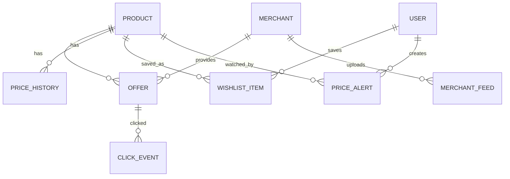
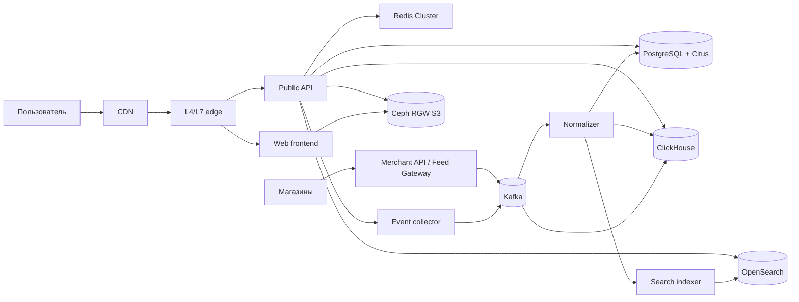

# Проектирование высоконагруженной системы: PriceCompare

Курсовой проект по дисциплине «Проектирование высоконагруженных систем» (НИУ ВШЭ).

PriceCompare — веб-сервис сравнения цен. Пользователь ищет товар, сравнивает предложения магазинов, смотрит историю цены, добавляет товар в избранное, создаёт уведомление о снижении цены и переходит в магазин для покупки.

## Содержание

1. [Тема и целевая аудитория](#1-тема-и-целевая-аудитория)
2. [Расчёт нагрузки](#2-расчёт-нагрузки)
3. [Глобальная балансировка нагрузки](#3-глобальная-балансировка-нагрузки)
4. [Локальная балансировка нагрузки](#4-локальная-балансировка-нагрузки)
5. [Логическая схема базы данных](#5-логическая-схема-базы-данных)
6. [Физическая схема базы данных](#6-физическая-схема-базы-данных)
7. [Алгоритмы](#7-алгоритмы)
8. [Технологии](#8-технологии)
9. [Обеспечение безопасности и надёжности](#9-обеспечение-безопасности-и-надёжности)
10. [Схема проекта](#10-схема-проекта)
11. [Список серверов](#11-список-серверов)
12. [Источники](#12-источники)

---

## 1. Тема и целевая аудитория

### 1.1. Краткое описание сервиса

PriceCompare проектируется как сервис сравнения цен по модели idealo. В рамках проекта рассматриваются только основные сценарии, необходимые для MVP:

1. поиск товара по строке, категории и фильтрам;
2. просмотр карточки товара;
3. просмотр предложений магазинов по выбранному товару;
4. просмотр истории цены;
5. добавление товара в избранное;
6. создание уведомления о снижении цены;
7. переход пользователя в магазин по выбранному предложению.

В работе используются следующие термины:

| Термин                 | Значение                                                                       |
|------------------------|--------------------------------------------------------------------------------|
| Товар                  | Нормализованная карточка товара в каталоге сервиса.                            |
| Предложение            | Конкретное предложение магазина: цена, доставка, наличие, ссылка на магазин.   |
| Магазин                | Продавец, передающий данные о товарах и ценах.                                 |
| История цены           | Временной ряд минимальной или агрегированной цены товара.                      |
| Уведомление о цене     | Пользовательское правило: уведомить при снижении цены ниже заданного значения. |
| Переход в магазин      | Событие перехода пользователя из PriceCompare на сайт магазина.                |
| Контур загрузки данных | Подсистема приёма, проверки и нормализации данных от магазинов.                |

### 1.2. Почему тема относится к высоконагруженным системам

В качестве ближайшего публичного аналога выбран idealo, так как это европейский сервис сравнения цен с близкой предметной областью. По публичному кейсу AWS idealo обслуживает более 72 млн посетителей в месяц и на пике поддерживает до 200 000 запросов в секунду к внутреннему хранилищу и до 60 000 обновлений в секунду [1]. В отчёте idealo за 2023 год указано, что сервис имеет более 2,5 млн посещений в день, около 50 000 магазинов и более 560 млн предложений [2]. В отдельных партнёрских материалах также указывается масштаб порядка сотен миллионов предложений и десятков тысяч магазинов [3].

Эти значения показывают, что даже минимальная версия сервиса должна учитывать:

1. большой каталог товаров и предложений;
2. интенсивный поток обновления цен и наличия;
3. высокую долю чтения со стороны пользователей;
4. необходимость отдельного поискового индекса;
5. необходимость кэширования популярных карточек и выдач;
6. хранение аналитических событий переходов в магазины.

### 1.3. Целевая аудитория

Основная целевая аудитория — пользователи, которые сравнивают цены перед покупкой бытовой техники, электроники, товаров для дома, одежды и других массовых категорий. Для расчётов используются метрики idealo как публичного аналога:

| Метрика                |                                         Значение | Основание                                                 |
|------------------------|-------------------------------------------------:|-----------------------------------------------------------|
| MAU                    |                 72 000 000 пользователей в месяц | AWS case study [1]                                        |
| DAU                    |                      2 500 000 посещений в сутки | idealo Sustainability Report 2023 [2]                     |
| Количество магазинов   |                                     около 50 000 | idealo Sustainability Report 2023 [2]                     |
| Количество предложений | более 560 млн; в отдельных материалах до 606 млн | idealo Sustainability Report и публичные материалы [2][3] |
| Количество стран       |                             6 европейских рынков | AWS case study [1]                                        |

Для дальнейших расчётов принимается более высокое значение `606 000 000` предложений. Это консервативное допущение: оно увеличивает оценку размера хранилища и нагрузки на контур обновления данных. Если преподаватель потребует использовать только официальные материалы idealo, это значение можно заменить на `560 000 000+` из Sustainability Report 2023; расчёты при этом уменьшатся примерно на `7,6%` [2].

---

## 2. Расчёт нагрузки

### 2.1. Исходные значения

Расчёт строится на публичных данных аналога и явно указанных инженерных допущениях.

| Параметр                                      |                  Значение | Тип значения                                      |
|-----------------------------------------------|--------------------------:|---------------------------------------------------|
| MAU                                           |                72 000 000 | публичное значение [1]                            |
| DAU                                           | 2 500 000 посещений/сутки | публичное значение [2]                            |
| Среднее число просмотров страниц за посещение |                      4,48 | инженерный benchmark для e-commerce-сценария      |
| Количество предложений                        |               606 000 000 | публичное значение / консервативная оценка [2][3] |
| Количество товаров                            |                 4 000 000 | инженерное допущение для MVP-каталога             |
| Количество магазинов                          |                    50 000 | публичное значение [1][2]                         |
| Пиковые обновления предложений                |          60 000 updates/s | публичное значение из AWS case study [1]          |
| Пиковые внутренние запросы к offer store      |         200 000 queries/s | публичное значение из AWS case study [1]          |
| Коэффициент суточного пика                    |                       2,5 | инженерное допущение                              |

Коэффициент суточного пика `2,5` выбран не как точное публичное значение, а как запас для проектирования. У сервиса сравнения цен трафик зависит от дневного цикла, рекламных кампаний и распродаж. Поэтому средний RPS недостаточен для выбора серверов и балансировщиков. В тексте это значение используется как инженерный коэффициент запаса, а не как метрика idealo.

### 2.2. Расчёт пользовательских действий

Количество просмотров страниц в сутки:

```text
PV_day = 2 500 000 * 4,48 = 11 200 000 page views/day
```

Для MVP принимается следующее распределение просмотров:

| Экран / действие               |                 Доля |            Расчёт | Значение в сутки |
|--------------------------------|---------------------:|------------------:|-----------------:|
| Поиск                          |       30% page views | 11 200 000 * 0,30 |        3 360 000 |
| Карточка товара                |       40% page views | 11 200 000 * 0,40 |        4 480 000 |
| Список предложений             |       20% page views | 11 200 000 * 0,20 |        2 240 000 |
| История цены                   |       10% page views | 11 200 000 * 0,10 |        1 120 000 |
| Переход в магазин              |        25% посещений |  2 500 000 * 0,25 |          625 000 |
| Добавление/удаление избранного |   1% карточек товара |  4 480 000 * 0,01 |           44 800 |
| Создание/удаление уведомления  | 0,5% карточек товара | 4 480 000 * 0,005 |           22 400 |

Переход от суточного объёма к RPS:

```text
RPS_avg = N_day / 86 400
RPS_peak = RPS_avg * 2,5
```

| Запрос                     |     N_day | RPS_avg |   RPS_peak |
|----------------------------|----------:|--------:|-----------:|
| Поиск                      | 3 360 000 |   38,89 |      97,22 |
| Карточка товара            | 4 480 000 |   51,85 |     129,63 |
| Список предложений         | 2 240 000 |   25,93 |      64,81 |
| История цены               | 1 120 000 |   12,96 |      32,41 |
| Избранное                  |    44 800 |    0,52 |       1,30 |
| Уведомления о цене         |    22 400 |    0,26 |       0,65 |
| Переход в магазин          |   625 000 |    7,23 |      18,08 |
| **Итого динамическое API** |         — |       — | **344,10** |

Итоговое значение `344,10 req/s` относится только к пользовательскому API. Оно не включает запросы к статике, изображениям и внутренний контур загрузки данных от магазинов.

### 2.3. Статика и сетевой трафик

По данным HTTP Archive Web Almanac 2024, медианная страница содержит 71 запрос на desktop и 66 запросов на mobile. Медианный вес страницы составляет 2 652 KB для desktop и 2 311 KB для mobile [4].

Для расчёта принимается доля mobile-трафика `58%`, так как в публичных материалах idealo указывается высокая доля мобильного пользовательского пути. Тогда среднее количество запросов на страницу:

```text
Requests_per_page = 0,58 * 66 + 0,42 * 71 = 68,1
Static_requests_day = 11 200 000 * 68,1 = 762 720 000 requests/day
Static_RPS_peak = 762 720 000 / 86 400 * 2,5 ≈ 22 069 req/s
```

Средний вес страницы:

```text
Page_weight = 0,58 * 2,311 MB + 0,42 * 2,652 MB = 2,454 MB
Traffic_day = 11 200 000 * 2,454 MB ≈ 27,49 TB/day
```

Средняя и пиковая полоса:

```text
BW_avg = 27,49 TB/day * 8 / 86 400 ≈ 2,55 Gbit/s
BW_peak = 2,55 * 2,5 ≈ 6,36 Gbit/s
```

Статика и изображения должны отдаваться через CDN. Для проектирования принимается целевой cache hit ratio CDN `95%` для статических ресурсов и оптимизированных изображений. Cache hit ratio определяется как отношение запросов, обслуженных из кэша, к общему числу запросов к кэшу; при hit ratio около `95%` только оставшаяся доля запросов уходит на origin [16]. Тогда:

| Показатель                         |     Значение |
|------------------------------------|-------------:|
| Общий трафик страниц               | 27,49 TB/day |
| Трафик через CDN при hit ratio 95% | 26,11 TB/day |
| Origin traffic при hit ratio 95%   |  1,37 TB/day |
| Пиковая полоса CDN                 |  6,04 Gbit/s |
| Пиковая полоса origin              |  0,32 Gbit/s |

Это приближение корректнее, чем делить трафик между origin и CDN только по количеству HTTP-запросов: HTML, JavaScript, CSS, изображения и шрифты имеют разный размер, поэтому распределение по числу запросов не отражает распределение байтов.

### 2.4. Контур обновления предложений

Для контура загрузки данных используется публичное пиковое значение idealo:

```text
Offer_updates_peak = 60 000 updates/s
```

Размер нормализованного события обновления предложения принимается равным `500 B`. Это инженерное допущение: в событие входят идентификаторы товара и магазина, цена, валюта, наличие, ссылка, версия данных и технические поля.

Пиковая входящая полоса:

```text
Ingestion_BW_peak = 60 000 * 500 B = 30 000 000 B/s ≈ 30 MB/s ≈ 0,24 Gbit/s
```

С учётом репликации Kafka с replication factor `3` внутренняя запись в брокеры создаёт примерно трёхкратный сетевой и дисковый объём. Для отказоустойчивых Kafka-топиков типовая конфигурация использует replication factor `3`, `min.insync.replicas = 2` и producer `acks=all`, чтобы запись считалась успешной только после подтверждения большинством синхронных реплик [15][26]:

```text
Kafka_internal_BW_peak ≈ 0,24 * 3 = 0,72 Gbit/s
```

Пиковое значение не используется как среднесуточное, потому что это привело бы к завышению хранилища. Для оценки буферов и аналитического хранилища отдельно принимается сценарий, где средняя нагрузка составляет 25% от пика:

```text
Offer_updates_avg = 60 000 * 0,25 = 15 000 updates/s
Raw_events_day = 15 000 * 500 B * 86 400 ≈ 648 GB/day
```

При коэффициенте сжатия ClickHouse 3–4 раза ожидаемый суточный объём сырых событий составляет примерно `162–216 GB/day`. Для хранения сырых событий 30 дней с двумя репликами требуется ориентировочно:

```text
Raw_events_30d_physical ≈ 162 GB/day * 30 * 2 = 9,72 TB
```

Для планирования принимается запас `15 TB` на сырые события обновления предложений за 30 дней.

### 2.5. Оценка объёма основных данных

| Тип данных            |  Количество | Размер элемента | Логический объём |
|-----------------------|------------:|----------------:|-----------------:|
| Предложения           | 606 000 000 |            2 KB |          1,21 TB |
| Товары                |   4 000 000 |            4 KB |            16 GB |
| Магазины              |      50 000 |            2 KB |           0,1 GB |
| История цены          |   4 000 000 |           12 KB |            48 GB |
| Профили пользователей |   7 200 000 |            1 KB |           7,2 GB |
| Избранное             | 144 000 000 |            24 B |          3,46 GB |
| Уведомления о цене    |  36 000 000 |            64 B |          2,30 GB |

Для физического размера необходимо учитывать индексы, WAL/журналы, служебные данные, реплики и запас на рост. PostgreSQL использует WAL для записи изменений и восстановления после сбоев; этот же механизм применяется в continuous archiving и point-in-time recovery [19]. Для PostgreSQL/Citus принимается коэффициент `2,6` к логическому объёму: `1,3` на индексы и служебные структуры и `2` на основную реплику. Тогда для таблицы предложений:

```text
Offer_physical ≈ 1,21 TB * 2,6 ≈ 3,15 TB
```

С учётом роста и перераспределения шардов принимается запас не менее `5 TB` полезного SSD-объёма для хранилища актуальных предложений.

---

## 3. Глобальная балансировка нагрузки

### 3.1. Разделение доменов

Сервис разделяется на несколько доменов, так как трафик имеет разные свойства.

| Домен                           | Назначение                                                         | Тип трафика                        |
|---------------------------------|--------------------------------------------------------------------|------------------------------------|
| `www.pricecompare.example`      | сайт и HTML-страницы                                               | частично кэшируемый                |
| `api.pricecompare.example`      | карточки товара, предложения, история цены, избранное, уведомления | динамический                       |
| `search.pricecompare.example`   | поиск, подсказки, фильтры                                          | динамический, read-heavy           |
| `events.pricecompare.example`   | события переходов и аналитики                                      | write-heavy                        |
| `static.pricecompare.example`   | JS, CSS, шрифты, изображения                                       | CDN-кэшируемый                     |
| `merchant.pricecompare.example` | загрузка данных от магазинов                                       | write-heavy, внутренний B2B-контур |

Такое разделение позволяет независимо настраивать TTL, rate limiting, WAF-правила и маршрутизацию. Rate limiting применяется для ограничения частоты действий клиента в заданном временном окне и защиты API от злоупотреблений [21].

### 3.2. Расположение дата-центров

Так как основной аналог работает на европейских рынках, система проектируется для трёх европейских площадок:

1. Frankfurt — основной регион для Германии и Центральной Европы;
2. Amsterdam — резервный и балансирующий регион для Северной и Западной Европы;
3. Paris — дополнительный регион для Франции, Южной Европы и отказоустойчивости.

Все пользовательские контуры работают в active-active режиме. Запись в пользовательские таблицы маршрутизируется в ближайший доступный регион, но для данных, требующих строгой консистентности, используется лидерство на уровне конкретного шарда или домена данных.

### 3.3. DNS- и Anycast-балансировка

На глобальном уровне используются два механизма:

1. **GeoDNS / latency-based DNS** — возвращает пользователю ближайший доступный регион.
2. **Anycast для CDN и edge-слоя** — позволяет направлять запрос на ближайшую точку входа сети.

Anycast в CDN-сценариях обычно направляет входящие запросы в ближайший или наиболее подходящий дата-центр с учётом ёмкости и сетевого состояния [17]. DNS-балансировка подходит для выбора региона, но не обеспечивает мгновенное переключение при аварии из-за TTL и кэшей резолверов. Поэтому внутри каждого региона дополнительно используются L4/L7 балансировщики и health checks. Для DNS failover обычно используются health checks, которые исключают недоступный endpoint из ответов DNS [18].

### 3.4. Распределение трафика между регионами

Для нормального режима принимается следующее распределение:

| Регион    | Доля пользовательского трафика | Назначение             |
|-----------|-------------------------------:|------------------------|
| Frankfurt |                            50% | основной регион        |
| Amsterdam |                            30% | резерв и балансировка  |
| Paris     |                            20% | дополнительная ёмкость |

При отказе одного региона трафик перераспределяется между оставшимися регионами. Для этого каждый регион должен иметь запас ёмкости. Для пользовательского API целевая загрузка в нормальном режиме не должна превышать 60–65% доступной мощности, чтобы оставался резерв на аварийное перераспределение.

---

## 4. Локальная балансировка нагрузки

### 4.1. Схема балансировки внутри региона

В каждом регионе используется следующая цепочка:

```text
Пользователь
  -> CDN / edge
  -> региональный L4-балансировщик
  -> L7 reverse proxy / ingress
  -> Kubernetes Service
  -> pod приложения
```

L4-слой распределяет TCP/TLS-трафик между L7-балансировщиками. L7-слой выполняет маршрутизацию по hostname и path, завершение TLS для публичного API, rate limiting, проверку заголовков и передачу запросов в Kubernetes. В Kubernetes Service используется как стабильная точка доступа к группе pod'ов и связанным EndpointSlice [25].

### 4.2. Резервирование балансировщиков

Для каждого региона принимается схема `N+1` на уровне L7 и минимум две независимые L4-точки входа.

| Компонент                       | Минимум на регион | Обоснование                                               |
|---------------------------------|------------------:|-----------------------------------------------------------|
| L4-балансировщик                |                 2 | отказ одного узла не должен отключать регион              |
| L7 reverse proxy / ingress      |                 3 | rolling update и отказ одного узла без потери доступности |
| Ingress controller в Kubernetes |             3 pod | распределение по трём зонам доступности                   |

Для L7-пула используется формула:

```text
N = ceil(RPS_peak_region / RPS_per_node / target_utilization) + reserve
```

Где:

- `RPS_peak_region` — пиковый RPS региона;
- `RPS_per_node` — безопасная производительность одного узла;
- `target_utilization` — целевая загрузка, например 0,6;
- `reserve` — резерв на отказ одного узла.

Даже если расчёт даёт меньше трёх экземпляров, для production-режима принимается минимум три pod, чтобы их можно было распределить по трём зонам доступности. При rolling update Deployment постепенно создаёт новую ReplicaSet и уменьшает старую; параметры `maxUnavailable` и `maxSurge` ограничивают временную потерю доступности и избыточное число pod'ов [28].

### 4.3. Расчёт для пользовательского API

Пиковый RPS динамического пользовательского API:

```text
API_RPS_peak = 344,10 req/s
```

Для основного региона Frankfurt при доле 50%:

```text
API_RPS_peak_Frankfurt = 344,10 * 0,5 = 172,05 req/s
```

Даже небольшой L7-балансировщик выдержит такой объём, поэтому решающим фактором является не производительность, а отказоустойчивость. Минимальная конфигурация на регион:

```text
L7 replicas per region = 3
```

Для статических ресурсов основной объём должен обслуживаться CDN. Origin-слой проектируется на пиковую полосу около `0,32 Gbit/s` после CDN-кэширования. Это значение также не требует большого числа балансировщиков, но требует резервирования и ограничения запросов к origin при cache miss storm.

---

## 5. Логическая схема базы данных

### 5.1. Основные сущности

Логическая модель разделяется на каталожные данные, пользовательские данные, события и служебные данные.



### 5.2. Таблицы каталога

| Таблица               | Назначение                       | Ключ                         |
|-----------------------|----------------------------------|------------------------------|
| `products`            | нормализованные товары           | `product_id`                 |
| `product_attributes`  | характеристики товаров           | `(product_id, attribute_id)` |
| `categories`          | дерево категорий                 | `category_id`                |
| `merchants`           | магазины                         | `merchant_id`                |
| `offers_current`      | актуальные предложения магазинов | `(product_id, merchant_id)`  |
| `price_history_daily` | дневная история минимальной цены | `(product_id, date)`         |

### 5.3. Пользовательские таблицы

| Таблица               | Назначение          | Ключ                    |
|-----------------------|---------------------|-------------------------|
| `users`               | учётные записи      | `user_id`               |
| `wishlist_items`      | избранные товары    | `(user_id, product_id)` |
| `price_alerts`        | правила уведомлений | `alert_id`              |
| `notification_outbox` | очередь уведомлений | `event_id`              |

### 5.4. Событийные таблицы

| Таблица               | Назначение                           | Основные поля                                                             |
|-----------------------|--------------------------------------|---------------------------------------------------------------------------|
| `click_events`        | переходы пользователей в магазины    | `event_id`, `product_id`, `offer_id`, `merchant_id`, `created_at`         |
| `offer_update_events` | сырые события обновления предложений | `merchant_id`, `external_offer_id`, `price`, `availability`, `created_at` |
| `search_events`       | события поиска                       | `query`, `filters`, `created_at`                                          |

Событийные таблицы не должны находиться в основной OLTP-базе. Они имеют высокий объём записи и используются для аналитики, антифрода, отчётности и пересчёта агрегатов. Поэтому для них выбран ClickHouse: колоночное хранение и семейство MergeTree лучше подходят для больших append-only таблиц и аналитических запросов по времени [12][27].

### 5.5. Требования к консистентности

| Данные                 | Требование                                                             |
|------------------------|------------------------------------------------------------------------|
| Профиль пользователя   | строгая консистентность в пределах записи пользователя                 |
| Избранное              | read-after-write для пользователя                                      |
| Уведомления о цене     | консистентность при создании правила, асинхронная доставка уведомлений |
| Актуальные предложения | eventual consistency допустима в пределах секунд или минут             |
| Поисковый индекс       | eventual consistency допустима                                         |
| История цены           | асинхронное обновление, допустима задержка агрегации                   |
| Click events           | at-least-once запись с дедупликацией по `event_id`                     |

Такая модель консистентности соответствует разделению на OLTP-операции, где важна транзакционность, и асинхронные read models, которые могут пересобираться из журналов событий. Для write-heavy потоков используется Kafka с партициями и репликацией [15][26], а для аналитических read models — ClickHouse и OpenSearch [12][13].

---

## 6. Физическая схема базы данных

### 6.1. Принципы выбора хранилищ

Для системы используются разные типы хранилищ, так как один тип базы данных не покрывает все требования одинаково эффективно.

| Контур                        | Хранилище                           | Причина выбора                                                                                   |
|-------------------------------|-------------------------------------|--------------------------------------------------------------------------------------------------|
| Пользовательские данные       | PostgreSQL + Citus                  | SQL-модель, транзакции, горизонтальное шардирование                                              |
| Актуальные предложения        | PostgreSQL + Citus                  | шардирование по `product_id`, совместимость с реляционной моделью                                |
| Поиск                         | OpenSearch                          | полнотекстовый поиск, фасеты, фильтры, сортировка                                                |
| События и аналитика           | ClickHouse                          | высокая скорость вставки и аналитические запросы по большим таблицам                             |
| Кэш                           | Redis Cluster                       | быстрый key-value cache, TTL, распределение ключей по слотам                                     |
| Очереди и потоковая обработка | Apache Kafka                        | партиционирование, репликация, параллельное потребление                                          |
| Объектное хранилище           | Ceph Object Gateway (RADOS Gateway) | open source S3-совместимое хранилище, поддержка S3 API и масштабирование на собственных серверах |

MinIO не выбирается как основное S3-хранилище, так как репозиторий `minio/minio` был архивирован владельцем 13 февраля 2026 года и переведён в read-only режим [9]. Для курсового проекта допустимо рассмотреть Garage как более лёгкую альтернативу, но для данного масштаба выбран Ceph Object Gateway: он лучше подходит для промышленного объектного хранилища, поддерживает S3-совместимый API и может использоваться поверх Ceph Storage Cluster [8]. В документации Ceph RGW отдельно указана совместимость с большой частью Amazon S3 REST API и поддержка bucket operations, lifecycle, object versioning и bucket policies [8][23].

### 6.2. Физическое распределение таблиц

| Таблица / данные      | Хранилище                        | Шардирование                                  | Репликация                   |
|-----------------------|----------------------------------|-----------------------------------------------|------------------------------|
| `users`               | PostgreSQL/Citus                 | `user_id`                                     | 1 primary + 1 replica        |
| `wishlist_items`      | PostgreSQL/Citus                 | `user_id`                                     | 1 primary + 1 replica        |
| `price_alerts`        | PostgreSQL/Citus                 | `user_id`                                     | 1 primary + 1 replica        |
| `products`            | PostgreSQL/Citus                 | `product_id`                                  | 1 primary + 1 replica        |
| `offers_current`      | PostgreSQL/Citus                 | `product_id`                                  | 1 primary + 1 replica        |
| `merchants`           | PostgreSQL/Citus reference table | полная копия на worker nodes                  | репликация reference table   |
| `categories`          | PostgreSQL/Citus reference table | полная копия на worker nodes                  | репликация reference table   |
| `price_history_daily` | ClickHouse                       | `product_id`, партиции по месяцу              | 2 реплики                    |
| `offer_update_events` | ClickHouse                       | `merchant_id` / `product_id`, партиции по дню | 2 реплики                    |
| `click_events`        | ClickHouse                       | `event_id`/`product_id`, партиции по дню      | 2 реплики                    |
| поисковые документы   | OpenSearch                       | primary shards по индексу                     | 1 replica shard              |
| изображения товаров   | Ceph RGW                         | распределение Ceph CRUSH                      | replication / erasure coding |
| кэш карточек и выдач  | Redis Cluster                    | hash slots                                    | master + replica             |

### 6.3. Шардирование PostgreSQL/Citus

Citus использует distribution column для распределения строк по шардам. Выбор этого столбца критичен: при правильном выборе связанные данные оказываются на одних и тех же worker nodes, что ускоряет join-запросы и уменьшает межузловой обмен [10]. Документация Citus также рекомендует выбирать столбец с высокой кардинальностью и частым использованием в фильтрах или join-условиях, а небольшие справочники выносить в reference tables [10][11].

#### 6.3.1. Каталог и предложения

Для каталожного контура основным ключом шардирования является `product_id`.

```sql
SELECT create_distributed_table('products', 'product_id');
SELECT create_distributed_table('offers_current', 'product_id', colocate_with => 'products');
```

Обоснование:

1. карточка товара почти всегда запрашивает товар и его предложения вместе;
2. список предложений строится по `product_id`;
3. co-location позволяет выполнять join `products` и `offers_current` локально на worker node;
4. `product_id` имеет высокую кардинальность, поэтому лучше распределяет данные по шардам.

Таблицы `merchants` и `categories` являются справочниками. Они существенно меньше таблицы предложений, поэтому размещаются как reference tables. Reference table копируется на worker nodes и может участвовать в локальных join-запросах [10][11].

```sql
SELECT create_reference_table('merchants');
SELECT create_reference_table('categories');
```

#### 6.3.2. Пользовательские данные

Пользовательские таблицы шардируются по `user_id`.

```sql
SELECT create_distributed_table('users', 'user_id');
SELECT create_distributed_table('wishlist_items', 'user_id', colocate_with => 'users');
SELECT create_distributed_table('price_alerts', 'user_id', colocate_with => 'users');
```

Обоснование:

1. пользовательские операции почти всегда выполняются в контексте одного пользователя;
2. избранное и уведомления должны быстро читаться вместе с профилем пользователя;
3. co-location по `user_id` позволяет обрабатывать эти запросы локально.

#### 6.3.3. Ключи шардирования

Нельзя выбрать один универсальный ключ для всех таблиц без ухудшения части запросов. Если шардировать `offers_current` по `merchant_id`, то обновления от магазинов будут удобнее, но чтение карточки товара потребует собирать предложения по разным шардам. Так как пользовательский read-path является основным продуктовым сценарием, для актуальных предложений выбран `product_id`.

Для merchant ingestion используется отдельный поток: входные события сначала попадают в Kafka и ClickHouse, затем нормализаторы обновляют `offers_current` по `product_id`. Это отделяет B2B-загрузку от пользовательского чтения.

#### 6.3.4. Количество шардов

Для `offers_current` принимается `256` логических шардов Citus. Это значение больше числа физических worker nodes и оставляет возможность добавлять worker nodes без полной смены модели данных.

При `606 000 000` предложений:

```text
Rows_per_shard = 606 000 000 / 256 ≈ 2 367 188 rows/shard
Logical_size_per_shard = 1,21 TB / 256 ≈ 4,73 GB/shard
```

Размер одного логического шарда остаётся управляемым. При увеличении числа worker nodes шарды можно перераспределять между узлами.

Для пользовательских таблиц принимается `128` логических шардов, так как их объём существенно меньше:

```text
Users_per_shard = 7 200 000 / 128 ≈ 56 250 users/shard
```

### 6.4. Шардирование ClickHouse

ClickHouse используется для событий и временных рядов. Для таблиц ClickHouse применяется семейство MergeTree. В документации ClickHouse указано, что для большинства случаев не следует делать слишком гранулярные партиции; для временных данных обычно подходят месячные или дневные партиции в зависимости от объёма [12].

Для истории цен:

```sql
PARTITION BY toYYYYMM(date)
ORDER BY (product_id, date)
```

Для событий переходов:

```sql
PARTITION BY toYYYYMMDD(created_at)
ORDER BY (created_at, product_id, merchant_id, event_id)
```

Для сырых обновлений предложений:

```sql
PARTITION BY toYYYYMMDD(created_at)
ORDER BY (merchant_id, created_at, external_offer_id)
```

Репликация задаётся на уровне таблиц ReplicatedMergeTree. В ClickHouse репликация работает на уровне отдельных таблиц, а каждый shard имеет независимую репликацию [12].

### 6.5. Шардирование OpenSearch

OpenSearch используется как read model для поиска. Индекс `products_search_vN` содержит подготовленный документ товара: название, категория, бренд, характеристики, минимальная цена, количество предложений и агрегированные поля для фильтров.

Для индекса принимается:

```json
{
  "index.number_of_shards": 24,
  "index.number_of_replicas": 1
}
```

Обоснование:

1. OpenSearch требует указать число primary shards при создании индекса; `index.number_of_shards` относится к статическим настройкам индекса, а `index.number_of_replicas` может задавать число replica shards [13];
2. реплика `1` позволяет продолжать поиск при отказе одного data node;
3. 24 primary shards достаточно для распределения индекса по 6–12 data nodes;
4. при росте каталога используется новый индекс `products_search_vN+1` и атомарное переключение alias.

### 6.6. Объектное хранилище S3

Для изображений товаров и файлов магазинов используется Ceph Object Gateway.

Физические bucket'ы:

| Bucket                  | Назначение                                | Политика хранения                                                 |
|-------------------------|-------------------------------------------|-------------------------------------------------------------------|
| `pc-product-images`     | оптимизированные изображения товаров      | хранение без удаления, versioning только для служебных обновлений |
| `pc-merchant-raw-feeds` | исходные файлы магазинов                  | TTL 30–90 дней                                                    |
| `pc-export-reports`     | выгрузки и отчёты                         | TTL по требованиям отчётности                                     |
| `pc-backups`            | резервные копии конфигураций и метаданных | отдельный доступ, lifecycle policy                                |

Расчёт для изображений:

```text
Products = 4 000 000
Images_per_product = 3
Optimized_image_size = 120 KB
Images_logical = 4 000 000 * 3 * 120 KB = 1 440 000 000 KB ≈ 1,44 TB
```

С учётом исходных изображений, версий, служебных файлов, индексов и роста принимается логический запас `5 TB`. При трёхкратной репликации и запасе 30%:

```text
S3_physical = 5 TB * 3 * 1,3 = 19,5 TB
```

Для начального этапа достаточно заложить `20 TB` полезного физического объёма под объектное хранилище. При росте каталога Ceph масштабируется добавлением OSD-узлов. Доступ приложений к объектам выполняется через RGW gateway, а фактическое размещение объектов управляется Ceph Storage Cluster [8][23].

### 6.7. Кэширование

Redis Cluster используется для:

1. кэша карточек товара;
2. кэша популярных поисковых выдач;
3. rate limiting;
4. краткоживущих feature-флагов и служебных данных.

Redis Cluster распределяет ключевое пространство по 16 384 hash slots. Каждый master node отвечает за часть slots, а replica node может быть повышена до master при отказе [14].

Примеры ключей:

```text
product:{product_id}:card
product:{product_id}:offers
search:{query_hash}:page:{page}
ratelimit:{client_id}:{window}
```

TTL:

| Данные             |         TTL |
|--------------------|------------:|
| карточка товара    |  5–15 минут |
| список предложений |   1–5 минут |
| поисковая выдача   |  1–10 минут |
| rate limiting      | 1–60 секунд |

### 6.8. Резервное копирование

| Хранилище        | Способ резервного копирования                                          |               RPO |               RTO |
|------------------|------------------------------------------------------------------------|------------------:|------------------:|
| PostgreSQL/Citus | base backup + WAL archiving / PITR                                     |        5–15 минут |          1–2 часа |
| ClickHouse       | snapshot + репликация + TTL raw events                                 |         до 1 часа |          2–4 часа |
| OpenSearch       | snapshot индексов в S3                                                 |             1 час |          1–3 часа |
| Ceph RGW         | multisite / snapshot / lifecycle                                       | зависит от bucket | зависит от bucket |
| Redis            | RDB/AOF для критичных служебных данных, но кэш считается восстановимым |       до 15 минут |            минуты |
| Kafka            | replication factor 3 + retention                                       |  зависит от topic |            минуты |

Кэш Redis и поисковый индекс OpenSearch не являются единственным источником истины. При полной потере они восстанавливаются из PostgreSQL/Citus, ClickHouse и Kafka. Для PostgreSQL выбран base backup вместе с WAL archiving, так как этот подход позволяет восстановить кластер и затем проиграть WAL до нужной точки времени [19].

---

## 7. Алгоритмы

### 7.1. Поиск товаров

Поиск выполняется через OpenSearch. В индекс заранее помещается документ товара с нормализованными полями. Выбор OpenSearch связан с тем, что поисковый индекс может масштабироваться через primary/replica shards и хранить заранее подготовленную read model для полнотекстового поиска и фасетов [13]:

```text
product_id, title, brand, category_id, attributes, min_price, offer_count, popularity_score
```

Этапы поиска:

1. нормализация запроса пользователя;
2. полнотекстовый поиск по названию, бренду и категории;
3. применение фильтров;
4. сортировка по релевантности, цене или популярности;
5. получение `product_id` из OpenSearch;
6. дозагрузка карточек из кэша или PostgreSQL/Citus.

Такое разделение нужно, потому что PostgreSQL не должен обслуживать тяжёлый полнотекстовый поиск по всему каталогу. Основная OLTP-база хранит источник истины, а OpenSearch хранит поисковую read model.

### 7.2. Обновление предложений

Обновление предложений выполняется асинхронно:

```text
merchant feed/API
  -> validation
  -> Kafka topic offer.updates.raw
  -> normalizer
  -> Kafka topic offer.updates.normalized
  -> offer writer
  -> PostgreSQL/Citus offers_current
  -> Kafka topic search.reindex.product
  -> OpenSearch updater
```

События в Kafka партиционируются по ключу:

```text
partition_key = hash(product_id)
```

Для событий, где `product_id` ещё неизвестен, временно используется:

```text
partition_key = hash(merchant_id, external_offer_id)
```

После сопоставления внешнего предложения с каноническим товаром событие получает `product_id`.

Kafka использует partitions как единицу параллелизма и replication factor для отказоустойчивости [15]. Для production-настроек дополнительно принимаются `acks=all` и `min.insync.replicas = 2`, так как такая связка с replication factor `3` обеспечивает подтверждение записи большинством синхронных реплик [26]. Для topic `offer.updates.normalized` принимается 384 partitions. При пике 60 000 сообщений/с средняя нагрузка на partition:

```text
60 000 / 384 ≈ 156 messages/s/partition
```

Это значение оставляет запас для параллельной обработки и увеличения числа consumer instances.

Для основных топиков принимаются следующие параметры:

| Topic                      | Partitions | Replication factor | min.insync.replicas | Ключ партиционирования                |
|----------------------------|-----------:|-------------------:|--------------------:|---------------------------------------|
| `offer.updates.raw`        |        384 |                  3 |                   2 | `merchant_id` / внешний идентификатор |
| `offer.updates.normalized` |        384 |                  3 |                   2 | `product_id`                          |
| `click.events`             |         96 |                  3 |                   2 | `event_id` / `product_id`             |
| `price.min.changed`        |         96 |                  3 |                   2 | `product_id`                          |

Связка replication factor `3`, `min.insync.replicas = 2` и producer `acks=all` выбрана как компромисс между доступностью и сохранностью сообщений [26].

### 7.3. Дедупликация событий

Для событий переходов и обновлений используется идентификатор события:

```text
event_id = UUIDv7 или hash(source, external_id, timestamp_bucket, payload_hash)
```

Дедупликация выполняется на двух уровнях:

1. в Kafka consumers — краткоживущий Redis/set или локальный state store для повторов в пределах окна;
2. в целевом хранилище — уникальный ключ или idempotent upsert.

Для `offers_current` используется idempotent upsert по ключу:

```text
(product_id, merchant_id)
```

Если новое событие имеет более старую версию или timestamp, оно не должно перезаписывать актуальное предложение.

### 7.4. История цены

История цены не строится из каждого пользовательского запроса. Она пересчитывается асинхронно из обновлений предложений. Для хранения временных рядов используется ClickHouse с партиционированием по времени и сортировкой по ключам запроса [12][27].

На уровне товара хранится дневная агрегированная цена:

```text
(product_id, date, min_price, median_price, offer_count)
```

Для карточки товара достаточно получить готовый временной ряд из ClickHouse или материализованной витрины. Это снижает нагрузку на `offers_current`.

### 7.5. Уведомления о цене

Проверка уведомлений выполняется не полным сканированием всех правил, а через поток обновления предложений:

1. пришло обновление минимальной цены товара;
2. событие попало в topic `price.min.changed`;
3. consumer получает активные правила по `product_id`;
4. подходящие уведомления записываются в `notification_outbox`;
5. отдельный сервис отправляет email/push/Telegram-уведомление.

Для ускорения проверки активных правил используется индекс. Такой подход сохраняет OLTP-нагрузку локальной: проверяются только правила, связанные с конкретным `product_id`, а не весь набор пользовательских уведомлений:

```sql
CREATE INDEX idx_price_alerts_product_threshold
ON price_alerts (product_id, target_price)
WHERE status = 'active';
```

---

## 8. Технологии

| Задача            | Технология                                    | Обоснование                                                                                                                                                       |
|-------------------|-----------------------------------------------|-------------------------------------------------------------------------------------------------------------------------------------------------------------------|
| Backend API       | Go                                            | высокая производительность, простая конкурентность, удобство для микросервисов                                                                                    |
| Public API        | REST/JSON + OpenAPI                           | простота интеграции и документирования                                                                                                                            |
| Внутренние вызовы | gRPC                                          | строгие контракты, эффективная сериализация                                                                                                                       |
| Frontend          | React / Next.js                               | SSR/SPA для пользовательского сайта                                                                                                                               |
| Контейнеризация   | Docker                                        | единый формат поставки сервисов                                                                                                                                   |
| Оркестрация       | Kubernetes                                    | управление репликами, rolling updates, service discovery; Deployment и Service являются базовыми механизмами управления workload'ами и доступом к pod'ам [25][28] |
| Ingress           | NGINX Ingress или Envoy Gateway               | L7-маршрутизация и TLS termination                                                                                                                                |
| Очереди           | Apache Kafka                                  | потоковая обработка, partitions, replication factor, `acks=all` и `min.insync.replicas` для отказоустойчивой записи [15][26]                                      |
| OLTP              | PostgreSQL + Citus                            | SQL, транзакции, горизонтальное шардирование; ключ шардирования выбирается по основным фильтрам и join-условиям [10][11]                                          |
| Поиск             | OpenSearch                                    | полнотекстовый поиск и фасеты; индекс масштабируется через primary и replica shards [13]                                                                          |
| Аналитика         | ClickHouse                                    | колоночное хранение, MergeTree, партиционирование по времени и репликация таблиц [12][27]                                                                         |
| Кэш               | Redis Cluster                                 | низкая задержка и распределение ключей по 16 384 hash slots [14]                                                                                                  |
| Object storage    | Ceph RGW                                      | S3-совместимое open-source хранилище поверх Ceph Storage Cluster [8][23]                                                                                          |
| Мониторинг        | Prometheus + Grafana                          | метрики и дашборды для контроля RPS, задержек, ошибок и ёмкости                                                                                                   |
| Логи              | Loki или OpenSearch Dashboards                | централизованный просмотр логов                                                                                                                                   |
| Трейсинг          | OpenTelemetry + Jaeger/Tempo                  | анализ распределённых запросов через trace/span модель [22]                                                                                                       |
| Secrets           | HashiCorp Vault или External Secrets Operator | централизованное управление секретами; секреты не должны храниться в Git                                                                                          |
| CI/CD             | GitLab CI/CD                                  | сборка, тесты, деплой в Kubernetes                                                                                                                                |

Выбор технологий ориентирован на возможность самостоятельного развёртывания. Managed-сервисы в работе не являются обязательными, так как задача курсового проекта — показать архитектуру и расчёт собственной инфраструктуры. Для компонентов, где выбор основан на конкретных свойствах технологии, ссылки приведены непосредственно в таблице и в разделах 6–9.

---

## 9. Обеспечение безопасности и надёжности

### 9.1. Зоны доступности Kubernetes

В каждом регионе Kubernetes-кластер разворачивается минимум в трёх зонах доступности. Kubernetes рекомендует при высокой доступности использовать не менее трёх failure zones и размещать компоненты control plane по разным зонам [5]. Для пользовательских workload'ов применяются `topologySpreadConstraints`, которые позволяют распределять pod'ы по failure domains, включая зоны и узлы [6].

Для stateless-сервисов принимаются правила:

1. минимум 3 реплики production-сервиса;
2. распределение pod'ов по зонам через `topology.kubernetes.io/zone`;
3. распределение по узлам через `kubernetes.io/hostname`;
4. `PodDisruptionBudget`, чтобы voluntary disruptions не удаляли слишком много pod'ов одновременно [7];
5. `readinessProbe` и `livenessProbe` для исключения неготовых pod'ов из балансировки и перезапуска зависших контейнеров [24].

Пример фрагмента Deployment:

```yaml
spec:
  replicas: 3
  template:
    metadata:
      labels:
        app: product-api
    spec:
      topologySpreadConstraints:
        - maxSkew: 1
          topologyKey: topology.kubernetes.io/zone
          whenUnsatisfiable: DoNotSchedule
          labelSelector:
            matchLabels:
              app: product-api
        - maxSkew: 1
          topologyKey: kubernetes.io/hostname
          whenUnsatisfiable: ScheduleAnyway
          labelSelector:
            matchLabels:
              app: product-api
```

Пример PodDisruptionBudget:

```yaml
apiVersion: policy/v1
kind: PodDisruptionBudget
metadata:
  name: product-api-pdb
spec:
  minAvailable: 2
  selector:
    matchLabels:
      app: product-api
```

PDB ограничивает число pod'ов, которые могут быть одновременно недоступны при добровольных disruptions, например при drain узла [7].

### 9.2. Надёжность компонентов

| Компонент             | Механизм надёжности                                                    |
|-----------------------|------------------------------------------------------------------------|
| Kubernetes API server | 3 control-plane node по разным зонам                                   |
| etcd                  | нечётное число участников, размещение по зонам                         |
| Stateless API         | 3+ replicas, topology spread, PDB                                      |
| Kafka                 | replication factor 3, min.insync.replicas 2, rack awareness            |
| PostgreSQL/Citus      | primary + replica, регулярные backup, WAL archiving                    |
| ClickHouse            | 2 replicas на shard, ClickHouse Keeper                                 |
| OpenSearch            | dedicated master nodes, replica shards                                 |
| Redis Cluster         | master + replica, распределение slots                                  |
| Ceph RGW              | несколько RGW gateway, несколько OSD nodes, replication/erasure coding |
| CDN                   | кэширование статики и изображений                                      |

### 9.3. Сетевая безопасность

Публично доступны только edge/L7-компоненты. Остальные сервисы находятся во внутренней сети Kubernetes или в закрытых подсетях.

Меры:

1. TLS 1.2+ / TLS 1.3 на публичных endpoints;
2. WAF на edge-уровне;
3. rate limiting для публичного API и merchant API;
4. Kubernetes NetworkPolicy между namespace'ами; NetworkPolicy позволяет задавать ingress- и egress-правила для выбранных pod'ов [29];
5. отдельные service accounts для сервисов;
6. запрет прямого доступа к базам данных из публичной сети;
7. mTLS для критичных внутренних сервисов при необходимости.

### 9.4. Безопасность данных

| Данные               | Меры защиты                                                                                                                                                                           |
|----------------------|---------------------------------------------------------------------------------------------------------------------------------------------------------------------------------------|
| Пароли пользователей | Argon2id/bcrypt, соль, запрет хранения открытого пароля; OWASP рекомендует Argon2id как основной современный алгоритм хранения паролей, а bcrypt — как вариант для legacy-систем [20] |
| Сессии и токены      | короткий срок жизни access token, refresh token с ротацией                                                                                                                            |
| Персональные данные  | минимизация состава данных, разграничение доступа                                                                                                                                     |
| Секреты сервисов     | хранение в Vault/External Secrets, не в Git                                                                                                                                           |
| Резервные копии      | шифрование, отдельные ключи доступа                                                                                                                                                   |
| S3 bucket'ы          | bucket policies, отдельные access keys, запрет публичной записи                                                                                                                       |
| Логи                 | маскирование персональных данных и токенов                                                                                                                                            |

### 9.5. Защита от перегрузки

Для защиты системы от всплесков используются:

1. CDN для статики и изображений; cache hit ratio позволяет контролировать долю запросов, не доходящих до origin [16];
2. rate limiting на edge-уровне для защиты API и чувствительных endpoints от злоупотреблений [21];
3. request timeout и circuit breaker во внутренних клиентах;
4. Kafka как буфер для write-heavy контуров;
5. backpressure в consumer'ах;
6. отдельные autoscaling policies для API, ingestion и workers;
7. деградация неключевых функций при перегрузке.

Для диагностики деградаций используется трассировка: OpenTelemetry описывает trace как путь запроса через приложение, состоящий из связанных span'ов, что важно для микросервисной схемы [22].

Пример деградации: если OpenSearch недоступен, карточка товара продолжает открываться по прямой ссылке через PostgreSQL/Citus и Redis, но полнотекстовый поиск временно возвращает ошибку или ограниченную выдачу из кэша.

---

## 10. Схема проекта

### 10.1. Общая схема



### 10.2. Основные потоки данных

| Поток                  | Описание                                                                           |
|------------------------|------------------------------------------------------------------------------------|
| Пользовательский поиск | пользовательский запрос -> OpenSearch -> дозагрузка карточек из Redis/PostgreSQL   |
| Карточка товара        | API -> Redis -> PostgreSQL/Citus -> ответ пользователю                             |
| Список предложений     | API -> Redis/PostgreSQL -> сортировка -> ответ                                     |
| История цены           | API -> ClickHouse/materialized view -> ответ                                       |
| Переход в магазин      | API -> Kafka -> ClickHouse -> redirect                                             |
| Загрузка предложений   | Merchant API/feed -> Kafka -> normalizer -> PostgreSQL/Citus/OpenSearch/ClickHouse |
| Изображения            | загрузка/обработка -> Ceph RGW -> CDN                                              |

### 10.3. Разделение source of truth и read models

| Данные                  | Source of truth       | Read model                         |
|-------------------------|-----------------------|------------------------------------|
| Товары                  | PostgreSQL/Citus      | OpenSearch, Redis                  |
| Предложения             | PostgreSQL/Citus      | Redis, OpenSearch aggregate fields |
| История цены            | ClickHouse / агрегаты | API cache                          |
| Пользовательские данные | PostgreSQL/Citus      | Redis для краткоживущего кэша      |
| События                 | Kafka + ClickHouse    | аналитические витрины              |
| Изображения             | Ceph RGW              | CDN                                |

Такое разделение уменьшает связанность компонентов: отказ поискового индекса не приводит к потере каталожных данных, а отказ Redis не приводит к потере пользовательского состояния. Этот подход также упрощает восстановление: source of truth восстанавливается из OLTP/аналитических хранилищ и журналов, а read models пересобираются асинхронно.

---

## 11. Список серверов

### 11.1. Принципы sizing

Список серверов отражает стартовую production-конфигурацию для рассчитанной нагрузки. Количество узлов выбрано с запасом на:

1. отказ одного узла в группе;
2. rolling update;
3. перераспределение трафика между зонами;
4. рост каталога и числа магазинов;
5. пиковые обновления предложений.

Для Kubernetes используются три зоны доступности в каждом регионе. Stateful-хранилища могут разворачиваться как вне Kubernetes, так и через операторов, но в обоих случаях они должны быть распределены по зонам. Такая схема соответствует рекомендации Kubernetes размещать компоненты control plane по нескольким failure zones при требованиях высокой доступности [5].

### 11.2. Edge и Kubernetes

| Группа                   |           Количество | Конфигурация узла                | Размещение | Назначение                        |
|--------------------------|---------------------:|----------------------------------|------------|-----------------------------------|
| L4 edge                  |          2 на регион | 8 vCPU, 16 GB RAM, 10 Gbit/s NIC | разные AZ  | входной TCP/TLS-трафик            |
| L7 ingress               |      3 pod на регион | 2 vCPU, 2–4 GB RAM на pod        | 3 AZ       | HTTP routing, TLS, rate limiting  |
| Kubernetes control plane |          3 на регион | 4–8 vCPU, 16 GB RAM              | 3 AZ       | API server, scheduler, controller |
| Kubernetes worker nodes  |          9 на регион | 16 vCPU, 64 GB RAM               | 3 AZ       | API, frontend, workers            |
| Ingestion worker nodes   | 6 в основном регионе | 16 vCPU, 64 GB RAM               | 3 AZ       | нормализация offer updates        |

### 11.3. Базы данных и хранилища

| Группа                       |                       Количество | Конфигурация                     | Назначение                                              |
|------------------------------|---------------------------------:|----------------------------------|---------------------------------------------------------|
| PostgreSQL/Citus coordinator |                                3 | 8 vCPU, 32 GB RAM, SSD           | координаторы запросов и failover                        |
| PostgreSQL/Citus workers     |                               12 | 32 vCPU, 128 GB RAM, 2–4 TB NVMe | актуальные предложения, товары, пользовательские данные |
| PostgreSQL replicas          |                               12 | аналогично workers               | отказоустойчивость и чтение                             |
| ClickHouse shards            | 6 shards * 2 replicas = 12 nodes | 32 vCPU, 128 GB RAM, 4–8 TB SSD  | события, история цены, аналитика                        |
| OpenSearch master            |                                3 | 4 vCPU, 16 GB RAM                | master-узлы кластера                                    |
| OpenSearch data              |                                9 | 16–32 vCPU, 64–128 GB RAM, SSD   | поисковые индексы                                       |
| Redis Cluster                |             6 master + 6 replica | 8 vCPU, 32 GB RAM                | кэш и rate limiting                                     |
| Kafka brokers                |                                9 | 16 vCPU, 64 GB RAM, NVMe         | offer updates, click events, outbox                     |
| Ceph RGW gateway             |                              3–6 | 8 vCPU, 16–32 GB RAM             | S3 API endpoints                                        |
| Ceph OSD nodes               |                              6–9 | 16 vCPU, 64 GB RAM, HDD/SSD pool | объектное хранилище                                     |
| Monitoring                   |                                3 | 8 vCPU, 32 GB RAM                | Prometheus/VictoriaMetrics, Grafana                     |
| Logs/traces                  |                              3–6 | 16 vCPU, 64 GB RAM               | Loki/OpenSearch, Jaeger/Tempo                           |

### 11.4. Проверка достаточности по ключевым нагрузкам

#### Пользовательское API

Пиковый RPS пользовательского API — около `344 req/s`. Даже при запасе `x5` это около `1 720 req/s`. Для 9 worker nodes на регион и нескольких регионов это значение не является узким местом. Основной запас нужен не для среднего API RPS, а для отказов, всплесков, фоновых задач и тяжёлых запросов.

#### Kafka ingestion

Пик входящих обновлений — `60 000 messages/s`. При 384 partitions среднее значение:

```text
60 000 / 384 ≈ 156 messages/s/partition
```

9 Kafka brokers с replication factor 3 позволяют распределить partitions и выдерживать отказ broker без потери доступности, если настроены `min.insync.replicas = 2` и producer `acks=all` [15][26].

#### PostgreSQL/Citus offers_current

Логический объём `offers_current` — около `1,21 TB`. При 12 worker nodes:

```text
Logical_per_worker = 1,21 TB / 12 ≈ 101 GB
Physical_per_worker_with_replica_and_indexes ≈ 101 GB * 2,6 ≈ 263 GB
```

Даже с запасом на рост в несколько раз конфигурация `2–4 TB NVMe` на worker node достаточна для начального этапа.

#### ClickHouse events

Для сырых offer events принят сценарий `15 000 events/s` в среднем, `500 B` на событие, сжатие 3–4 раза. Для 30 дней и двух реплик требуется около `10–13 TB`, поэтому 12 nodes по 4–8 TB SSD дают достаточный запас для событий, истории цены и аналитических витрин.

#### Ceph RGW

Для изображений товаров рассчитан логический стартовый объём около `1,44 TB`, а с запасом — `5 TB`. При трёхкратной репликации и 30% запасе требуется около `20 TB` физического объёма. Группа из 6–9 OSD nodes обеспечивает запас и позволяет масштабировать объектное хранилище добавлением дисков или узлов. Ceph RGW предоставляет S3-совместимый HTTP gateway поверх Ceph Storage Cluster, поэтому gateway-узлы и storage-узлы можно масштабировать независимо [8][23].

---

## 12. Источники

[1] AWS Partner Case Study: idealo Increases Traffic 6x for Black Friday Using MongoDB Atlas on AWS.  
https://aws.amazon.com/partners/success/idealo-mongodb/

[2] idealo Sustainability Report 2023.  
https://www.idealo.co.uk/dam/jcr%3A121765b3-d53f-4ef7-908f-ef200a2a2c0c/idealo_SustainabilityReport_2023.pdf

[3] Productsup: idealo partner profile.  
https://www.productsup.com/partners/idealo/

[4] HTTP Archive Web Almanac 2024: Page Weight.  
https://almanac.httparchive.org/en/2024/page-weight

[5] Kubernetes Documentation: Running in multiple zones.  
https://kubernetes.io/docs/setup/best-practices/multiple-zones

[6] Kubernetes Documentation: Pod Topology Spread Constraints.  
https://kubernetes.io/docs/concepts/scheduling-eviction/topology-spread-constraints/

[7] Kubernetes Documentation: Disruptions and PodDisruptionBudget.  
https://kubernetes.io/docs/concepts/workloads/pods/disruptions/

[8] Ceph Documentation: Ceph Object Gateway.  
https://docs.ceph.com/en/latest/radosgw/

[9] GitHub: minio/minio repository.  
https://github.com/minio/minio

[10] Citus Documentation: Choosing Distribution Column.  
https://learn.microsoft.com/en-us/postgresql/citus/data-modeling

[11] Citus Documentation: Table co-location and reference tables.  
https://docs.citusdata.com/en/v10.1/sharding/data_modeling.html

[12] ClickHouse Documentation: Replication in MergeTree family.  
https://docs-content.clickhouse.tech/docs/en/engines/table-engines/mergetree-family/replication

[13] OpenSearch Documentation: Index settings.  
https://docs.opensearch.org/latest/install-and-configure/configuring-opensearch/index-settings/

[14] Redis Cluster Specification.  
https://redis.io/docs/latest/operate/oss_and_stack/reference/cluster-spec/

[15] Apache Kafka Documentation.  
https://kafka.apache.org/documentation/

[16] Cloudflare Learning Center: What is a cache hit ratio?  
https://www.cloudflare.com/learning/cdn/what-is-a-cache-hit-ratio/

[17] Cloudflare Learning Center: What is Anycast?  
https://www.cloudflare.com/learning/cdn/glossary/anycast-network/

[18] AWS Route 53 Documentation: Creating health checks and DNS failover.  
https://docs.aws.amazon.com/Route53/latest/DeveloperGuide/dns-failover.html

[19] PostgreSQL Documentation: Continuous Archiving and Point-in-Time Recovery.  
https://www.postgresql.org/docs/current/continuous-archiving.html

[20] OWASP Cheat Sheet Series: Password Storage Cheat Sheet.  
https://cheatsheetseries.owasp.org/cheatsheets/Password_Storage_Cheat_Sheet.html

[21] Cloudflare WAF Documentation: Rate limiting rules.  
https://developers.cloudflare.com/waf/rate-limiting-rules/

[22] OpenTelemetry Documentation: Traces.  
https://opentelemetry.io/docs/concepts/signals/traces/

[23] Ceph Documentation: Ceph Object Gateway S3 API.  
https://docs.ceph.com/en/latest/radosgw/s3/

[24] Kubernetes Documentation: Liveness, Readiness, and Startup Probes.  
https://kubernetes.io/docs/concepts/configuration/liveness-readiness-startup-probes/

[25] Kubernetes Documentation: Service.  
https://kubernetes.io/docs/concepts/services-networking/service/

[26] Apache Kafka Documentation: Topic-level min.insync.replicas and durability settings.  
https://kafka.apache.org/42/configuration/topic-configs/

[27] ClickHouse Documentation: Custom partitioning key for MergeTree tables.  
https://clickhouse.com/docs/engines/table-engines/mergetree-family/custom-partitioning-key

[28] Kubernetes Documentation: Deployments and RollingUpdate strategy.  
https://kubernetes.io/docs/concepts/workloads/controllers/deployment/

[29] Kubernetes Documentation: Network Policies.  
https://kubernetes.io/docs/concepts/services-networking/network-policies/
